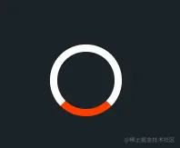

# loading

Created: November 21, 2021 8:16 PM
标签: css, 代码



```css
.loader-1 {
    width: 48px;
    height: 48px;
    border: 5px solid #FFF;
    border-bottom-color: #FF3D00;
    border-radius: 50%;
    display: inline-block;
    -webkit-animation: rotation 1s linear infinite;
    animation: rotation 1s linear infinite;
}

@-webkit-keyframes rotation {
    0% {
      transform: rotate(0deg);
    }
    100% {
      transform: rotate(360deg);
    }
  }
```


```css
.loader-2 {
    width: 48px;
    height: 48px;
    border: 3px solid #FFF;
    border-radius: 50%;
    display: inline-block;
    position: relative;
    -webkit-animation: rotation 1s linear infinite;
    animation: rotation 1s linear infinite;
}

.loader-2:after {
    content: "";
    position: absolute;
    left: 50%;
    top: 50%;
    transform: translate(-50%, -50%);
    width: 40px;
    height: 40px;
    border-radius: 50%;
    border: 3px solid transparent;
    border-bottom-color: #FF3D00;
}
```


```css
.loader-3 {
    width: 48px;
    height: 48px;
    border: 3px solid #FFF;
    border-radius: 50%;
    display: inline-block;
    position: relative;
    -webkit-animation: rotation 1s linear infinite;
    animation: rotation 1s linear infinite;
}

.loader-3:after {
    content: "";
    position: absolute;
    left: 50%;
    top: 50%;
    transform: translate(-50%, -50%);
    width: 56px;
    height: 56px;
    border-radius: 50%;
    border: 3px solid transparent;
    border-bottom-color: #FF3D00;
}
```


```css
.loader-5 {
    width: 48px;
    height: 48px;
    border-radius: 50%;
    display: inline-block;
    position: relative;
    border: 3px solid;
    border-color: #FFF #FFF transparent transparent;
    -webkit-animation: rotation 1s linear infinite;
    animation: rotation 1s linear infinite;
}

.loader-5:before {
    width: 32px;
    height: 32px;
    border-color: #FFF #FFF transparent transparent;
    -webkit-animation: rotation 1.5s linear infinite;
    animation: rotation 1.5s linear infinite;
}

.loader-5:after, .loader-5:before {
    content: "";
    position: absolute;
    left: 0;
    right: 0;
    top: 0;
    bottom: 0;
    margin: auto;
    border: 3px solid;
    border-color: transparent transparent #FF3D00 #FF3D00;
    width: 40px;
    height: 40px;
    border-radius: 50%;
    -webkit-animation: rotationBack 0.5s linear infinite;
    animation: rotationBack 0.5s linear infinite; 
    transform-origin: center center; *
}

@keyframes rotationBack {
    0% {
      transform: rotate(0deg);
    }
    100% {
      transform: rotate(-360deg);
    }
  }
```


```css
.loader-6 {
    width: 48px;
    height: 48px;
    border: 2px solid #FFF;
    border-radius: 50%;
    display: inline-block;
    position: relative;
    -webkit-animation: rotation 1s linear infinite;
    animation: rotation 1s linear infinite;
}

.loader-6:after {
    content: "";
    position: absolute;
    left: 50%;
    top: 0;
    background: #FF3D00;
    width: 3px;
    height: 24px;
    transform: translateX(-50%);
}
```


```css
.loader-7 {
    width: 48px;
    height: 48px;
    display: inline-block;
    position: relative;
}

.loader-7::after, .loader--7::before {
    content: "";
    width: 48px;
    height: 48px;
    border-radius: 50%;
    border: 2px solid #FFF;
    position: absolute;
    left: 0;
    top: 0;
    -webkit-animation: animloader7 2s linear infinite;
    animation: animloader7 2s linear infinite;
}

.loader-7::after {
    -webkit-animation-delay: 1s;
    animation-delay: 1s;
}
.loader-7::after, .loader-7::before {
    content: "";
    width: 48px;
    height: 48px;
    border-radius: 50%;
    border: 2px solid #FFF;
    position: absolute;
    left: 0;
    top: 0;
    -webkit-animation: animloader7 2s linear infinite;
    animation: animloader7 2s linear infinite;
}

@keyframes animloader7 {
    0% {
      transform: scale(0);
      opacity: 1;
    }
    100% {
      transform: scale(1);
      opacity: 0;
    }
  }
```


```css
.loader-8 {
    width: 48px;
    height: 48px;
    border: 3px solid #FFF;
    border-bottom-color: transparent;
    border-radius: 50%;
    display: inline-block;
    position: relative;
    -webkit-animation: rotation 1s linear infinite;
    animation: rotation 1s linear infinite;
}

.loader-8:after {
    content: "";
    position: absolute;
    left: 25px;
    top: 36px;
    border: 10px solid transparent;
    border-right-color: #FFF;
    transform: rotate(-40deg);
}
```