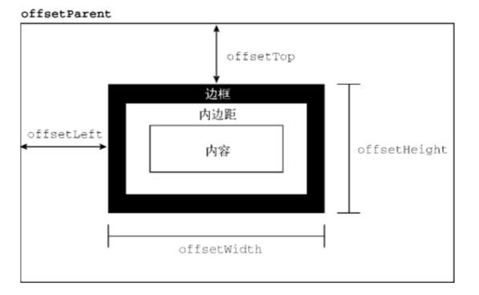
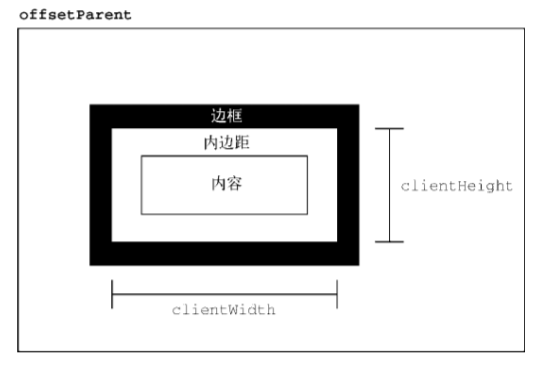
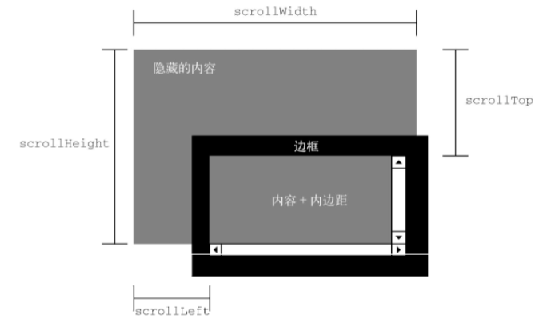

# JavaScript（JS）（用户和浏览器交互）

## 一、JS分为三个部分

1. ECMAScript	标准-----JS的基本的语法
2. DOM-----Document Object Model    文档对象模型
3. BOM-----Browser Object Model     浏览器对象模型

## 二、JavaScript是什么

- 是一门脚本语言
- 是一门解释性语言
- 是一门动态类型的语言
- 是一门基于对象的语言

## 三、JS的代码可以写在三个地方

1. 在HTML的文件中，script的标签中写JS代码

2. JS代码可以在HTML的标签中写

3. 在JS文件中可以写JS代码，但是需要在HTML的页面中引入script的标签中的src="js的路径"

   ```html
   <script src = "test.js"></script>
   ```

## 四、基本语法

### 4.1 script元素

当属性值 `type="module"`，代码会被当成ES6模块，只有这时候代码中才能出现 `import` 和 `export`


### 4.2 变量

#### 1. var关键字

1. var声明作用域

    使用`var`在一个函数内部定义一个变量，就意味着该变量将在函数退出时被销毁

    在函数内定义变量时省略`var`操作符，可以创建一个全局变量 —— **不推荐**  
2. var 声明提升

    使用这个关键字声明的变量会自动提升到函数作用域顶部

    只是提升声明，变量的赋值依然在下方，上方的调用无法获取赋值，输出 `undefined`

#### 2. let 声明

- let 声明的范围是**块作用域**
- var 声明的范围是**函数作用域**
- 块级作用域由最近的一对包含花括号 `{}` 界定

混用 `let` 和 `var` 会报错。两个关键字声明的并不是不同类型的变量，它们只是指出变量在相关作用域如何存在。

1. 暂时性死区

    let 声明的变量不会在作用域中被提升
    ```js
    console.log(age)  // ReferenceError: age 没有定义
    let age = 26
    ```
    在解析代码时，JavaScript 引擎也会注意出现在块后面的 let 声明，只不过在此之前不能以任何方式来引用未声明的变量。在 let 声明之前的执行瞬间被称为 “暂时性死区”，在此阶段引用任何后面的声明的变量都会抛出 ReferenceError 
2. 全局声明

    let 在全局作用域中声明的变量不会成为 window 对象的属性（var声明的变量则会） 
3. for 循环中的 let 声明

    使用 let 声明迭代变量时，JavaScript 引擎在后台会为每个迭代循环声明一个新的迭代变量

    适用于 for、for-in、for-of 循环

#### 3. const 声明

用 const 声明变量时必须同时初始化变量  
如果 const 变量引用的是一个对象，修改对象内部的属性并不违反 const 限制  
对于 for-of 和 for-in 循环有意义  

```js
for (const key in {a: 1, b: 2}) {
  console.log(key)
}
// a, b

for (const value of [1,2,3,4,5]) {
  console.log(value)
}
// 1, 2, 3, 4, 5
```

### 4.3 javascript运行三部曲

- 语法分析
- 预编译
- 解释执行
- **预编译前奏**
  - **规律1：任何变量，如果未经声明就赋值，此变量是属于 window 的属性**，而且不会做变量提升。（注意，无论在哪个作用域内赋值）
  - **规律2：一切声明的全局变量，全是window的属性**。（注意，我说的是在全局作用域内声明的全局变量，不是说局部变量）

### 4.5 函数

- **函数 == 真个函数**

- **fn() 和 fn 的区别【重要】**

  - `fn()`：调用函数。调用之后，还获取了函数的返回值。
  - `fn`：函数对象。相当于直接获取了整个函数对象。

- **方法**

  - **如果一个函数是作为一个对象的属性保存，那么，我们称这个函数是这个对象的方法**。
  - 我们可以这样说，如果直接是`fn()`，那就说明是函数调用。如果是`XX.fn()`的这种形式，那就说明是**方法**调用。

- **类数组arguments**

  - 在调用函数时，浏览器每次都会传递进两个隐含的参数：

    - 1.函数的上下文对象 this
    - 2.**封装实参的对象** arguments

  - arguments 是一个类数组对象，它可以通过索引来操作数据，也可以获取长度。

    **arguments 代表的是实参**。在调用函数时，我们所传递的实参都会在 arguments 中保存。有个讲究的地方是：arguments**只在函数中使用**。

  - arguments的展示形式是一个**伪数组**。伪数组具有以下特点：

    - 可以进行遍历；具有数组的 length 属性。
    - 按索引方式存储数据。
    - 不具有数组的 push()、pop() 等方法。

- **this**

  - 解析器在调用函数每次都会向函数内部传递进一个隐含的参数，这个隐含的参数就是 this，this 指向的是一个对象，这个对象我们称为函数执行的 上下文对象。
  - 根据函数的调用方式的不同，this 会指向不同的对象：
    - 1.以函数的形式（包括普通函数、定时器函数、立即执行函数）调用时，this 的指向永远都是 window。比如`fun();`相当于`window.fun();`
    - 2.以方法的形式调用时，this 指向调用方法的那个对象
    - 3.以构造函数的形式调用时，this 指向实例对象
    - 4.以事件绑定函数的形式调用时，this 指向**绑定事件的对象**
    - 5.使用 call 和 apply 调用时，this 指向指定的那个对象

- **改变函数内部的this指向。常见的方法有call()、apply()、bind()方法。**

  - **call()方法**

    - 作用：可以**调用**一个函数，与此同时，它还可以改变这个函数内部的 this 指向。

    - 另一个作用：**可以实现继承**。之所以能实现继承，其实是利用了上面的作用。

    - 语法：**fn1.call(想要将this指向哪里, 函数实参1, 函数实参2);**

    - 备注：第一个参数中，如果不需要改变 this 指向，则传 null。

    - 
      ```JavaScript
      // 给 Father 增加 name 和 age 属性
      function Father(myName, myAge) {
          this.name = myName;
          this.age = myAge;
      }
      
      function Son(myName, myAge) {
          // 【下面这一行，重要代码】
          // 通过这一步，将 father 里面的 this 修改为 Son 里面的 this；另外，给 Son 加上相应的参数，让 Son 自动拥有 Father 里的属性。最终实现继承
          Father.call(this, myName, myAge);
      }
      
      const son1 = new Son('千古壹号', 28);
      console.log(JSON.stringify(son1));
      ```

  - **apply()方法**

    - 可以**调用**一个函数，与此同时，它还可以改变这个函数内部的 this 指向。这一点，和 call()类似。

    - 语法：

      ```JavaScript
      fn1.apply(想要将this指向哪里, [函数实参1, 函数实参2]);
      ```

    - 备注：第一个参数中，如果不需要改变 this 指向，则传 null。

    - apply() 里面传入的**实参，必须是数组（或者维数组）**。

    - **apply() 方法的巧妙应用：求数组的最大值**

      - ```JavaScript
        const arr1 = [3, 7, 10, 8];
        
        // 下面这一行代码的目的，无需改变 this 指向，所以：第一个参数填 null，或者填 Math，或者填 this 都可以。严格模式中，不让填null。
        const maxValue = Math.max.apply(Math, arr1); // 求数组 arr1 中元素的最大值
        console.log(maxValue);
        
        const minValue = Math.min.apply(Math, arr1); // 求数组 arr1 中元素的最小值
        console.log(minValue);
        
        =========================
        打印：10
        	 3
        ```

  - **bind()方法**

    - bind() 方法**不会调用函数**，但是可以改变函数内部的 this 指向。

    - 语法：

      ```JavaScript
      新函数 = fn1.bind(想要将this指向哪里, 函数实参1, 函数实参2);
      ```

    - 参数：

      - 第一个参数：在 fn1 函数运行时，指定 fn1 函数的this 指向。如果不需要改变 this 指向，则传 null。
      - 其他参数：fn1 函数的实参。

      解释：它不会调用 fn1 函数，但会返回 由指定this 和指定实参的**原函数拷贝**。可以看出， bind() 方法是有返回值的。

### 4.6 对象

- 赋值对象，不影响各自对象的引用

  - `object.assign()`

  - ```javascript
    var obj1 = {name: '孙悟空'};
    
    var obj3 = object.assign({},obj1);
    ```

- **获取对象中的属性**

  - ```JavaScript
    对象.属性名;
    可以使用[]这种形式去操作属性
    ```

- **修改对象的属性值**

  - ```JavaScript
    对象.属性名 = 新值;
    obj.name = 'tom';
    
    删除
    delete obj.name;
    ```

- **in运算符**

  - ```javascript 
    '属性名' in 对象;
    ```

  - ```javascript
    if (obj.name) {
        // 如果对象 obj 中有name属性，我就继续做某某事情。
    }
    ```

- **for of：遍历数组**

  - ```javascript
    let arr1 = [2, 6, 8, 5];
    
    for (let value of arr1) {
        console.log(value);
    }
    ```

  - for ... of 的循环可以避免我们开拓内存空间，增加代码运行效率，所以建议大家在以后的工作中使用 for…of 遍历数组。

    注意，上面的数组中，`for ... of`获取的是数组里的值；如果采用`for ... in`遍历数组，则获取的是 index 索引值。

- **Map 对象的遍历**

  `for ... of`既可以遍历数组，也可以遍历 Map 对象。

- **for in：遍历对象的属性**

  - `for ... in`主要用于遍历对象，不建议用来遍历数组。

  - 语法：

    ```javascript
    for (const 变量 in 对象) {
    
    }
    ```

  - 对象中有几个属性，循环体就会执行几次。每次执行时，会将对象中的**每个属性的 属性名 赋值给变量**。

### 4.7 数据类型

#### 1. typeof 操作符

- `undefined` 表示值未定义
- `boolean` 表示值为布尔值
- `string` 表示值为字符串
- `number` 表示值为数值
- `object` 表示值为对象（而不是函数） 或 null
- `function` 表示值为函数
- `symbol` 表示值为符号

#### 2. undefined 类型

- 当使用 `var` 或 `let` 声明了变量但没有初始化时，就相当于给变量赋予了 `undefined` 值。
- 这个特殊值的目的是为了正式明确空对象指针（null）和未初始化变量的区别
- 未声明和声明了但未赋值的变量都会自动赋予 `undefined`
- 建议-在声明变量的同时进行初始化，当 `typeof` 返回 `undefined` 时，就可以知道是因为给定的变量尚未声明

#### 3. Nulll 类型

- `null` 表示一个空对象指针
```js
let car = null
console.log(typeof car)    // "object"
```

- **在定义要保存对象值的变量时**，建议使用 `null` 初始化，这样只要检查这个变量的值是不是 `null` 就知道这个变量是否再后来被重新赋予了一个对象的引用。
- `undefined` 和 `null` 表面上相等
```js
console.log(null == undefined)  // true
```

- 任何时候，只要变量要保存对象，而当时有没有那个对象可保存，就要用 `null` 来填充该变量

#### 4. Boolean 类型

- 要将一个其它类型的值转换为布尔值，可以调用特定的 `Boolean()` 转型函数。

|   数据类型   |  转换为 `true` 的值   |      转换为 `false` 的值       |
| :---------: | :------------------: | :---------------------------: |
|  `Boolean`  |        `true`        |            `false`            |
|  `String`   |      非空字符串       |         ""（空字符串）         |
|  `Number`   | 非零数值（包括无穷值） | `0、NaN`（参见后面的相关内容 ） |
|  `Object`   |       任意对象        |            `null`             |
| `Undefined` |    `N/A`（不存在）    |          `undefined`          |


#### 5. Number 类型

- 八进制
以数字 `0` 开头，然后是相应的八进制数字
- 十六进制
以 `0x` 开头，然后是相应的十六进制数字

#####  5.1 浮点值

定义浮点值：必须包含小数点，小数点后至少有一个数字

- 在小数点后面没有数字的情况下，数值就会成为整数。

- 科学计数法
  - 一个数值（整数或浮点数）后跟一个大写或小写 `e` ，再加上一个要乘的 `10` 的多少次幂
  - let floatNum = 3.125e7

##### 5.2 值的范围

`ECMAScript` 可以表示的最小的数值保存在 `Number.MIN_VALUE`中，最大的数值保存在 `Number.MAX_VALUE` 中。

任何无法表示的负数以 `-Infinity` （负无穷大）表示

任何无法表示的整数以 `Infinity` (正无穷大)表示

如果计算返回正 `Infinity` 或负`Infinity` ,则该值将不能在进一步用于任何计算。

要确定一个值是不是有限大，介于 `js` 能表达的最小值和最大值之间，可以使用 `isFinite()` 函数

##### 5.3 NaN

NaN —— 不是数值：用于表示本来要返回数值的操作失败了。

判断值是否“不是数值”—— `isNaN()`
- 当把值传给该函数时，该函数会尝试把它转换为数值

##### 5.4 数值转换

将非数值转换为数值
- `Number()` —— 转型函数，适用于任何数据类型
  - 布尔值， `true` 转换为 `1`， `false` 转换为 `0`
  - 数值，直接返回
  - `null`，返回 `0`
  -  `undefined`, 返回 `NaN`
  - 字符串
    - 如果字符串包含数值字符，包括数值字符串前面带加、减号的情况，则转换为一个十进制数值。
    - 如果字符串包含有效的浮点值格式如 `"1.1"`，则会转换为相应的浮点值（忽略前面的零）。
    - 如果字符串包含有效的十六进制格式 `0xf` ，转换为与该十六进制对应的十进制整数值。
    - 如果是空字符串，则返回 `0`
    - 如果字符串包含除上述情况之外的其他字符，则返回 `NaN`
  - 对象，调用 `valueof()` 方法，并按照上述规则转换返回的值。如果转换结果是  `NaN`，则调用 `toString()` 方法，在按照转换字符串的规则转换。
- `parseInt()` —— 将字符串转换为数值
  - 通常在需要得到整数时可以优先使用 `parseInt()` 函数。
  - 如果第一个字符串不是数值字符、加号或减号， `parseInt()` 立即返回 `NaN`。
  - 空字符串 返回 `NaN`
  - `parseInt("1234blue") => 1234` ; `parseInt("22.5") => 22`
  - 也能识别不同的整数格式，如八进制、十六进制
  - 第二个参数，用于指定底数。
    - let num = parseInt("oxAF", 16) => 175
    - 如果提供了十六进制参数，字符串前面的 `0x` 可以省掉
    - let num = parseInt("10", 2)   =>   2,   按二进制解析
    - let num = parseInt("10", 8)   =>   8,   按八进制解析
    - let num = parseInt("10", 10) =>   10, 按十进制解析
    - let num = parseInt("10", 16) =>   16, 按十六进制解析
- `parseFloat()` —— 将字符串转换为数值
  - 第一次出现的小数点是有效的，但第二次出现的小数点就无效了
  - 始终忽略字符串开头的零。
  - 只解析十进制值
  - 如果字符串表示整数（没有小数点或者小数点后面只有一个零），则返回整数

#### 6. String 类型

##### 6.1 转换为字符串

1. 使用 `toString()` 方法

几乎所有值都有的 `toString()` 方法  
用途：返回当前值的字符串等价物  
范围：数值、布尔值、对象、字符串值。（null 和 undefined 值没有 toString() 方法）

```js
let age = 11
let ageAsString = age.toString()
```
  - 可以接收一个底数参数，即以什么底数来输出数值的字符串表示。
```js
  let num = 10
  console.log(num.toString())   // "10"
  console.log(num.toString(2))  // "1010"
  console.log(num.toString(8))  // "12"
  console.log(num.toString(10)) // "10"
  console.log(num.toString(16)) // "a"
```
  - 如果不确定一个值是不是 `null` 或 `undefined` ，使用 `String()` 转型函数
    - 如果值有 `toString()` 方法，则调用`String()`方法（不传参数）并返回结果
    - 如果值是 null， 返回 "null"。
    - 如果值是 undefined，返回 "undefined"

2. 字符串插值  
    `${}` —— 字符串插值  
    所有插入的值都会使用 `toString()` 强制转型为字符串  
    在差值表达式中可以调用函数和方法
    模板可以插入自己之前的值  
    ```js
    let value = '';
    function append () {
      value = `${value}abc`
      console.log(value);
    }
    append();  // abc
    append();  // abcabc
    append();  // abcabcabc
    ```

3. 原始字符串  
    使用模板字面量可以直接获取原始的模板字面量内容，而不是被转换后的字符表示。  
    `String.raw` 标签函数
    ```js
    console.log(`\u00A9`)            // ©
    console.log(String.raw`\u00A9`)  // \u00A9
    ```
    使用标签函数的第一个参数，即字符串数组的 .raw 属性取得每个字符串的原始内容
    ```js
    function printRaw(strings) {
      console.log('Actual characters');
      for (const string of strings) {
        console.log(string)
      }
    
      console.log('Escaped characters:');
      for (const rawString of string.raw) {
        console.log(rawString)
      }
    }
    
    printRaw`\u00A9${ 'and' }\n`
    // Actual characters:
    // ©
    // (换行符)
    // Escaped characters:
    // \u00A9
    // \n
    ```
#### 7. symbol 类型

symbol（符号）。符号是原始值，且符号实例是唯一、不可变得。  
符号是用来创建唯一记号，进而用作非字符串形式的对象属性。  

### 4.8 基本引用类型

#### 1. Date

要创建日期对象，就使用 new 操作符来调用 Date 构造函数

```js
let now = new Date()
```

无传参数的情况下，创建的对象将保存当前日期和时间。
要基于其他日期和时间创建日期时间，必须传入其毫秒表示。

##### 辅助方法

###### Date.parse()

支持的日期格式
- "月/日/年"，如"5/23/2019"
- "月名 日, 年"，如"May 23， 2019"
- "周几 月名 日 年 时:分:秒 时区"，如"Tue May 23 2019 00:00:00 GMT-0700"
- ISO 8601扩展格式"YYYY-DDTHH:mm:ss.sssZ"，如2019-05-23T00:00:00(只适用于兼容ES5的实现)
```js
let someDate = new Date(Date.parse("May 23, 2019"))
```
如果传给该方法的字符串并不表示日期，则返回`NaN`。 
直接把表示日期的字符串传给`Date`构造函数，那么`Date`会在后台调用`Date.parse()`。

###### Date.UTC()

参数：
年、零起点月数（1月是0,2月是1）、日（1~31）、时（0~23）、分、秒、毫秒。  
年和月是必须的，不提供日，那么默认为`1`日，其他参数默认值是`0`。
```js
// GMT时间2005年5月5日下午5点55分55秒
let allFives = new Date(Date.UTC(2005, 4, 5, 17, 55, 55))
```

###### Date.now()

返回表示方法执行时日期和时间的毫秒数  

##### 日期格式化方法

- toDateString() 显示日期中的 周几、月、日、年
- toTimeString() 显示日期中的 时、分、秒和时区
- toLocaleDateString() 显示日期中的 年/月/日
- toLocaleTimeString() 显示日期中的 时、分、秒
- toUTCString() 显示完整的UTC日期
输出的格式会因为浏览器而异，不能在用户界面上一致的显示日期

##### 日期/时间组件方法
`UTC`日期指的是没有时区偏移时的日期

| 方法                              | 说明                                          |
| :------------------------------- | :-------------------------------------------- |
| getTime()                        | 返回日期的毫秒表示；与valueOf()相同              |
| setTime(milliseconds)            | 设置日期的毫秒表示，从而修改整个日期              |
| getFullYear()                    | 返回4位数年（即2019而不是19）                   |
| getUTCFullYear()                 | 返回UTC日期的4为数年                            |
| setFullYear(year)                | 设置日期的年(year必须是4位数)                   |
| setUTCFullYear(year)             | 设置UTC日期的年(year必须是4位数)                |
| getMonth()                       | 返回日期的月(0表示1月，11表示12月)               |
| getUTCMonth()                    | 返回UTC日期的月(0表示1月，11表示12月)            |
| setMonth(month)                  | 设置日期的月(month为大于0的数值，大于11加年)      |
| setUTCMonth(month)               | 设置UTC日期的月(month为大于0的数值，大于11加年)   |
| getDate()                        | 返回日期中的日(1~31)                           |
| getUTCDate()                     | 返回UTC日期中的日(1~31)                        |
| setDate(date)                    | 设置日期中的日(如果date大于该月天数，则加月)      |
| setUTCDate(date)                 | 设置UTC日期中的日(如果date大于该月天数，则加月)   |
| getDay()                         | 返回日期中表示周几的数值(0表示周日，6表示周六)    |
| getUTCDay()                      | 返回UTC日期中表示周几的数值(0表示周日，6表示周六) |
| getHours()                       | 返回日期中的时(0~23)                           |
| getUTCHours()                    | 返回UTC日期中的时(0~23)                        |
| setHours(hours)                  | 设置日期中的时(如果hours大于23，则加日)          |
| setUTCHours(hours)               | 设置UTC日期中的时(如果hours大于23，则加日)       |
| getMinutes()                     | 返回日期中的分(0~59)                           |
| getUTCMinutes()                  | 返回UTC日期中的分(0~59)                        |
| setMinutes(minutes)              | 设置日期中的分(如果minutes大于59，则加时)        |
| setUTCMinutes(minutes)           | 设置UTC日期中的分(如果minutes大于59，则加时)     |
| getSeconds()                     | 返回日期中的秒(0~59)                           |
| getUTCSeconds()                  | 返回UTC日期中的秒(0~59)                        |
| setSeconds(seconds)              | 设置日期中的秒(如果seconds大于59，则加分)        |
| setUTCSeconds(seconds)           | 设置UTC日期中的秒(如果seconds大于59，则加分)     |
| getMilliseconds()                | 返回日期中的毫秒                                |
| getUTCMillisecond()              | 返回UTC日期中的毫秒                             |
| setMilliseconds(milliseconds)    | 设置日期中的毫秒                                |
| setUTCMilliseconds(milliseconds) | 设置UTC日期中的毫秒                             |
| getTimezoneOffset()              | 返回以分钟计的UTC与本地时区的偏移量              |

#### 原始值包装类型

##### Boolean

创建 `Boolean` 对象，就使用 `Boolean` 构造函数并传入 `true` 或 `false`
```js
let booleanObject = new Boolean(true)
```

所有对象在布尔表达式中都会自动转换为 `true`。

**强烈建议永远不要使用后者**

##### Number

`Number` 对应数值的引用类型。要创建一个 Number 对象，就使用 Number 构造函数并传入一个数值。

```js
let numberObject = new Number(10)
```

##### String

`String`是对应字符串的引用类型。要创建一个String对象，使用String构造函数并传入一个数值
```js
let stringObject = new String("Hello World")
```

### 集合引用类型

#### object

显示创建 Object 实例  
- 第一种：
```js
let person = new Object()
person.name = "Nicholas"
person.age = 29
```
- 第二种：
```js
let person = {
  name: "Nicholas",
  age: 29  // 数值属性会自动转换为字符串
}
```

调用对象属性

```js
console.log(person["name"])
console.log(person.name)
```
使用中括号可以通过变量访问属性
```js
let propertyName = "name"
console.log(person[propertyName])
```

#### Array

##### 创建数组

可以省略 new 操作符
```js
let colors = new Array()

// 给构造函数传入一个数值，然后 length 属性会被自动创建
let colors = new Array(20)
let colors = new Array("red", "blue", "green")
```

ES6 创建数组的静态方法：from() 和 of()
- from() —— 将类数组结构转换为数组实例
  - 第一个参数是一个类数组对象（任何可迭代结构，或者有一个 length 属性和可索引元素的结构）
  - ```js
      Array.from("Matt")  // ["M", "a", "t", "t"]
      
      // 对现有数组执行浅复制
      const a1 = [1, 2, 3, 4]
      const a2 = Array.from(a1)
      console.log(a1)  // [1,2,3,4]
      alert(a1 === a2) // false
    ```
  - 第二个`可选`的映射函数参数
  - ```js
      const a1 = [1,2,3,4]
      const a2 = Array.from(a1, x => x**2)
      console.log(a2)  // [1,4,9,16]
     ```
- of() —— 将一组参数转换为数组实例
  - ```js
      console.log(Array.of(1,2,3,4))  // [1,2,3,4]
     ```

##### 数组空位

ES6 将新增方法普遍将这些空位当成存在的元素，只不过为 undefined
```js
const options = [1,,,,5]

for (const option of options) {
  console.log(option === undefined)
}
// false
// true
// true
// true
// false
```

如果需要空位，则可以显示的用 `undefined` 值代替

##### 数组索引

- 设定数组长度大于数组的最大索引，数组会自动扩展，其访问其值会返回特殊值 `undefined`
- 通过修改 `length` 属性，可以从数组末尾删除或添加元素。

##### 检测数组

```js
if (Array.isArray(value))
```

##### 迭代器方法

ES6，暴露3个用于检索数组内容的方法：key()、values()、和entries()。
- key() —— 返回数组索引的迭代器
- values() —— 返回数组元素的迭代器
- entries() —— 返回索引/值对的迭代器
```js
const a = ["foo", "bar", "baz", "qux"]

const aKeys = Array.from(a.keys())
const aValues = Array.from(a.values())
const aEntries = Array.from(a.entries())

console.log(aKeys)    // [0, 1, 2, 3]
console.log(aValues)  // ["foo", "bar", "baz", "qux"]
console.log(aEntries) // [[0, "foo"], [1, "bar"], [2, "baz"], [3, "qux"]]

ES6 解构循环拆分键/值
for (const [idx, element] of a.entries()) {
  alert(idx)
  alert(element)
}
// 0
// foo
// 1
// bar
// 2
// baz
// 3
// qux
```

##### 转换方法

所有对象都有 `toLocaleString()`、`toString()`、`valueOf()`
- valueOf() —— 返回的是数组本身
- toString() —— 返回由数组中每个值的等效字符串拼接而成的一个逗号分隔的字符串。
```js
let colors = ["red", "blue", "green"]
alert(colors.toString())  // red,blue,green
alert(colors.valueOf())   // red,blue,green
alert(colors)             // red,blue,green
```

**注意**
> 如果数组中某一项是 null 或 undefined ，则在 join()、toLocaleString()、toString() 和 valueOf() 返回的结果中会以空字符串表示

##### 栈方法

`push()`和`pop()`方法，实现类似栈的行为  
`shift()` 和 `push()` 实现队列行为 —— 在数组末尾添加新数据，在数组开头取得数据
`unshift()` 和 `pop()` 在相反方向上模拟队列  —— 在数组开头添加新数据，在数组末尾取得数据

##### 排序方法

方法：
- `reverse()` —— 将数组元素反向排列
- `sort()`
  - 默认按照升序重新排列数组元素
  - 每一项调用 String() 转型函数，比较字符串来决定顺序。
  - 接收一个**比较函数**，判断顺序
  - ```js
      function compare (value1, value2) {
        if (value1 < value2) {
          return -1
        } else if (value1 > value2) {
          return 1
        } else {
          return 0
        }
      }
    ```

#### Map

##### 基本API

创建空映射
```js
const m = new Map()
```

使用嵌套数组初始化映射
```js
const m1 = new Map([
  ["key1", "val1"],
  ["key2", "val2"],
  ["key3", "val3"]
])
alert(m1.size)  // 3
```

1. set,has,get
```js
const m = new Map()
m.set("firstName", "Matt")
 .set("lastName", "Frisbie")

alert(m.has("firstName"))  // true
alert(m.get("firstName"))  // Matt
alert(m.size)                     // 2
```
2. delete
```js
const m = new Map()
m.set("firstName", "Matt")
m.delete("firstName)
```

3. clear
```js
m.clear()
```

4. map 可以使用任何 js 数据类型作为键

5. 在映射中用作键和值的对象及其他 “集合”类型，在自己的内容或属性被修改时仍然保持不变
  - ```js
      const m = new Map()
      const objKey = {}
               objVal = {}
                arrKey = []
                arrVal = []
      m.set(objKey, objVal)
      m.set(arrKey, arrVal)
      
      objKey.foo = "foo"
      objVal.bar = "bar"
      arrKey.push("foo")
      arrVal.push("bar")
      
      console.log(m.get(objKey))  // {bar: "bar"}
      console.log(m.get(arrKey))  // ["bar"]
     ```

##### 顺序与迭代

映射实例可以提供一个迭代器（Iterator），能以插入顺序生成[key, value]形式的数组。  
可以通过 entries() 或者 Symbol.iterator 属性

```js
const m = new Map({
  ["key1", "val1"],
  ["key2", "val2"],
  ["key3", "val2"]
})

alert(m.entries === m[Symbol.iterator])  // true

for (let pair of m.entries()) {
  alert(pair)
}
// [key1, vall]
// [key2, val2]
// [key3, val3]
```

`entries()` 是默认迭代器,可以直接对映射实例使用扩展操作，把映射转换为数组  
```js
console.log([...m])
```

`keys()` 和 `values()` 分别返回以插入顺序生成键和值的迭代器  
```js
const m = new Map({
  ["key1", "val1"],
  ["key2", "val2"],
  ["key3", "val3"]
})

for (let key of m.keys) {
  alert(key)
}
// key1
// key2
// key3
```

#### Set

```js
const m = new Set()

const s1 = new Set(["val1", "val2", "val3"])

// add() 增加值
alert(m.add("Matt"))

m.add("val1").add("val2")
// has() 查询
alert(m.has("Matt"))    // true
// delete() 删除
m.delete("Matt")
m.has("Matt")           // false
// clear() 销毁所有值
m.add("Frisbie")
m.clear()
m.has("Frisbie")        // false
```

##### 顺序与迭代
values() 和 keys()
```js
const s = new Set(["val1", "val2", "val3"])

for (let value of s.values()) {
  alert(value)
}
// val1
// val2
// val3
```

entries() 返回一个迭代器，按照插入顺序产生包含两个元素的数组，两个元素是集合中每个值的重复出现
```js
const s = new Set(["val1", "val2", "val3"])

for (let pair of s.entries()) {
  console.log(pair)
}
// ["val1", "val1"]
// ["val2", "val2"]
// ["val3", "val3"]
```

### 迭代器与生成器

#### 迭代器模式

`iterable` —— 可迭代对象
`iterator` —— 迭代器

#### 可迭代协议

很多内置类型都实现了 `iterable` 接口

- 字符串
- 数组
- 映射
- 集合
- arguments 对象
- NodeList 等 DOM 集合类型

#### 迭代器协议

迭代器`API` 使用 `next()` 方法在可迭代对象中遍历数据。每次成功调用`next()`，都会返回一个 `iteratorResult`对象，其中包含迭代器返回的下一个值。  
`next()` 返回的迭代器对象 `iteratorResult` 包含两个属性： `done` 和 `value`。
- `done`：是一个布尔值，表示是否换可以再次调用 `next()` 取得下一个值. 
  - `done: true` 状态称为"耗尽"
- `value`: 包含可迭代对象的下一个值（`done` 为 `false`）, 或者 `undefined` (`done` 为 `true`)

### 对象、类与面向对象编程

#### 属性的类型

##### 数据属性

- [[Configurable]]
  - 表示属性是否可以通过 delete 删除并重新定义，是否可以修改它的特性，以及是否可以把它改为访问其属性。
  - 默认属性为 true
- [[Enumerable]]
  - 表示属性是否可以通过 for-in 循环返回。
  - 默认属性为 true
- [[Writable]]
  - 表示属性的值是否可以被修改。
  - 默认属性为 true
- [[Value]]
  - 包含属性实际的值
  - 默认值为 undefined

要修改属性的默认特性，需要使用 `Object.defineProperty()` 方法。
参数：
- 要添加属性的对象
- 属性的名称
- 描述符对象
  - 可以包含：`configurable`,`enumerable`,`writable`,`value`

```js
let person = {};
Object.defineProperty(person, "name", {
  writable: false,
  value: "Nicholas"
});
console.log(person.name);  // "Nicholas"
person.name = "Greg";
console.log(person.name);  // "Nicholas"
```

##### 访问其属性

包含一个获取（getter）函数和一个设置（setter）函数。

访问器属性有4个特性描述它们的行为。
- [[Configurable]]
  - 表述属性是否可以通过 delete 删除并重新定义，是否可以修改它的特性，以及是否可以把它改为数据属性。
  - 默认值为 true
- [[Enumerable]]
  - 表示属性是否可以通过 for-in 循环返回。
  - 默认值为 true
- [[Get]]
  - 获取函数，在读取属性时调用。
  - 默认值为 undefined。
- [[Set]]
  - 设置函数，在写入属性时调用。
  - 默认值 undefined。

```js
let book = {
  year_: 2017,
  edition: 1
};

Object.defineProperty(book, "year", {
  // 当有人读取person的age属性时，get函数就会被调用，且返回值就是age的值
  get () {
    return this.year_;
  ),
  // 当有人修改person打的age属性时，set函数就会被调用，且会收到修改的具体值
  set (newValue) {
    if (newValue > 2017) {
      this.year_ = newValue;
      this.edition += newValue - 2017;
    }
  }
});
book.year = 2018;
console.log(book.deition);  // 2
```

#### 读取属性的特性

使用 `Object.getOwnPropertyDescriptor()` 可以取得指定属性的属性描述符。
参数：
  - 属性所在的对象
  - 要取得其描述符的属性名
返回值是一个对象，对于访问器属性包含 `configurable`,`enumerable`,`get`,`set`，对于数据属性包含`configurable`,`enuerable`,`writable`,`value`
```js
let book = {}
Object.defineProperties(book, {
  year_: {
    value: 2017
  },
  edition: {
    value: 1
  },
  year: {
    get: function() {
      return this.year_;
    },
    set: functiono(newValue) {
      if (newValue > 2017) {
        this.year_ = newValue;
        this.edition += newValue - 2017;
      }
    }
  }
});

let descriptor = Object.getOwnPropertyDescriptor(book, "year_");
console.log(descriptor.value);         // 2017
console.log(descriptor.configurable);  // false
console.log(typeof descriptor.get);    // "undefined"
```

`Object.getOwnPropertyDescriptors()` 会在每个自有属性上调用`Object.getOwnPropertyDescriptor()`并在一个新对象中返回他们。
```js
console.log(Object.getOwnPropertyDescriptors(book));
// {
//   edition: {
//     configurable: false,
//     enumerable: false,
//     value: 1,
//     writable: false
//   },
//   year: {
//     configurable: false,
//     enumerable: false,
//     get: f(),
//     set: f(newValue)
//   },
//   year_: {
//     configurable: false,
//     enumerable: false,
//     value: 2017,
//     writable: false
//   }
// }
```

#### 合并对象

ES6 提供了 `Object.assign()` 方法。
参数：
- 一个目标对象和一个或多个源对象作为参数

`Object.assign()` 对每个源对象执行的是浅复制。如果多个源对象都有相同的属性，则使用最后一个复制的值。

#### 对象标识及相等判定

ES6 新增 `Object.is()`，必须接收两个参数

```js
console.log(Object.is(true, 1));  // false
console.log(Object.is({},{}));    // false
console.log(Object.is(+0, -0));   // false
console.log(Object.is(+0, 0));    // true
console.log(Object.is(-0, 0));    // false
console.log(Object.is(NaN, NaN);  // true
```

```js
function recursivelyCheckEqual (x, ...rest) {
  return Object.is(x, rest[0]) &&
         (rest.length < 2 || recursivelyCheckEqual(...rest));
```

#### 增强的对象语法

##### 属性值简写

```js
let name = 'Matt';

let person = {
  name: name
};

let person = {
  name
};

console.log(person);  // { name: 'Matt' }
```

##### 可计算属性

```js
let person = {};
person[nameKey] = 'Matt';
person[ageKey] = 27
person[jobKey] = 'Software engineer'
console.log(person)  // { name: 'Matt', age: 27, job: 'Software enginerr' }

let person = {  
  [nameKey]: 'Matt',
  [ageKey]: 27,
  [jobKey]: 'Software engineer'
}
console.log(person)  // { name: 'Matt, age: 27, job: 'Software engineer' }

function getUniqueKey (key) {
  return `${key}_${uniqueToken++}`;
}
let person = {
  [getUniqueKey(nameKey)]: 'Matt',
  [getUniqueKey(ageKey)]: 27,
  [getUniqueKey(jobKey)]: 'Software engineer'
};
console.log(person);  // { name_0: 'Matt', age_1: 27, job_2: 'Software enginerr' }
```

##### 简写方法名

```js
let person = {
  sayName: function(name) {
    console.log(`My name is ${name}`);
  }
};
person.sayName('Matt');  // My name is Matt

let person = {
  sayName(name) {
    console.log(`My name is ${name}`);
  }
};
person.sayName('Matt');  // My name is Matt

间写方法名与可计算属性键相互兼容
const methodKey = 'sayName';
let person = {
  [methodKey](name) {
    console.log(`My name is ${name}`);
  }
}
person.sayName('Matt');  // My name is Matt
```

##### 对象解构

```js
let person = {
  name: 'Matt',
  age: 27
}

let { name: personName, age: personAge } = person;

console.log(personName);  // Matt
console.log(personAge);   // 27

let { name, age } = person;

console.log(name)  // Matt
console.log(age)   // 27

定义默认值、适用于引用的属性不存在于源对象中的情况
let person = {
  name: 'Matt',
  age: 27
}

let { name, job='Software engineer' } = person;
console.log(name);  // Matt
console.log(job);   // Software engineer
```

1. 嵌套解构  
通过解构来复制对象属性

```js
let person = {
  name: 'Matt',
  age: 27,
  job: {
    title: 'Software engineer'
  }
};
let personCopy = {};

({
  name: personCopy.name,
  age: personCopy.age,
  job: personCopy.job
} = person);

// 浅复制，修改person.job对象的属性也会影响personCopy
```

2. 部分解构  
涉及多个属性的解构赋值是一个输出无关的顺序化操作。如果一个结构表达式涉及多个赋值，开始的赋值成功而后面的赋值出错，则整个解构赋值只会完成一部分；.

3. 参考上下文匹配  

```js
let person = {
  name: 'Matt',
  age: 27
};

function printPerson2(foo, {name: personName, age: personAge}, bar) {
  console.log(arguments);
  console.log(personName, personAge);
}

printPerson2('1st', person, '2nd');
// ['1st', { name: 'Matt', age: 27 }, '2nd']
// 'Matt', 27
```

#### 创建对象

##### 工厂模式

```js
function createPerson(name, age, job) {
  let o =new Object();
  o.name = name;
  o.age = age;
  o.job = job;
  o.sayName = function () {
    console.log(this.name)
  };
  return o;
}
let person1 = createPerson("Nicholas", 29, "Software Engineer");
let person2 = createPerson("Greg", 27, "Doctor")
```
- 可以解决创建多个类似对象的问题
- 没有解决对象标识问题

##### 构造函数模式

**构造函数名称的首字母都是要大写的，非构造函数则以小写字母开头**

```js
function Person(name, age, job) {
  this.name = name;
  this.age = age;
  this.job = job;
  this.sayName = function () {
    console.log(this.name);
  };
}

let person1 = new Person("Nicholas", 29, "Software Engineer");
let person2 = new Person("Greg", 27, "Doctor");

person1 和 person2 分别保存着 Person 的不同实例。这两个对象都有一个 constructor 属性指向 Person

console.log(person1.constructor == Person)  // true
console.log(person2.constructor == Person)  // true

person1.sayName();  // Nicholas
person2.sayName();  // Greg
```

**一般认为`instanceof`操作符是确定对象类型更可靠的方式**

上面的每个对象都是 `Object` 的实例，同时也是 `Person` 的实例，

```js
console.log(person1 instanceof Object);  // true
console.log(person1 instanceof Person);  // true
```

与工厂模式创建的对象相比的区别
- 没有显示地创建对象
- 属性和方法直接赋值给了 `this`
- 没有 `return`

要创建`Person`的实例，应使用 `new` 操作符。
- 在内存中创建一个新对象
- 这个新对象内部的`[[Prototype]]`特性被赋值为构造函数的`prototype`属性。
- 构造函数内部的`this`被赋值为这个新对象(即 `this` 指向新对象）
- 执行构造函数内部的代码（给新对象添加属性）
- 如果构造函数返回非空对象，则返回该对象；否则，返回刚创建的新对象。

1. 构造函数也是函数

除了调用方式不同。构造函数也是函数。

任何函数只要使用 new 操作符调用就是构造函数。不使用 new 操作符调用的函数就是普通函数。

2. 构造函数的问题

定义的方法在每个实例上都会创建一遍。但不是同一个 `Function` 实例.

##### 原型模式

创建一个函数，则为这个函数创建一个 prototype 属性——**指向原型对象**

所有的原型对象自动获得一个名为 construcotr 的属性——**指向回与之关联的构造函数**

正常的原型链都会终止与 Object 的原型对象

Object的原型的原型是 null

```js
Person.prototype.constructor => Person
```

- `Person.prototype` 指向原型对象
- `Person.prototype.contructor` 指回 `Person` 构造函数
- `Person1.__proto__` 指向原型对象
- 原型对象包含 `constructor` 属性和其他后来添加的属性。

**Object.getPrototypeOf()返回的对象就是传入对象的原型对象**

##### 原型层级

通过对象访问属性时，按照这个属性的名称开始搜索。 ↓  
搜索开始于对象实例本身。  ↓  
如果在这个实例上发现了给定的名称，则返回该名称对应的值。↓  
如果没有找到这个属性，则搜索会沿着指针进入原型对象，然后在原型对象上找到属性后，再返回对应的值。

只要给对象实例添加一个属性，这个属性就会**遮蔽**原型对象上的同名属性，也就是虽然不会修改它，但会屏蔽对它的访问。

使用 `delete` 操作符可以完全删除实例上的这个属性，从而让标识符解析过程能够继续搜索原型对象。

`hasOwnProperty()`——>用于确定某个属性是在实例上还是在原型对象上。

```js
function Person() {}  // 构造函数

Person.prototype.name = "Nicholas"

let person1 = new Person();
let person2 = new Person();
console.log(persono1.hasOwnProperty("name"));  // false

person1.name = "Greg"
console.log(person1.name);  // "Greg", 来自实例
console.log(person1.hasOwnProperty("name"));  // true

console.log(person2.name);  // "Nicholas", 来自原型
console.log(person2.hasOwnProperty("name"));  // false

delete person1.name;
console.log(person1.name);  // "Nicholas", 来自原型
console.log(person1.hasOwnProperty("name"));  // false
```

##### 原型和in操作符

使用`in`操作符的两种方式：单独使用和在`for-in`循环中使用

单独使用时，`in`操作符会在可以通过对象访问指定属性时返回`true`，无论该属性是在实例上还是在原型上。

```js
function Person() {}

Person.prototype.name = "Nicholas";

let person1 = new Person();
let pserson2 = new Person();

console.log(person1.hasOwnProperty("name"));  // false
console.log("name" in person1);  // true

person1.name = "Greg"
console.log(person1.hasOwnProperty("name");  // true
console.log("name" in person1);  // true
```

要确定某个属性是否存在于原型上，可以同时使用`hasOwnProperty()`和`in`操作符

```js
function hasPrototypeProperty(object, name){
  return !object.hasOwnProperty(name) && (name in object);
}
```

#### 对象迭代

将对象内容转换为序列化的——更重要的是可迭代的——格式。

`Object.values()` 和 `Object.entries()` 接收一个对象，返回它们内容的数组。**都是浅复制,非字符串属性会被转换为字符串输出**

`Object.values()` ——> 返回对象值的数组

`Object.entries()`——> 返回键/值对的数组

```js
const o = {
  foo: 'bar',
  baz: 1,
  qux: {}
};

console.log(object.values(o));  // ["bar", 1, {}]

console.log(object.entries((o)));  // [["foo", "bar"], ["baz", 1], ["qux", {}]]
```

##### 其他原型语法

```js
function Person() {}

Person.prototype = {
  name: "Nicholas",
  age: 29,
  job: "Software Engineer",
  sayName() {
    console.log(this.name);
  }
}
```

`Person.prototype` 被设置为等于一个通过对象字面量创建的新对象。

重写后，`Person.prototype`的`constructor`属性就不指向`Person`了。

可以在重写原型对象时专门设置一下它的值：

```js
function Person() {}

Person.prototype = {
  constructor: Person,
  name: "Nicholas",
  age: 29,
  job: "Software Engineer",
  sayName() {
    console.log(this.name);
  }
}

这种方法会创建一个[[Enumerable]]为true的属性。而原生constructor属性默认是不可枚举的。
可以使用下面的方法来设置。

// 恢复 constructor 属性
object.defineProperty(Person.prototype, "constructor", {
  enumerable: false,
  value: Person
})
```

##### 原型的动态性

从原型上搜索值的过程是动态的，所以即使实例在修改原型之前已经存在，任何时候对原型对象所做的修改也会在实例上反映出来。

```js
let friend = new Person();

Person.prototype.sayHi = function () {
  console.log("hi");
}

friend.sayHi();  // "hi"
```

重写整个原型会切断最初原型与构造函数的联系，但实例引用的仍然是最初的原型。

**实例只有指向原型的指针，没有指向构造函数的指针。**

```js
function Person() {}

let friend = new Person();
Person.prototype = {
  constructor: Person,
  name: "Nicholas",
  age: 29,
  job: "Software Engineer",
  sayName() {
    console.log(this.name);
  }
}

friend.sayName();  // 错误
```

重写构造函数上的原型之后在创建的实例才会引用新的原型。而在此之前创建的实例仍然会引用最初的原型。

##### 原生对象原型

原型模式之所以重要，不仅体现在自定义类型上，还因为它也是实现所有原生引用类型的模式。

> 推荐的做法是创建一个自定义的类，继承原生类型

##### 原型的问题

```js
function Person() {}

Person.prototype = {
  friends: ["Shelby", "Court"]
}

let person1 = new Person();
let person2 = new Person();

person1.frinends.push("Van")

console.log(person1.friends, person2.friends)  // "Shelby,Court,Van" "Shelby,Court,Van"
```

### 继承

很多面向对象语言都支持两种继承：接口继承和实现继承。

接口继承——继承方法签名

实现继承——继承实际的方法

实现继承是ECMAScript唯一支持的继承方式，主要通过原型链实现

#### 原型链

**构造函数、原型和实例的关系：每个构造函数都有一个原型对象，原型有一个属性指回构造函数，而实例有一个内部指针指向原型。**

##### 默认原型

默认情况下，所有引用类型都继承自`Object`。任何函数的默认原型都是一个`Object`实例。

##### 原型与继承关系

原型与实例的关系可以通过两种方式来确定。

第一种方式：使用`instanceof`操作符，如果一个实例的原型链中出现过相应的构造函数，则`instanceof`返回`true`。

第二种方式：使用`isPrototypeOf()`方法。只要原型链中包含这个原型，这个方法就返回`true`。

##### 关于方法

子类有时候需要覆盖父类的方法，或者增加父类没有的方法。为此，这些方法必须在**原型赋值之后**再添加到原型上。

以**字面量**方式创建原型方法会破坏之前的原型链，这相当于重写了原型链。

```js
function SuperType() {
  this.property = true
}

SuperType.prototype.getSuperValue = function () {
  return this.property
}

function SubType() {
  this.subproperty = false
}

SubType.prototype = new SuperType()

// 通过对象字面量添加新方法，这会导致上一行无效
SubType.prototype = {
  getSubValue() {
    return this.subproperty
  },
  someOtherMethod() {
    return false
  }
}

let instance = new SubType();
console.log(instance.getSuperValue());  // 出错！
```

##### 原型链的问题

所有的实例都会共享原型上的属性。

原型链基本不会被单独使用。

#### 盗用构造函数

在子类构造函数中调用父类构造函数。

因为函数就是在特定上下文中执行代码的简单对象，可以使用apply()和call()方法以新创建的对象为上下文执行构造函数。
```js
function SuperType() {
  this.colors = ["red", "blue", "green"];
}

function SubType () {
  // 继承SuperType
  SuperType.call(this);
}

let instance1 = new SubType();
instance1.colors.push("black");
conosole.log(instance1.colors);  // "red,blue,green,black"

let instace2 = new SubType();
console.log(instace2.colors);  // "red,blue,green"
```

#### 组合继承

综合了原型链和盗用构造函数。

思路：使用原型链继承原型上的属性和方法，而通过盗用构造函数继承实例属性。

```js
function SuperType(name){
  this.name = name;
  this.colors = ["red", "blue", "green"]
}

SuperType.prototype.sayName = function () {
  console.log(this.name);
}

function SubType(name, age){
  // 继承属性
  SuperType.call(this, name)
  this.age = age;
}

// 继承方法
SubType.prototype = new SuperType()

SubType.prototype.sayAge = function(){
  console.log(this.age);
}

let instance1 = new SubType("Nicholas", 29);
instance1.colors.push("black")
console.log(instance1.colors)  // "red,blue,green,black"
instance1.sayName();           // "Nicholas"
instance1.sayAge();            // 29

let instance1 = new SubType("Greg", 27);
console.log(instance2.colors)  // "red,blue,green"
instance1.sayName();           // "Greg"
instance1.sayAge();            // 27
```

#### 原型式继承

`Object.create()`方法将原型式继承的概念规范化了。接收两个参数：作为新对象原型的对象，给新对象定义额外属性的对象。

```js
let person = {
  name: "Nicholas",
  friends: ["Shelby", "Court", "Van"]
}

let anotherPerson = Object.create(person)
anotherPerson.name = "Greg"
anotherPerson.friends.push("Rob")

let yetAnotherPerson = Object.create(person)
yetAnotherPerson.name = "Linda"
yetAnotherPerson.friends.push("Barbie")

console.log(person.friends)  // "Shelby,Court,Van,Rob,Barbie"
```

#### 寄生式继承

```js
function createAnother(original){
  let clone = object(original)    // 通过调用函数创建一个新对象
  clone.sayHi = function() {      // 以某种方式增强这个对象
    console.log("hi")
  }
  return clone
}
```
**通过寄生式继承给对象添加函数会导致函数难以重用，与构造函数模式类似**

#### 寄生式组合继承

```js
function inheritPrototype(subType,superType){
  let prototype = object(superType.prototype)  // 创建对象
  prototype.constructor = subType              // 增强对象
  subType.prototype = prototype                // 赋值对象
}

接收两个参数：子类构造函数和父类构造函数
function SuperType(name){
  this.name = name
  this.colors = ["red", "blue", "green"]
}

SuperType.prototype.sayName = function() {
  console.log(this.name)
}

function SubType(name, age) {
  SuperType.call(this, name);
  this.age = age
}

inheritPrototype(SubType, SuperType)

subType.prototype.sayAge = function(){
  console.log(this.age)
}
```

### 类 

#### 类定义

定义方式：

```js
// 类声明
class Person {}

// 类表达式
const Animal = class {}
```

### 函数

#### 箭头函数

#### 默认参数值

只要在函数定义中的参数后面用 = 就可以为参数赋一个默认值

```js
function makeKing(name = 'Herry') {
  return `King ${name} VIII`
}

console.log(makeKing('Louis'));  // 'King Louis VIII'
console.log(kakeKing());         // 'King Henry VIII'
```

arguments 对象的值不反应参数的默认值，只反应传给函数的参数
```js
function makeKing(name = 'Henry') {
  name = 'Louis'
  return `King ${arguments[0]}`
}
console.log(makeKing())         // 'King undefined'
console.log(kakeKing('Louis'))  // 'King Louis'
```

#### 函数声明与函数表达式

指定代码时，会把函数声明在任何代码执行之前读取并添加到执行上下文，这一过程叫做**函数声明提升**

#### 函数属性与方法

如果想直接传`argument`对象或者一个数组，就用`apply()`，否则就用`call()`。
- 通过`call()`向函数传参时，必须将参数一个一个列出来。

```js
function callSum1 (num1, num2) {
  return sum.apply(this, arguments) // 传入arguments对象
}
function callSum2 (num1, num2) {
  return sum.apply(this,[num1, num2])  // 传入数组
}
```

### 浅拷贝和深拷贝

- 用Object.assgin()实现浅拷贝（推荐）

- **语法**：

  ```javascript
  // 语法1
  obj2 = Object.assgin(obj2, obj1);
  
  // 语法2
  Object.assign(目标对象, 源对象1, 源对象2...);
  ```

- **解释**：将`obj1` 拷贝给 `obj2`。执行完毕后，obj2 的值会被更新。

- **作用**：将 obj1 的值追加到 obj2 中。如果对象里的属性名相同，会被覆盖。

  从语法2中可以看出，Object.assign() 可以将多个“源对象”拷贝到“目标对象”中。

- ```javascript
  const obj1 = {
      name: 'qianguyihao',
      age: 28,
      desc: 'hello world',
  };
  
  const obj2 = {
      name: '许嵩',
      sex: '男',
  };
  
  // 浅拷贝：把 obj1 赋值给 obj2。这一行，是关键代码。这行代码的返回值也是 obj2
  Object.assign(obj2, obj1);
  
  console.log(JSON.stringify(obj2));
  
  =============================
      {"name":"qianguyihao","sex":"男","age":28,"desc":"hello world"}
  
  将 obj1 的值追加到 obj2 中。如果两个对象里的属性名相同，则 obj2 中的值会被 obj1 中的值覆盖。
  ```

- **用for in递归实现深拷贝**

  - ```JavaScript
    let obj1 = {
        name: 'qianguyihao',
        age: 28,
        info: {
            desc: 'hello',
        },
        color: ['red', 'blue', 'green'],
    };
    let obj2 = {};
    
    deepCopy(obj2, obj1);
    console.log(obj2);
    obj1.info.desc = 'github';
    console.log(obj2);
    
    // 方法：深拷贝
    function deepCopy(newObj, oldObj) {
        for (let key in oldObj) {
            // 获取属性值 oldObj[key]
            let item = oldObj[key];
            // 判断这个值是否是数组
            if (item instanceof Array) {
                newObj[key] = [];
                deepCopy(newObj[key], item);
            } else if (item instanceof Object) {
                // 判断这个值是否是对象
                newObj[key] = {};
                deepCopy(newObj[key], item);
            } else {
                // 简单数据类型，直接赋值
                newObj[key] = item;
            }
        }
    }
    ```

### Object.freeze() 冻结对象

- Object.freeze() 方法可以冻结一个对象。一个被冻结的对象再也不能被修改；冻结了一个对象则不能向这个对象添加新的属性，不能删除已有属性，不能修改该对象已有属性的可枚举性、可配置性、可写性，以及不能修改已有属性的值。此外，冻结一个对象后该对象的原型也不能被修改。freeze() 返回和传入的参数相同的对象。

  代码举例：

  ```
  const params = {
      name: 'qianguyihao';
      port: '8899';
  }
  
  Object.freeze(params); // 冻结对象 params
  
  params.port = '8080';// 修改无效
  ```

  上方代码中，把 params 对象冻结后，如果想再改变 params 里面的属性值，是无效的。


### switch语句

```javascript
var day=new Date().getDay();
switch (day)
{
case 6:
  x="Today it's Saturday";
  break;
case 0:
  x="Today it's Sunday";
  break;
default: //default关键字用来规定匹配不存在时做的事情
  x="Looking forward to the Weekend";
}
```


### 输出

```javascript
document.write(); --- 请使用 document.write() 仅仅向文档输出写内容。
如果在文档已完成加载后执行 document.write，整个 HTML 页面将被覆盖。

.innerHTML --- 写入到HTML元素,修改元素的HTML内容

window.alert("哈哈，我又变帅了");	以页面弹框的形式出现
window.prompt();----弹出一个输入框
console.log(num);	把内容输出在浏览器的控制台中
console.dir();	在控制台显示指定JavaScript对象的属性，并通过类似文件数样式的交互列表显示
```

### 定义变量

```javascript
var num = 10;
var num = "小黑";
var num = true;
var num = null;
var obj = new Object();
```

### 变量名的注意问题

1. 变量的名字要有意义
2. 变量名有一定的规范：一般以字母、$符号、下划线开头、中间或者后面可以有$符号、字母、数字
3. 变量名一般都是小写的
4. 变量名如果是多个单词，第一个单词的首字母是小写的，后面的所有的单词的首字母都是大写的，这种命名方式称为：驼峰命名

### 位运算交换数字

```javascript
var num1 = 10;
var num2 = 20;
num1 = num1 ^ num2;
num2 = num1 ^ num2;
num1 = num1 ^ num2;
console.log(num1,num2);
```

### 注释

1. 单行注释：//
2. 多行注释：/**/

### js中的数据类型

- number：数字类型

  - console.log(Number.MAX_VALUE);
  - console.log(Number.MIN_VALUE);

- string：字符串类型

- boolean：布尔类型

- null：空类型，只有一个值：null，一个对象指向为空了，此时可以赋值为null

- undefined：未定义，值只有一个：undefined

  - 变量声明了，没有赋值，结果是undefined
  - 函数没有明确返回值，如果接收了，结果也是undefined

- object：对象

- 注意:

  - 不要用小数去验证小数

  - 不要用NaN验证是不是NaN

  - 应该使用isNaN() 验证结果是不是NaN

    console.log(isNaN(num));//不是数字为true，是数字结果为false

### 如何获取这个变量的数据类型

typeof（变量名） |	typeof    num

### 获取字符串的长度

变量名.length

### html中的转义字符

```
<	&lt;	>	&gt;	空格:	&nbsp;
```

### 字符串的拼接

- 使用+可以把多个字符串放在一起形成一个字符串
- 如果一个是字符串，另一个不是字符串，使用 - 号，此时会发生计算
- 如果一个是字符串，其他的是数字，那么结果也是拼接，不是相加

### 类型转换

1. ​	parseInt();	转整数

   console.log(parseInt("10.98"));	===	10

2. ​    parseFloat();   转小数

   console.log(parseFloat("10fasdf"));   ===   10

3. ​    Number();    转数字

   console.log(Number("10sadf"));   ===   NaN

4. ​    .toString();

   console.log(num.toString());

   **在调用toString（）时，可以再方法中传递一个正数作为参数。此时他将会把数字转换为指定的进制，如果不指定则默认转换为10进制。**

   ​    String();
   
   console.log(String(num1));

### 数组

var 数组名 = new Array(); === 定义了一个数组(构造函数的方法)

var 数组名 = new Array(值1,值2......);

如果直接输出数组的名字，那么直接就可以把数组中的数据显示出来

字面量创建数组：var 数组名 = [值1,值2......];

### 函数

定义：

```javascript 
function 函数名字(){
    
}

函数表达式
var f1 = function(){
    
};
调用：f1();
```

注意：

- 函数一旦重名，后面的会把前面的函数覆盖。

- 一个函数，最好就是一个功能。

- return 下面的代码是不会执行的

- ```JavaScript
  function f1(){
      var sum = 0;
      for(var i = 0;i < arguments.length;i++){
          sum += arguments[i];
      }
      return sum;
  }
  ```

### 回调函数

当函数作为参数使用了，那就是回调函数。

### 全局变量

- 隐式全局变量：声明的变量没有var

- 全局变量是不能被删除的，隐式全局变量是可以被删除的

- ```javascript 
  var num1 = 10;
  num2 = 20;
  delete num1;	不能删除
  delete num2;	可以删除
  ```


### 创建对象

1. 调用系统的构造函数创建对象

   var 变量名 = new Object();	Object 是系统的构造函数

   ```JavaScript
   var obj = new Object();
   添加属性
   obj.name = "小苏";
   obj.age = 38;
   obj.sex = "女";
   添加方法
   obj.eat = function(){
     console.log("来哇就分手了点卡服即可拉伸京东客服");  
   };
   方法的调用
   obj.ear();
   判断变量类型
   变量 instanceof 类型的名字 --- 布尔类型，true就是这种类型，false不是这种类型
   在当前的对象的方法中，可以使用提示书关键字代表当前的对象
   ```

   

2. 自定义构造函数创建对象

   ```JavaScript
   工厂模式创建对象
   function creatObject(name,age){
       var obj = new Object();
       obj.name = name;
       obj.age = age;
       obj.sayHi = function(){
           console.log("sdaf");
       };
       return obj;
   }
   var per1 = createObject("小芳",20);
   per1.sayHi();
   
   自定义构造函数创建对象
   函数和构造函数的区别：名字是不是大写
   function Person(name,age){
       this.name = name;
       this.age = age;
       this.sayHi = function(){
         console.log("我叫:" + this.name + "，年龄是：" + this.age);
       };
   }
   
   var obj = new Person("小明",10);
   console.log(obj["name"];
   console.lgo(obj.name);
   console.log(obj.age);
   obj.sayHi();
   obj["play"]();
   ```

   

3. 字面量的方式创建对象

   ```javascript
   var obj = {};
   obj.name = "小白";
   obj.age = 10;
   obj.sayHi = function(){
     console.log("我是：" + this.name);  
   };
   obj.sayHi();
   
   var obj2 = {
       name:"小明",
       age:20,
       sayHi:function(){
           console.log("我是：" + this.name);
       },
       eat:function(){
           console.lgo("吃了");
       }
   };
   obj2.sayHi();
   obj2.eat();
   ```

   缺陷：一次性的对象

### json也是一个变量

都是键值对，成对的数据

JavaScript内置函数`JSON.parse()`将字符串转换为JavaScript对象

```JavaScript
var json = {
	"name":"小明",
    "age":"10",
    "sex":"男"
};
key是一个 变量，这个变量中存储的是该对象的所有的属性的名字
for(var key in json){
    console.log(key + "==========" + json[key]);
}
```

### Number对象

1. **Number.isInteger()判断是否为正数**

   - ```JavaScript
     布尔值 = Number.isInteger(数字);
     ```

2. **toFixed()小数点后面保留多少位**

   - ```JavaScript
     字符串 = myNum.toFixed(num);
     ```

   - 将数字 myNum 的小数点后面保留 num 位小数（四舍五入），并返回。不会改变原数字。注意，**返回结果是字符串**。

   - 参数 num：指定了小数点后面的位数。

   - ```JavaScript
     let num = 3.456;
     let num2 = num.toFixed(2);
     
     console.log(num); // 打印结果：3.456
     console.log(num2); // 打印结果：3.47
     
     console.log(typeof num); // number
     console.log(typeof num2); // string
     ```

     

### Math对象

- Math.PI --- π ---

- Math.E --- 常数的底数

- Math.abs(值) --- 绝对值

- Math.ceil(值) --- 向上取整

- Math.floor(值) --- 向下取整

- Math.random(值) --- 随机数字,可以取到0

  - **生成 [0, x) 之间的随机数**

    ```
        Math.round(Math.random()*x)
    ```

    **生成 [x, y) 之间的随机数**

    ```
        Math.round(Math.random()*(y-x)+x)
    ```

  - **生成 [x, y]之间的随机整数**

    - 生成两个整数之间的随机整数，**并且要包含这两个整数**。

    - ```JavaScript
          /*
          * 生成两个整数之间的随机整数，并且要包含这两个整数
          */
          function getRandom(min, max) {
              return Math.floor(Math.random() * (max - min + 1)) + min;
          }
      
          console.log(getRandom(1, 10));
      ```

- Math.round()---四舍五入取整（正数四舍五入，负数五舍六入）

- Math.max(x,y,z)---返回多个数中的最大值

- Math.min(x,y,z)---返回多个书中的最小值

- Math.pow(x,y)---返回x的y次幂

- Math.sqrt()---对一个数进行开方运算

### Date对象

```JavaScript
//不传递参数时，则获取系统的当前时间对象
var dt = new Date();
当前的时间---当前的服务器
console.log(dt);
console.log(typeof date1);

Mon Feb 17 2020 21:57:22 GMT+0800 (中国标准时间)
object
==============================================
//传递参数


var dt = new Date();
获取年份
console.log(dt.getFullYear());
获取月份
console.log(dt.getMonth()+1);//是0开始的，真是的月份是需要加1的
获取日期
console.log(dt.getDate());
获取小时
console.log(dt.getHours());
获取分钟
console.log(dt.getMinutes());
获取秒
console.log(dt.getSeconds());
获取星期
console.log(dt.getDay());星期从0开始的

英文的日期
console.log(dt.toDateString());
数字格式的日期
console.log(dt.toLocaleDateString());
小时分钟秒
console.log(dt.toTimeString());
console.log(dt.toLocaleTimeString());
毫秒值
console.log(dt.calueOf());
格式化日期和时间
console.log(getDate(new Date()));

================================================
getTime():获取时间戳
// 方式一：获取 Date 对象的时间戳（最常用的写法）
const timestamp1 = +new Date();
console.log(timestamp1); // 打印结果举例：1589448165370

// 方式二：获取 Date 对象的时间戳（较常用的写法）
const timestamp2 = new Date().getTime();
console.log(timestamp2); // 打印结果举例：1589448165370

// 方式三：获取 Date 对象的时间戳
const timestamp3 = new Date().valueOf();
console.log(timestamp3); // 打印结果举例：1589448165370

// 方式4：获取 Date 对象的时间戳
const timestamp4 = new Date() * 1;
console.log(timestamp4); // 打印结果举例：1589448165370

// 方式5：获取 Date 对象的时间戳
const timestamp5 = Number(new Date());
console.log(timestamp5); // 打印结果举例：1589448165370

//	H5新增特性获取时间戳
var dt = Date.now();
console.log(dt);
===============================================
    
年月日的格式化
/*
    方法：日期格式化。
    格式要求：今年是：2020年02月02日 08:57:09 星期日
*/
function formatDate() {
    var date = new Date();

    var year = date.getFullYear(); // 年
    var month = date.getMonth() + 1; // 月
    var day = date.getDate(); // 日

    var week = date.getDay(); // 星期几
    var weekArr = ['星期日', '星期一', '星期二', '星期三', '星期四', '星期五', '星期六'];

    var hour = date.getHours(); // 时
    hour = hour < 10 ? '0' + hour : hour; // 如果只有一位，则前面补零

    var minute = date.getMinutes(); // 分
    minute = minute < 10 ? '0' + minute : minute; // 如果只有一位，则前面补零

    var second = date.getSeconds(); // 秒
    second = second < 10 ? '0' + second : second; // 如果只有一位，则前面补零

    var result = '今天是：' + year + '年' + month + '月' + day + '日 ' + hour + ':' + minute + ':' + second + ' ' + weekArr[week];

    return result;
}
```

### String 对象

- 字符串可以看成是数组，所以可以 通过for循环进行遍历
- 字符串的值是不能改变的
- 之所以改变一定是指向改变了

**字符串的常用属性:**

- **indexOf()/lastIndexOf():----获取字符串中制定内容的索引**

  - `indexOf()`是从前向后查找字符串的位置。`lastIndexOf()`是从后向前寻找。

  - 如果检索出内容，则会返回第一次出现的索引；如果没有，返回-1

  - ```javascript
    const str = 'abcabc';
    console.log(str.indexOf('c'));
    ```

  - 指定两个参数时

  - ```Javascript
    var str = 'qianguyihao';
    result = str.indexOf('a',3); // 从第三个位置开始查找‘a’这个字符
    console.log(result); // 9
    ```

- **search(): 获取字符串中制定内容的索引（参数里一般是正则）**

  - search() 方法里面的参数，既可以传字符串，也可以传正则表达式

  - 检索字符串中是否含有制定内容。如果字符串中含有该内容，则返回**第一次出现**的索引；没有返回-1

  - ```JavaScript
    const name = 'qianguyihao';
    
    console.log(name.search('yi')); //打印：6
    console.log(name.search(/\yi/i));//打印：6
    ```

- **includes():字符串中是否包含指定的内容**

  - 判断一个字符串是否含有指定内容。如果字符串中含有该内容，则会返回true；否则返回false

  -  `position`：如果不指定，则默认为0；如果指定，则规定了检索的其实位置。

  - ```JavaScript
    const name = 'qianguyihao';
    
    console.log(name.includes('yi'));//打印：true
    console.log(name.includes('haha'));//打印：false
    console.log(name.includes('yi',7));//打印：false
    ```

- **startsWith():字符串是否以指定的内容开头**

  - 判断一个字符串是否以指定的子字符串开头。如果是，则返回true；否则返回false。

  - 参数中的`position`：不指定则默认为0，指定则规定**检索的起始位置**

  - ```JavaScript
    const name = 'abcdefg';
    
    console.log(name.startsWith('a'));//打印：true
    console.log(name.startsWith('b'));//打印：false
    
    console.log(name.starstWith('d',3));//打印：true
    console.log(name.startsWith('c',3)); // 打印结果：false
    ```

- **endsWith()：字符串是否以指定的内容结尾**

  - 判断一个字符串是否以指定的子字符串结尾。如果是，则返回 true；否则返回 false。

  - 如果不指定，则默认为 str.length。

  - 如果指定，则规定了**检索的结束位置**。检索的范围包括：从第一个字符串开始，直到这个指定的位置。即：[0, position)

  - ```JavaScript
    const name = 'abcdefg';
    
    console.log(name.endsWith('g')); // 打印结果：true
    console.log(name.endsWith('f')); // 打印结果：false
    
    // 因为指定了截止位置为3，所以是在 abc 这个长度为3字符串中检索
    console.log(name.endsWith('c', 3)); // 打印结果：true
    console.log(name.endsWith('d', 3)); // 打印结果：false
    ```

#### 获取指定位置的字符

1. **charAt(index)**

   - 返回字符串指定位置的字符。这里的 `str.charAt(index)`和`str[index]`的效果是一样的。

   - 字符串中第一个字符的下标是 0。如果参数 index 不在 [0, string.length) 之间，该方法将返回一个空字符串。

   - ```javascript
     var str = new String('smyhvae');
     
     for (var i = 0; i < str.length; i++) {
         console.log(str.charAt(i));
     }
     
     //打印：
     s
     m
     y
     h
     v
     a
     e
     ```

   - **打印数组和json的时候用索引，打印string不建议用索引**

2. **str[index]**

   - 和上面的效果一样。是H5里新增的特性

3. **charCodeAt(index)**

   - 返回字符串指定位置的字符的 Unicode 编码。不会修改原字符串。

   - 在实际应用中，通过这个方法，我们可以判断用户按下了哪个按键。

   - ```javascript
     //打印字符串的占位长度。
     
     提示：一个英文占一个位置，一个中文占两个位置。
     
     思路：判断该字符是否在 0-127 之间（在的话是英文，不在是非英文）。
     <script>
         //    sort();   底层用到了charCodeAt();
     
         var str = 'I love my country!我你爱中国！';
     
         //需求：求一个字符串占有几个字符位。
         //思路；如果是英文，站一个字符位，如果不是英文占两个字符位。
         //技术点：判断该字符是否在0-127之间。（在的话是英文，不在是非英文）
         alert(getZFWlength(str));
         alert(str.length);
     
         //定义方法：字符位
         function getZFWlength(string) {
             //定义一个计数器
             var count = 0;
             for (var i = 0; i < string.length; i++) {
                 //对每一位字符串进行判断，如果Unicode编码在0-127，计数器+1；否则+2
                 if (string.charCodeAt(i) < 128 && string.charCodeAt(i) >= 0) {
                     count++;
                 } else {
                     count += 2;
                 }
             }
             return count;
         }
     </script>
     
     //打印： 30
     		24
     ```

#### 字符串截取

1. **slice(开始索引，结束索引)**

   - 从字符串中截取指定的内容。不会修改原字符串，而是将及截取到的内容返回。
   - **截取时包括开始索引，不包括结束索引**
     - `(2, 5)` 截取时，包左不包右。
     - `(2)` 表示**从指定的索引位置开始，截取到最后**。
     - `(-3)` 表示从倒数第三个开始，截取到最后。
     - `(1, -1)` 表示从第一个截取到倒数第一个。
     - `(5, 2)` 表示前面的大，后面的小，返回值为空

2. **substring()**

   - ```JavaScript
     新字符串 = str.substring(开始索引, 结束索引); //两个参数都是索引值。包左不包右。
     ```

   - 从字符串中截取指定的内容。和`slice()`类似。
   - `substring()`和`slice()`是类似的。但不同之处在于：
     - `substring()`不能接受负值作为参数。如果传递了一个**负值**，则默认使用 0。
     - `substring()`还会自动调整参数的位置，如果第二个参数小于第一个，则自动交换。比如说， `substring(1, 0)`相当于截取的是第一个字符。

3. **substr()**

   - ```javascript 
     字符串 = str.substr(开始索引, 截取的长度);
     ```

   - 从字符串中截取指定的内容。不会修改原字符串，而是将及截取到的内容返回。

   - 第二个参数**截取的长度**，不是结束索引。

   - 参数举例：

     - `(2,4)` 从索引值为 2 的字符开始，截取 4 个字符。
     - `(1)` 从指定位置开始，截取到最后。
     - `(-3)` 从倒数第几个开始，截取到最后.

   - ECMAscript没有对substr()进行标准化，不建议使用它。

4. **String.fromCharCode()**

   - `String.fromCharCode()`：根据字符的 Unicode 编码获取字符。

   - ```JavaScript
     var result1 = String.fromCharCode(72);
     var result2 = String.fromCharCode(20013);
     
     console.log(result1); // 打印结果：H
     console.log(result2); // 打印结果：中
     ```

5. **concat()**

   - ```javascript
     新字符串 = str1.concat(str2)； //连接两个字符串
     ```

   - 数组中也有`concat()`方法，用于数组的连接。这个方法在数组中用得挺多的。

6. **split()：字符串转换为数组 【重要】**

   - ```JavaScript
     新的数组 = str.split(分隔符);
     ```

   - 通过指定的分隔符，将一个字符串拆分成一个**数组**。不会改变原字符串。

   - ```JavaScript
     var str = 'qian, gu, yi, hao'; // 用逗号隔开的字符串
     var array = str.split(','); // 将字符串 str 拆分成数组，通过逗号来拆分
     
     console.log(array); // 打印结果是数组：["qian", " gu", " yi", " hao"]
     ```

   - ```JavaScript
     var str3 = '千古壹号|qianguyihao|许嵩';
     
     console.log('结果1：' +str3.split()); // 无参数，表示：把整个字符串作为一个元素添加到数组中。
     
     console.log(str3.split('')); // 参数为空字符串，则表示：分隔字符串中每一个字符，分别添加到数组中
     
     console.log(str3.split('|')); // 参数为指定字符，表示：用 '|' 分隔字符串。此分隔符将不会出现在数组的任意一个元素中
     
     console.log(str3.split('许')); // 同上
     ```

     

7. **replace()**

   - ```JavaScript
     新的字符串 = str.replace(被替换的字符，新的字符);
     ```

   - 将字符串中的指定内容，替换为新的内容并返回。不会修改原字符串。

   - 这个方法，默认只会替换第一个被匹配到的字符。如果要全局替换，需要**使用正则**。

   - ```JavaScript
     var str2 = 'Today is fine day,today is fine day !';
     console.log(str2);
     
     console.log(str2.replace('today', 'tomorrow')); //只能替换第一个today
     console.log(str2.replace(/today/gi, 'tomorrow')); //这里用到了正则，才能替换所有的today
     ```

8. **repeat()：重复字符串**

   - ```JavaScript
     newStr = str.repeat(重复的次数);
     ```

   - 将字符串重复指定的次数。会返回新的值，不会修改原字符串。

   - ```JavaScript
     const name = 'qianguyihao';
     
     console.log(name.repeat(2)); // 打印内容：qianguyihaoqianguyihao
     
     const telephone = '13088889999';
     const mix_telephone = telephone.slice(0, -4) + '*'.repeat(4); // 模糊电话号码的后四位
     
     console.log(telephone); // 打印结果：13088889999
     console.log(mix_telephone); // 打印结果：1308888****
     ```
   
9. **trim()**

   - 去除字符串前后的空白。

   - ```javascript
     //去除字符串前后的空格，trim();
     let str = '   a   b   c   ';
     console.log(str);
     console.log(str.length);
     
     console.log(str.trim());
     console.log(str.trim().length);
     ```

10. **大小写转换**

    - ```JavaScript
      var str = 'abcdEFG';
      
      //转换成小写
      console.log(str.toLowerCase());
      
      //转换成大写 
      console.log(str.toUpperCase());
      ```

      

.length --- 字符串的长度

.charAt(索引) --- 输出索引位置的字符串，超出索引，结果是空字符串

.fromCjarCode(数字值，数字值...) --- 输出的是ASCII码对应的值

.concat(字符串1，字符串2，...) --- 返回的是拼接之后的新的字符串

.indexOf(要找的字符串，从某个位置开始的索引) --- 返回的是这个字符串的索引值，没找到则返回-1

.lastIndexOf(要找的字符串) --- 从后向前找，但是索引依然是从左向右的方式，找不到则返回-1

.replace("原来的字符串","新的字符串") --- 用来替换字符串的

.slice(开始的索引，结束的索引) --- 从索引开始到索引结束的前一个结束，并返回这个提取后的字符串

.split("要干掉的字符串",切割后留下的个数) --- 切割字符串

.substr(开始的位置，个数) --- 返回的是截取后的新的字符串

.substring(开始的索引，结束的索引) --- 返回截取后的字符串，不包含结束的索引的字符串

.toLocaleLowerCase() --- 转小写

.toLowerCase() --- 转小写

.toLocaleUpperCase() --- 转大写

.toUpperCase() --- 转大写

.trim() --- 干掉字符串两端的空格

实例方法 ---- 必须通过new的方式创建的对象

静态方法 --- 直接通过大写的构造函数的名字调用的方法

### Array对象

#### 数组元素的添加和删除

- .push(值) --- 把值追加到数组中，加到最后了，返回值也是追加数组之后的数组长度

  - ```javascript
    var arr = ['王一', '王二', '王三'];
    
    var result1 = arr.push('王四'); // 末尾插入一个元素
    var result2 = arr.push('王五', '王六'); // 末尾插入多个元素
    
    console.log(result1); // 打印结果：4
    console.log(result2); // 打印结果：6
    console.log(JSON.stringify(arr)); // 打印结果：["王一","王二","王三","王四","王五","王六"]
    ```

- .pop() --- 删除数组中最后一个元素，返回值就是删除的这个值

  - ```javascript
    var arr = ['王一', '王二', '王三'];
    
    var result1 = arr.pop();
    
    console.log(result1); // 打印结果：王三
    console.log(JSON.stringify(arr)); // 打印结果：["王一","王二"]
    ```

- .shift() --- 删除数组中的第一个元素，返回值就是删除的这个值

  - ```javascript
    var arr = ['王一', '王二', '王三'];
    
    var result1 = arr.shift();
    
    console.log(result1); // 打印结果：王一
    console.log(JSON.stringify(arr)); // 打印结果：["王二","王三"]
    ```

- .unshift() --- 向数组的第一个元素前面插入一个新的元素，返回值就是插入后的新的数组

  - ```javascript
    var arr = ['王一', '王二', '王三'];
    
    var result1 = arr.unshift('王四'); // 最前面插入一个元素
    var result2 = arr.unshift('王五', '王六'); // 最前面插入多个元素
    
    console.log(result1); // 打印结果：4
    console.log(result2); // 打印结果：6
    console.log(JSON.stringify(arr)); // 打印结果：["王五","王六","王四","王一","王二","王三"]
    ```

    

- .arr.slice(开始的索引，结束的索引) --- 把截取的数组的值放在一个新的数组中，但不包含结束的索引对应的元素值

  - ```javascript
    const arr = ['a', 'b', 'c', 'd', 'e', 'f'];
    
    const result1 = arr.slice(); // 不加参数时，则获取所有的元素。相当于数组的整体赋值
    const result2 = arr.slice(2); // 从第二个值开始提取，直到末尾
    const result3 = arr.slice(-2); // 提取最后两个元素
    const result4 = arr.slice(2, 4); // 提取从第二个到第四个之间的元素（不包括第四个元素）
    const result5 = arr.slice(4, 2); // 空
    
    console.log('arr:' + JSON.stringify(arr));
    console.log('result1:' + JSON.stringify(result1));
    console.log('result2:' + JSON.stringify(result2));
    console.log('result3:' + JSON.stringify(result3));
    console.log('result4:' + JSON.stringify(result4));
    console.log('result5:' + JSON.stringify(result5));
    
    arr: ['a', 'b', 'c', 'd', 'e', 'f'];
    result1: ['a', 'b', 'c', 'd', 'e', 'f'];
    result2: ['c', 'd', 'e', 'f'];
    result3: ['e', 'f'];
    result4: ['c', 'd'];
    result5: [];
    ```

- .splice(开始的位置，要删除的个数，替换的元素的值) --- 一般是用于删除数组中的元素，或者是替换元素，或者是插入元素

  - ```javascript
    var arr1 = ['a', 'b', 'c', 'd', 'e', 'f'];
    var result1 = arr1.splice(1); //从第index为1的位置开始，删除元素
    
    console.log('arr1：' + JSON.stringify(arr1));
    console.log('result1：' + JSON.stringify(result1));
    
    arr1：["a"]
    result1：["b","c","d","e","f"]
    ==========================================
    var arr2 = ['a', 'b', 'c', 'd', 'e', 'f'];
    var result2 = arr2.splice(-2); //删除最后两个元素
    
    console.log('arr2：' + JSON.stringify(arr2));
    console.log('result2：' + JSON.stringify(result2));
    
    arr2：["a","b","c","d"]
    result2：["e","f"]
    ===========================================
    var arr3 = ['a', 'b', 'c', 'd', 'e', 'f'];
    var result3 = arr3.splice(1, 3); //从第index为1的位置开始删除元素,一共删除三个元素
    
    console.log('arr3：' + JSON.stringify(arr3));
    console.log('result3：' + JSON.stringify(result3));
    
    arr3：["a","e","f"]
    result3：["b","c","d"]
    ===========================================
        var arr4 = ['a', 'b', 'c', 'd', 'e', 'f'];
    
    //从第index为1的位置开始删除元素,一共删除三个元素。并且在 index=1 的前面追加两个元素
    var result4 = arr4.splice(1, 3, '千古壹号', 'vae');
    
    console.log('arr4：' + JSON.stringify(arr4));
    console.log('result4：' + JSON.stringify(result4));
    
    arr4：["a","千古壹号","vae","e","f"]
    result4：["b","c","d"]
    ```

    

- fill() ---- 填充数组：用固定的值填充数组，返回新的数组

  - ```javascript
    // 用一个固定值填充数组。数组里的每个元素都会被这个固定值填充
    新数组 = 数组.fill(固定值);
    
    // 从 startIndex 开始的数组元素，用固定值填充
    新数组 = 数组.fill(固定值, startIndex);
    
    // 从 startIndex 到 endIndex 之间的元素（包左不包右），用固定值填充
    新数组 = 数组.fill(固定值, startIndex, endIndex);
    
    // 创建一个长度为4的空数组，然后用 'f' 来填充这个空数组
    console.log(Array(4).fill('f')); // ['f', 'f', 'f,' 'f']
    
    // 将现有数组的每一个元素都进行填充
    console.log(['a', 'b', 'c', 'd'].fill('f')); // ['f', 'f', 'f,' 'f']
    
    // 指定位置进行填充
    console.log(['a', 'b', 'c', 'd'].fill('f', 1, 3)); // ["a", "f", "f", "d"]
    ```

    

#### 数组的合并和拆分

- .concat(数组，数组，...) --- 组合成一个新的数组

  - ```javascript
    const arr1 = [1, 2, 3];
    const arr2 = ['a', 'b', 'c'];
    const arr3 = ['千古壹号', 'vae'];
    
    const result1 = arr1.concat(arr2);
    
    const result2 = arr2.concat(arr1, arr3);
    
    console.log('arr1 =' + JSON.stringify(arr1));
    console.log('arr2 =' + JSON.stringify(arr2));
    console.log('arr3 =' + JSON.stringify(arr3));
    
    console.log('result1 =' + JSON.stringify(result1));
    console.log('result2 =' + JSON.stringify(result2));
    
    arr1 = [1, 2, 3];
    arr2 = ['a', 'b', 'c'];
    arr3 = ['千古壹号', 'vae'];
    
    result1 = [1, 2, 3, 'a', 'b', 'c'];
    result2 = ['a', 'b', 'c', 1, 2, 3, '千古壹号', 'vae'];
    ====================================================
    const arr1 = [1, 2, 3];
    
    const result = ['a', 'b', 'c', ...arr1];
    console.log(JSON.stringify(result)); // 打印结果：["a","b","c",1,2,3]
    ```

    

- .join("字符串") --- 将后面的字符串添加到每个元素之间，如果只有一个元素，不添加返回的是一个字符串

  - ```javascript
    var arr = ['a', 'b', 'c'];
    
    var result1 = arr.join(); // 这里没有指定连接符，所以默认使用 , 作为连接符
    
    var result2 = arr.join('-'); // 使用指定的字符串作为连接符
    
    console.log(typeof arr); // 打印结果：object
    console.log(typeof result1); // 打印结果：string
    
    console.log('arr =' + JSON.stringify(arr));
    console.log('result1 =' + JSON.stringify(result1));
    console.log('result2 =' + JSON.stringify(result2));
    
    arr =["a","b","c"]
    result1 =a,b,c
    result2 =a-b-c
    ```

    

- split() --- 将字符串按照指定的分隔符，组装为数组。

  - **是字符串的方法，不是数组的方法**

- Array.isArray(对象) --- 判断这个对象是不是数组
- toString() --- 将数组转换为字符串
- Array.from(arrayLike) --- 将伪数组转化为真数组
- Array.of(value1,value2,value3) --- 创建数组：将一系列值转换成数组

#### 数组排序

- .reverse() --- 反转数组

- .sort() --- 排序的，可能不稳定，如果不稳定，MDN中的那个固定的代码

  - 如果在 sort()方法中带参，我们就可以**自定义**排序规则。具体做法如下：

    我们可以在 sort()添加一个回调函数，来指定排序规则。回调函数中需要定义两个形参，浏览器将会分别使用数组中的元素作为实参去调用回调函数。

    浏览器根据回调函数的返回值来决定元素的排序：（重要）

    - 如果返回一个大于 0 的值，则元素会交换位置
    - **如果返回一个小于 0 的值，则元素位置不变**
    - 如果返回一个等于 0 的值，则认为两个元素相等，则不交换位置

  - ```JavaScript
    let arr = [5, 2, 11, 3, 4, 1];
    
    // 自定义排序规则
    let result = arr.sort(function (a, b) {
        return a - b; // 升序排列
        // return b - a; // 降序排列
    });
    
    console.log('arr =' + JSON.stringify(arr));
    console.log('result =' + JSON.stringify(result));
    
    =====================================================
    let arr = [5, 2, 11, 3, 4, 1];
    
    // 自定义排序规则
    let result = arr.sort((a, b) => {
        return a - b; // 升序排列
    });
    
    console.log('arr =' + JSON.stringify(arr));
    console.log('result =' + JSON.stringify(result));
    ===================================================
    let arr = [5, 2, 11, 3, 4, 1];
    
    // 自定义排序规则：升序排列
    let result = arr.sort((a, b) => a - b);
    
    console.log('arr =' + JSON.stringify(arr));
    console.log('result =' + JSON.stringify(result));
    ```

#### 查找数组的方法

| 方法                  | 描述                                                         | 备注                                                     |
| --------------------- | ------------------------------------------------------------ | -------------------------------------------------------- |
| indexOf(value)        | 从前往后索引，检索一个数组中是否含有指定的元素               |                                                          |
| lastIndexOf(value)    | 从后往前索引，检索一个数组中是否含有指定的元素               |                                                          |
| includes(item)        | 数组中是否包含指定的内容                                     |                                                          |
| find(function())      | 找出**第一个**满足「指定条件返回 true」的元素                |                                                          |
| findIndex(function()) | 找出**第一个**满足「指定条件返回 true」的元素的 index        |                                                          |
| every()               | 确保数组中的每个元素都满足「指定条件返回 true」，则停止遍历，此方法才返回 true | 全真才为真。要求每一项都返回 true，最终的结果才返回 true |
| some()                | 数组中只要有一个元素满足「指定条件返回 true」，则停止遍历，此方法就返回 true | 一真即真。只要有一项返回 true，最终的结果就返回 true     |

#### 遍历数组

| 方法      | 描述                                                         | 备注                                                   |
| --------- | ------------------------------------------------------------ | ------------------------------------------------------ |
| for 循环  | 这个大家都懂                                                 |                                                        |
| forEach() | 和 for 循环类似，但需要兼容 IE8 以上                         | forEach() 没有返回值。也就是说，它的返回值是 undefined |
| map()     | 对原数组中的每一项进行加工，将组成新的数组                   | 不会改变原数组                                         |
| filter()  | 过滤数组：返回结果是 true 的项，将组成新的数组，返回结果为**新的数组** | 不会改变原数组                                         |
| reduce    | 接收一个函数作为累加器，返回值是回调函数累计处理的结果       |                                                        |

- **isArray(): 判断是否为数组**

  - ```JavaScript
    布尔值 = Array.isArray(被检测的数组);
    ```

- **toString()：数组转换为字符串**

  - ```JavaScript
    字符串 = 数组.toString();
    ```

  - 把数组转换成字符串，每一项用`,`分割。

  - 大多数的数据类型都可以使用`.toString()`方法，将其转换为字符串。

  - 方式 1：

    ```
    字符串 = 数组.toString();
    ```

    方式 2：

    ```
    字符串 = String(数组);
    ```

    方式 3：

    ```
    字符串 = 数组.join(','); // 将数组转为字符串，每一项用 英文逗号 分隔
    ```

#### 将维数组转为真正的数组

1. ```js
    Array.prototype.slice.call({ 0: 'a', 1: 'b', length: 2 })
    // ['a', 'b']
    
    Array.prototype.slice.call(document.querySelectorAll("div"));
    Array.prototype.slice.call(arguments);
   ```

2. Array.from()：将伪数组转换为真数组

  - ```javascript
    array = Array.from(arrayLike);
    ```

  - 将**伪数组**或可遍历对象转换为**真数组**。

  - ```javascript
    const name = 'qianguyihao';
    console.log(Array.from(name)); // 打印结果是数组：["q","i","a","n","g","u","y","i","h","a","o"]
    ```

- **Array.of()：创建数组**

  - ```javascript
    Array.of(value1, value2, value3);
    ```

  - 根据参数里的内容，创建数组。

  - ```javascript
    const arr = Array.of(1, 'abc', true);
    console.log(arr); // 打印结果是数组：[1, "abc", true]
    ```

  - `new Array()`和 `Array.of()`的区别在于：当参数只有一个时，前者表示数组的长度，后者表示数组中的内容。

- **indexOf() 和 lastIndexOf()：获取数据的索引**

  - ```javascript
    索引值 = 数组.indexOf(想要查询的元素);
    
    索引值 = 数组.lastIndexOf(想要查询的元素);
    ```

  - `indexOf()` 是从前向后查找元素的位置。同理，`lastIndexOf()`是从后向前寻找。

  - 可以检索一个数组中是否含有指定的元素。如果数组中含有该元素，则会返回其**第一次出现**的索引；如果没有找到指定的内容，则返回 -1。

  - 这个方法的作用：

    - **如果获取的索引值为 0，说明数组是以查询的元素为开头的**。
    - 如果获取的索引值为-1，说明这个数组中没有指定的元素。

  - `indexOf()`在检索时，是严格类型约束，类似于`===`。

  - ```javascript
    var arr = ['a', 'b', 'c', 'd', 'e', 'd', 'c'];
    
    console.log(arr.indexOf('c')); //从前往后，找第一个"c"在哪个位置
    console.log(arr.lastIndexOf('d')); //从后往前，找第一个"d"在哪个位置
    
    打印：2
    	 5
    ```

  - 这个方法还可以指定第二个参数，用来指定查找的**起始位置**。

    - ```JavaScript
      let arr = ['q', 'i', 'a', 'n', 'g', 'u', 'y', 'i', 'h', 'a', 'o'];
      result = str.indexOf('a', 3); // 从第三个位置开始查找 'a'这个元素 【重要】
      
      console.log(result); // 打印结果：9
      ```

- **includes()**

  - ```JavaScript
    布尔值 = arr.includes(想要查找的元素, [position]);
    ```

  - 判断一个数组中是否包含指定的元素。如果是，则会返回 true；否则返回 false。

    参数中的 `position`：如果不指定，则默认为0；如果指定，则规定了检索的起始位置。

  - ```JavaScript
    const arr = [11, 12, 13, 14, 15];
    console.log(arr.includes(12)); // 打印结果：true
    console.log(name.includes(20)); // 打印结果：false
    
    console.log(name.includes(11, 1)); // 打印结果：false
    ```

- **find()**

  - ```javascript
    find((item, index, arr) => {
        return true;
    });
    ```

  - 找出**第一个**满足「指定条件返回 true」的元素；如果没找到，则返回 undefined。

    备注：一旦找到符合条件的第一个元素，将不再继续往下遍历。

  - ```javascript
    let arr = [2, 3, 2, 5, 7, 6];
    
    let result = arr.find((item, index) => {
        return item > 4; //遍历数组arr，一旦发现有第一个元素大于4，就把这个元素返回
    });
    
    console.log(result); //打印结果：5
    ```

- **findIndex()**

  - ```javascript
    findIndex((item, index, arr) => {
        return true;
    });
    ```

  - 找出**第一个**满足「指定条件返回 true」的元素的 index。

  - ```javascript
    let arr = [2, 3, 2, 5, 7, 6];
    
    let result = arr.findIndex((item, index) => {
        return item > 4; //遍历数组arr，一旦发现有第一个元素大于4，就把这个元素的index返回
    });
    
    console.log(result); //打印结果：3
    ```

- **every()**

  - 对数组中每一项运行回调函数，如果都返回 true，every 就返回 true；如果有一项返回 false，则停止遍历，此方法返回 false。

  - ```javascript
    var arr1 = ['千古', '宿敌', '南山忆', '素颜'];
    var bool1 = arr1.every(function (element, index, array) {
        if (element.length > 2) {
            return false;
        }
        return true;
    });
    console.log(bool1); //输出结果：false。只要有一个元素的长度是超过两个字符的，就返回false
    
    var arr2 = ['千古', '宿敌', '南山', '素颜'];
    var bool2 = arr2.every(function (element, index, array) {
        if (element.length > 2) {
            return false;
        }
        return true;
    });
    console.log(bool2); //输出结果：true。因为每个元素的长度都是两个字符。
    ```

- **some()**

  - 对数组中每一个元素运行回调函数，只要有一个元素返回 true，则停止遍历，此方法返回 true。

  - **every() 和 some() 的使用场景**

    every() 和 some() 这两个方法，初学者很容易搞混。要怎么区分呢？你可以这样记：

    - every()：全部真，才为真。当你需要让数组中的每一个元素都满足指定条件时，那就使用 every()。
    - some()：一个真，则为真，点到为止。数组中只要有一个元素满足指定条件时，就停止遍历。那就使用 some()。

- **遍历数组**

  - forEach()方法需要一个函数作为参数。这种函数，是由我们创建但是不由我们调用的，我们称为回调函数。

  - 回调函数中传递三个参数：

    - 第一个参数，就是当前正在遍历的元素
    - 第二个参数，就是当前正在遍历的元素的索引
    - 第三个参数，就是正在遍历的数组

  - ```JavaScript
    let myArr = ['王一', '王二', '王三'];
    
    myArr.forEach((item, index, arr) => {
        console.log('item:' + item);
        console.log('index:' + index);
        console.log('arr:' + JSON.stringify(arr));
        console.log('----------');
    });
    ==================================
    item:王一
    index:0
    arr:["王一","王二","王三"]
    ----------
    item:王二
    index:1
    arr:["王一","王二","王三"]
    ----------
    item:王三
    index:2
    arr:["王一","王二","王三"]
    ----------
    ```

  - **forEach() 通过参数 2、参数 3 修改原数组**：

    - ```JavaScript
      // 1、数组的元素是基本数据类型
      let numArr = [1, 2, 3];
      
      numArr.forEach((item, index, arr) => {
          arr[index] = arr[index] * 2;
      });
      console.log(JSON.stringify(numArr)); // 打印结果：[2,4,6]
      
      // 2、数组的元素是引用数据类型时，直接修改对象
      let objArr = [
          { name: '千古壹号', age: 28 },
          { name: '许嵩', age: 34 },
      ];
      
      objArr.forEach((item, index, arr) => {
          arr[index] = {
              name: '小明',
              age: '10',
          };
      });
      console.log(JSON.stringify(objArr)); // 打印结果：[{"name":"小明","age":"10"},{"name":"小明","age":"10"}]
      
      // 3、数组的元素是引用数据类型时，修改对象的某个属性
      let objArr2 = [
          { name: '千古壹号', age: 28 },
          { name: '许嵩', age: 34 },
      ];
      
      objArr2.forEach((item, index, arr) => {
          arr[index].name = '小明';
      });
      console.log(JSON.stringify(objArr2)); // 打印结果：[{"name":"小明","age":28},{"name":"小明","age":34}]
      ```

  - 如果纯粹只是遍历数组，那么，可以用 forEach() 方法。但是，如果你想在遍历数组的同时，去改变数组里的元素内容，那么，最好是用 map() 方法来做，不要用 forEach()方法，避免出现一些低级错误。

- **map()方法**

  - ```JavaScript
    arr.map(function (item, index, arr) {
        return newItem;
    });
    ```

  - 对数组中每一项运行回调函数，返回该函数的结果，组成的新数组（返回的是**加工之后**的新数组）。不会改变原数组。

  - ```JavaScript
    var arr1 = [1, 3, 6, 2, 5, 6];
    
    var arr2 = arr1.map(function (item, index) {
        return item + 10; //让arr1中的每个元素加10
    });
    console.log(arr2);
    
    //输出：[11,13,16,12,15,16]
    ```

  - 将 A 数组中某个属性的值，存储到 B 数组中。代码举例：

    ```javascript
    const arr1 = [
        { name: '千古壹号', age: '28' },
        { name: '许嵩', age: '32' },
    ];
    
    // 将数组 arr1 中的 name 属性，存储到 数组 arr2 中
    const arr2 = arr1.map((item) => item.name);
    
    // 将数组 arr1 中的 name、age这两个属性，改一下“键”的名字，存储到 arr3中
    const arr3 = arr1.map((item) => ({
        myName: item.name,
        myAge: item.age,
    })); // 将数组 arr1 中的 name 属性，存储到 数组 arr2 中
    
    console.log('arr1:' + JSON.stringify(arr1));
    console.log('arr2:' + JSON.stringify(arr2));
    console.log('arr3:' + JSON.stringify(arr3));
    ```

    打印结果：

    ```javascript
    arr1:[{"name":"千古壹号","age":"28"},{"name":"许嵩","age":"32"}]
    
    arr2:["千古壹号","许嵩"]
    
    arr3:[{"myName":"千古壹号","myAge":"28"},{"myName":"许嵩","myAge":"32"}]
    ```

- **filter()**

  语法：

  ```
  arr.filter(function (item, index, arr) {
      return true;
  });
  ```

  解释：对数组中的**每一项**运行回调函数，该函数返回结果是 true 的项，将组成新的数组（返回值就是这个新的数组）。不会改变原数组。

  作用：对数组进行过滤。

  **举例 1**：找出数组 arr1 中大于 4 的元素，返回一个新的数组。代码如下：

  ```
  let arr1 = [1, 3, 6, 2, 5, 6];
  
  let arr2 = arr1.filter((item) => {
      if (item > 4) {
          return true; // 将arr1中大于4的元素返回，组成新的数组
      }
      return false;
  });
  
  console.log(JSON.stringify(arr1)); // 打印结果：[1,3,6,2,5,6]
  console.log(JSON.stringify(arr2)); // 打印结果：[6,5,6]
  ```

  上方代码更简洁的写法如下：

  ```
  let arr1 = [1, 3, 6, 2, 5, 6];
  
  let arr2 = arr1.filter((item) => item > 4); // 将arr1中大于4的元素返回，组成新的数组
  
  console.log(JSON.stringify(arr1)); // 打印结果：[1,3,6,2,5,6]
  console.log(JSON.stringify(arr2)); // 打印结果：[6,5,6]
  ```

  **举例 2**：

  获取数组 A 中指定类型的对象，放到数组 B 中。代码举例如下：

  ```
  const arr1 = [
      { name: '许嵩', type: '一线' },
      { name: '周杰伦', type: '过气' },
      { name: '邓紫棋', type: '一线' },
  ];
  
  const arr2 = arr1.filter((item) => item.type == '一线'); // 筛选出一线歌手
  
  console.log(JSON.stringify(arr2));
  ```

  打印结果：

  ```
  [
      { name: '许嵩', type: '一线' },
      { name: '邓紫棋', type: '一线' },
  ];
  ```

- **reduce()方法**

  **reduce() 语法**

  > reduce 的发音：[rɪ'djuːs]。中文含义是减少，但这个方法跟“减少”没有任何关系。

  reduce() 方法接收一个函数作为累加器，数组中的每个值（从左到右）开始缩减，最终计算为一个值。返回值是回调函数累计处理的结果。

  **语法**：

  ```
  arr.reduce(function (previousValue, currentValue, currentIndex, arr) {}, initialValue);
  ```

  参数解释：

  - previousValue：必填，上一次调用回调函数时的返回值
  - currentValue：必填，当前正在处理的数组元素
  - currentIndex：选填，当前正在处理的数组元素下标
  - arr：选填，调用 reduce()方法的数组
  - initialValue：选填，可选的初始值（作为第一次调用回调函数时传给 previousValue 的值）

  在以往的数组方法中，匿名的回调函数里是传三个参数：item、index、arr。但是在 reduce() 方法中，前面多传了一个参数`previousValue`，这个参数的意思是上一次调用回调函数时的返回值。第一次执行回调函数时，previousValue 没有值怎么办？可以用 initialValue 参数传给它。

  备注：绝大多数人在一开始接触 reduce() 的时候会很懵逼，但是没关系，有事没事多看几遍，自然就掌握了。如果能熟练使用 reduce() 的用法，将能替代很多其他的数组方法，并逐渐走上进阶之路，领先于他人。

  为了方便理解 reduce()，我们先来看看下面的简单代码，过渡一下：

  ```
  let arr1 = [1, 2, 3, 4, 5, 6];
  
  arr1.reduce((prev, item) => {
      console.log(prev);
      console.log(item);
      console.log('------');
      return 88;
  }, 0);
  ```

  打印结果：

  ```
  0
  1
  ------
  88
  2
  ------
  88
  3
  ------
  88
  4
  ------
  88
  5
  ------
  88
  6
  ------
  ```

  上面的代码中，由于`return`的是固定值，所以 prev 打印的也是固定值（只有初始值是 0，剩下的遍历中，都是打印 88）。

  现在来升级一下，实际开发中，prev 的值往往是动态变化的，这便是 reduce()的精妙之处。我们来看几个例子就明白了。

  **reduce() 的常见应用**

  **举例 1**、求和：

  计算数组中所有元素项的总和。代码实现：

  ```
  const arr = [2, 0, 1, 9, 6];
  // 数组求和
  const total = arr.reduce((prev, item) => {
      return prev + item;
  });
  
  console.log('total:' + total); // 打印结果：18
  ```

  **举例 2**、统计某个元素出现的次数：

  代码实现：

  ```
  // 定义方法：统一 value 这个元素在数组 arr 中出现的次数
  function repeatCount(arr, value) {
      if (!arr || arr.length == 0) return 0;
  
      return arr.reduce((totalCount, item) => {
          totalCount += item == value ? 1 : 0;
          return totalCount;
      }, 0);
  }
  
  let arr1 = [1, 2, 6, 5, 6, 1, 6];
  
  console.log(repeatCount(arr1, 6)); // 打印结果：3
  ```

  **举例 3**、求元素的最大值：

  代码实现：

  ```
  const arr = [2, 0, 1, 9, 6];
  // 数组求最大值
  const maxValue = arr.reduce((prev, item) => {
      return prev > item ? prev : item;
  });
  
  console.log(maxValue); // 打印结果：9
  ```

#### 清空数组

- ```JavaScript
  var array = [1, 2, 3, 4, 5, 6];
  
  array.splice(0); //方式1：删除数组中所有项目
  array.length = 0; //方式2：length属性可以赋值，在其它语言中length是只读
  array = []; //方式3：推荐
  ```

## BOM

### 窗口关系

window.parent、window.top、window.self

### 窗口位置和像素比

- screenLeft —— 窗口相对于屏幕左侧
- screenTop —— 窗口相对于顶部的位置
- window.devicePixelRatio —— 表示物理像素与逻辑像素之间的缩放系数

### 窗口大小

四个属性：
- innerWidth _____→ 返回浏览器窗口中页面视口的大小，不包含浏览器边框和工具栏
- innerHeight ____↑
- outerWidth _____→ 返回浏览器窗口自身的大小（不论是最外层`window`上使用，还是在窗格`<frame>`中使用）
- outerHeight ____↑

**返回页面视口的宽度和高度**

document.documentElement.clientWidth和document.documentElement.clientHeight

**在移动设备上**

window.innerWidth 和 window.innerHeight 返回视口的大小，屏幕页面可是区域的大小。
缩放页面时，值做相应变化

### 视口位置

- window.pageXoffset/window.srollX
- window.pageYoffset/window.scrollY

**滚动页面方法**

- scroll(x, y)
- scrollTo(x, y) —— 相对于页面左上角滚动
- scrollBy(x, y) —— 相对于当前视口滚动

这三个方法，接收一个`ScrollToOptions`字典，通过`behavior`属性告诉浏览器是否平滑滚动
```js
// 正常滚动
window.scrollTo({
  left: 100,
  top: 100,
  behavior: 'auto'
})

// 平滑滚动
window.scrollTo({
  left: 100,
  top: 100,
  behavior: 'smooth'
})
```

### location对象

即使window的属性，也是documen的属性

| 属性               | 值                                                | 说明                                                   |
| :---------------- | :----------------------------------------------- | :---------------------------------------------------- |
| location.hash     | "#contents"                                      | URL散列值，如果没有则为空字符串                           |
| location.host     | "www.wrox.com:80"                                | 服务器名及端口号                                        |
| location.hostname | "www.wrox.com"                                   | 服务器名                                               |
| location.href     | "http://www.wrox.com:80/WileyCDA/?q=js#contents" | 当前加载页面的完整URL。location的toString()方法返回这个值 |
| location.pathname | "/WileyCDA/"                                     | URL中的路径和文件名                                     |
| location.port     | "80"                                             | 请求的端口。如果URL中没有端口，则返回空字符串              |
| location.protocol | "http:"                                          | 页面使用的协议。通常是"http:"或"https:"                  |
| location.search   | "?q=js"                                          | URL的查询字符串。这个字符串以问号开头                     |
| location.username | "foouser"                                        | 域名前指定的用户名                                      |
| location.password | "barpassword"                                    | 域名前指定的密码                                        |
| location.origin   | "http://www.wrox.com"                            | URL的原地址。只读                                       |

#### 查询字符串

```js
let getQueryStringArgs = function () {
  // 取得没有开头问号的查询字符串
  let qs = (location.search.length > 0 ? location.search.substring(1) : ""),
      // 保存数据的对象
      args = {};
  // 把每个参数添加到args对象
  for (let item of qs.split("&").map(kv => kv.split("="))) {
    let name = decodeURIComponent(item[0])
        value = docodeURIComponent(item[1])
    if (name.lenght) {
      args[name] = value;
    }
  }
}
```

**URLSearchParams**

给URLSearchParams构造函数传入一个查询字符串，就可以创建一个实例。

```js
let qs = "?q=javascript&num=10";

let searchParams = new URLSearchParams(qs);

alert(searchParams.toString());  // "q=javascript&num=10"
searchParams.has("num");         // true
searchParams.get("num");         // 10

searchParams.set("page", "3");
alert(searchParams.toString());  // "q=javascript&num10&page=3"

searchParams.delete("q")
alert(searchParams.toString());  // "num=10&page=3"
```

大多数支持URLSearchParams的浏览器也支持将URLSearchParams的实例用作可迭代对象：

```js
let qs = "?q=javascript&num=10";
let searchParams = new URLSearchParams(qs);
for (let param of searchParams) {
  console.log(param);
}
// ["q", "javascript"]
// ["num", "10"]
```

#### 操作地址

运行代码后会立即启动导航到新URL的操作，同时在浏览器历史记录中增加一条记录。
window.location = "http://www.wrox.com"
location.href = "http://www.wrox.com"

修改location对象的属性也会修改当前加载的页面，出了hash之外，只要修改location的一个属性，就会导致页面重新加载新URL。

如果不希望增加历史记录，可以使用replace()方法

### navigator对象

| 属性/方法            | 说明                                                         |
| :------------------ | :----------------------------------------------------------- |
| activeVrDisplays    | 返回数组，包含ispresenting属性为true的VRDisplay实例             |
| appCodeName         | 即使在非Mozilla浏览器中也会返回"Mozilla"                       |
| appName             | 浏览器全名                                                    |
| appVersion          | 浏览器版本。通常与实际的浏览器版本不一致                         |
| battery             | 返回暴露Battery Status API 的BatteryManager对象               |
| buildId             | 浏览器的构建编号                                               |
| connection          | 返回暴露Network Information API 的NetworkInformation对象      |
| cookieEnabled       | 返回布尔值，表示是否启用了cookie                                |
| credentials         | 返回暴露Credentials Management API 的CredentialsContainer对象 |
| deviceMemory        | 返回单位为GB的设备内存容量                                     |
| doNotTrack          | 返回用户的"不跟踪"设置                                         |
| geolocation         | 返回暴露Geolocation API的Geolocation对象                      |
| getVRDisplays()     | 返回数组，包含可用的每个VRDisplay实例                           |
| getUserMedia()      | 返回与可用媒体设备硬件关联的流                                  |
| hardwareConcurrency | 返回设备的处理器核心数量                                       |
| javaEnabled         | 返回布尔值，表示浏览器是否启用了Java                            |
| language            | 返回浏览器的主语言                                             |
| languages           | 返回浏览器偏好的语言数组                                       |

## 客户端检测

### 1. 能力检测

测试浏览器是否支持某种特性。

```js
function getElement(id) {
  if (focument.getElementById) {
    return document.getElementById(id);
  } else if (document.all) {
    return document.all[id];
  } else {
    throw new Error("No way to retrieve element!")
  }
}
```

能力检测的关键理解两个重要概念。  
- 先检测做常用的方式
- 必须检测切实需要的特性。

#### 1.1 基于能力检测进行浏览器分析

##### 1.1.1 检测特性

如果应用程序需要使用特定的浏览器能力，name最好集中检测所有能力。

```js
// 检测浏览器是否支持Netscape式的插件
let hasNSPlugins = !!(navigator.plugins && navigator.plugins.length);

// 检测浏览器是否具有DOM Level 1能力
let hasDOM1 = !!(document.getElementById && document.createElement && document.getElementsByTagName);
```

# 浏览器模型

## js代码嵌入网页的方法

- `<script>` 元素直接嵌入代码
- `<script>` 标签加载外部脚本
- 事件属性
- `URL` 协议

### script元素嵌入代码

`<script>` 内部可以直接写入 `javascript` 代码

`<script>` 标签有一个 `type` 属性，指定脚本类型。
  - `text/javascript` : 默认值，对于老浏览器，设为这个值比较好
  - `application/javascript` : 对于新的浏览器，建议使用这个值

如果浏览器不认识 `type` 属性的值，就不会执行其中的代码。利用这一点，可以在 `<script>` 标签之中嵌入任意的文本内容，只要加上一个浏览器不认识的 `type` 属性。
```js
<script id="mydata" type="x-custom-data">
  console.log('Hello World');
</script>
```

### script元素加载外部脚本

- `charset` —— 注明字符的编码

为了防止攻击者篡改外部脚本，设置一个 `integrity` 属性，写入该外部脚本的 `Hash` 签名，用来检验脚本的一致性。

```js
<script src="/assets/application.js"
  integrity="sha256-TvVUHzSfftWg1rcfL6TIJ0XKEGrgLyEq6lEpcmrG9qs=">
</script>
```

上面代码中，script标签有一个integrity属性，指定了外部脚本/assets/application.js的 SHA256 签名。一旦有人改了这个脚本，导致 SHA256 签名不匹配，浏览器就会拒绝加载。

### URL协议

`URL` 支持 `javascript:` 协议，即在 `URL` 位置写入代码，就会执行js代码
```js
<a href="javascript:console.log('Hello')">点击</a>
```

浏览器地址栏也可以执行 `javascript:` 协议。将 `javascript:console.log('hello') 放入地址栏，按回车就会执行。

浏览器会新建一个文档，展示内容，原有文档的内容就会消失。

## script元素

### defer属性

```js
<script src="a.js" defer></script>
<script src="b.js" defer></script>
```

延迟脚本的执行，等到 `DOM` 加载生成后，在执行脚本。

defer属性的运行流程如下。

1. 浏览器开始解析 HTML 网页。
2. 解析过程中，发现带有defer属性的 `<script>` 元素。
3. 浏览器继续往下解析 HTML 网页，同时并行下载 `<script>` 元素加载的外部脚本。
4. 浏览器完成解析 HTML 网页，此时再回过头执行已经下载完成的脚本。

### async属性

```js
<script src="a.js" async></script>
<script src="b.js" async></script>
```

使用另一个进程下载脚本，下载时不会阻塞渲染。

流程

1. 浏览器开始解析 HTML 网页。
2. 解析过程中，发现带有async属性的script标签。
3. 浏览器继续往下解析 HTML 网页，同时并行下载 `<script` 标签中的外部脚本。
4. 脚本下载完成，浏览器暂停解析 HTML 网页，开始执行下载的脚本。
5. 脚本执行完毕，浏览器恢复解析 HTML 网页。

无法保证脚本的执行顺序。哪个脚本先下载结束，就先加载哪个。

### 加载使用的协议

默认采用 `HTTP` 协议下载

如果要采用 `HTTPS` 协议下载，必须写明。
```js
<script src="https://example.js"></script>
```

根据页面本身的协议来决定加载协议，这时可以采用下面的写法。
```js
<script src="//example.js></script>
```

### 浏览器的组成
渲染引擎和js解释器

#### 渲染引擎
渲染引擎处理网页，分为四个阶段

1. 解析代码：HTML代码解析为DOM，CSS代码解析为 CSSOM
2. 对象和成： 将DOM和CSSOM合成一颗渲染树
3. 布局： 计算出渲染树的布局
4. 绘制

### 重流和重绘

优化技巧：

- 读取 `DOM` 或者写入 `DOM` ，尽量写在一起，不要混杂。
- 缓存 `DOM` 信息。
- 不要一项一项地改变样式，而是使用 `CSS class` 一次性改变样式。
- 使用 `documentFragment` 操作 `DOM`。
- 

# DOM

## 获取元素

* 根据ID获取元素  
   document.getElementById("id属性的值");

* 根据标签的名字获取元素  
  document.getElementsByTagName("标签的名字");

上述两个返回的都是**实时**列表

* 根据标签的name属性取得引用
```js

let images = document.getElementsByTagName("img")

// 引用
let myImage = images.namedItem("myImage")

let myImage = images["myImage"]
```

* 根据name属性的值获取元素  
  document.getElementsByName("name1");\

* 根据类样式的名字获取元素  
  document.getElementsByClassName("cls");

* 根据选择器的方式获取元素,返回来的是一个元素对象  
  document.querySelector("#btn");

* 根据选择器获取元素，返回来的是一个伪数组，保存多个DOM对象  
  document.querySelectorAll(".cls");

## 点击操作

```html
<input type = "button" value = "按钮" id = "btn">
<script>
	var btn1 = document.getElementById("bnt");
    btn1.onclick = function(){
      	alert("阿萨德了开发商考虑到");  
    };
</script>
```

阻止超链接弹出对话框 --- 阻止超链接的默认的跳转：return false；

```JavaScript
<a hreff = "http://www.baidu.com" id = "ak">百度</a>
<script>
	document.getElementById("ak").onclick = function(){
    	alert("gaga");
    	return false;
	};    
</script>
```


## 修改文本内容

凡是成对的标签，中间的文本内容，设置的时候，都使用innerText这个属性的方式

```JavaScript
<p id = "p1">我是一个P</p>
<script>
document.getElementById("btn").onclick = function(){
  	document.getElementById("p1").innerText = "这是一个p";  
};
</script>
```

## 修改css属性

- 在css属性中是多个单词的写法，在js代码中把 - 去掉后，后面的第一个字母大写
- style 属性值必须放在**引号里**

```JavaScript
document.getElementById("btn").onclick = function(){
  	document.getElementById("dv").style.width = "300px";
    document.getElementById("dv").style.backgroundColor = "red";  
};
```

### 设置元素的类名

```JavaScript
document.getElementById("dv").className = "cls";
```

### 鼠标进入和鼠标离开事件

.onmouseover --- 鼠标进入事件

.onmouseout --- 鼠标离开事件

### 获取焦点的事件和失去焦点事件

.onfocus --- 获取焦点的事件

.onblur --- 失去焦点的事件

### 键盘抬起事件

.onkeyup --- 键盘抬起事件

### 设置任意标签中间的任意文本内容

.innerText --- 谷歌，火狐，IE8都支持

.textContent --- 谷歌，火狐支持，IE8不支持

```JavaScript
设置任意的标签中间的任意文本内容
function setInnerText(element,text){
    if(typeof element.textContent == "undefined"){
    	element.innerText = text;   
    }else{
        element.textContext = text;
    }
}

获取任意标签中间的文本内容
function getInnerText(element){
    if(typeof element.textContent = "undefined){
       	return element.innerText;
    }else{
        return element.textContent;
    }
}
```

- innerText ---主要设置文本的，设置标签内容，是没有标签效果的
- innerHTML --- 主要设置新的HTML标签内容，有标签效果
- 结论：
  - 如果要设置标签及内容，使用innerHTML、
  - 如果想要设置标签，使用innerHTML
  - 设置文本，用innerText，innerHTML，textContent

### 自定义属性

在HTML标签中添加的自定义属性，如果想要获取这个属性的值，使用

.setAttribute("属性的名字","属性的值"); --- 设置自定义属性

.getAttribute("自定义属性的名字"); --- 获取自定义属性的值

.removeAttribute("属性名字"); --- 移除自定义属性和原有的属性

## 节点Node

DOM Level 1描述了名为Node的接口，这个接口是所有DOM节点类型都必须实现的。  

每个节点都有一个`childNodes`属性，其中包含一个`NodeList`的实例。  
`NodeList`是一个类数组对象，用于存储可以按位置存取的有序节点。  
```js
// 将类数组转化为数组
let arrayOfNodes = Array.from(someNode.cikedodes)
```
**特殊**: 它其实是一个对DOM结构的查询，因此DOM结构的变化会自动地在NodeList中反映出来。

节点的属性：

- `nodeType` —— 节点的类型
  - 1----标签
  - 2----属性
  - 3----文本
```js
  document.nodeType // 9
```

- `nodeName`—— 节点的名字
  - 标签节点---大写的标签名字
  - 属性节点---小写的属性名字
  - 文本节点---#text

- `nodeValue` —— 属性返回一个字符串，表示当前节点本身的文本值
  - 标签节点---null
  - 属性节点---属性值
  - 文本节点---文本内容

- `textContent` —— 属性返回当前节点和它的所有后代节点的文本内容
  - 属性自动忽略当前节点内部的 HTML 标签，返回所有文本内容
  - 自动对 HTML 标签转义
  ```js
  document.getElementById('foo').textContent = '<p>GoodBye</p>';
  ```
  - 如果一个结点没有子节点，则返回空字符串
  - 如果要读取整个文档的内容，可以使用 `document.documentElement.textContent`

- `baseURI` —— 返回一个字符串，表示当前网页的绝对路径，该属性为只读。
  - 如果无法得到，返回 `null`
  - 可以使用 `HTML` 的 `<base>` 标签，改变该属性的值，设置了之后 `baseURI` 属性返回 `<base>` 标签设置的值
  ```js
  <base href="http://www.example.com/page.html">
  ```

- `isConnected` —— 返回一个布尔值，表示当前节点是否在文档之中

### 获取标签的父级节点和元素


document.getElementById("id").parentNode; --- 父节点

document.getElementById("id").parentElement; --- 父元素

### 获取兄弟节点

1. **下一个节点|下一个元素节点**

   - 1）`nextSibling`：

     - 火狐、谷歌、IE9+版本：都指的是下一个节点（包括标签、空文档和换行节点）。
     - IE678版本：指下一个元素节点（标签）。

     （2）`nextElementSibling`：

     - 火狐、谷歌、IE9+版本：都指的是下一个元素节点（标签）。

   - ```javascript
     下一个兄弟节点 = 节点.nextElementSibling || 节点.nextSibling
     ```

2. **前一个节点 | 前一个元素节点**：

   - （1）`previousSibling`：

     - 火狐、谷歌、IE9+版本：都指的是前一个节点（包括标签、空文档和换行节点）。
     - IE678版本：指前一个元素节点（标签）。

     （2）`previousElementSibling`：

     - 火狐、谷歌、IE9+版本：都指的是前一个元素节点（标签）。

   - ```javascript
     前一个兄弟节点 = 节点.previousElementSibling || 节点.previousSibling
     ```

3. **补充**：获得任意一个兄弟节点：

   ```javascript
   	节点自己.parentNode.children[index];  //随意得到兄弟节点
   ```

### 获取单个的子节点

**1、第一个子节点 | 第一个子元素节点**：

（1）firstChild：

- 火狐、谷歌、IE9+版本：都指的是第一个子节点（包括标签、空文档和换行节点）。
- IE678版本：指第一个子元素节点（标签）。

（2）firstElementChild：

- 火狐、谷歌、IE9+版本：都指的是第一个子元素节点（标签）。

**总结**：为了获取第一个**子元素节点**，我们可以这样做：在IE678中用firstChild，在火狐谷歌IE9+以后用firstElementChild，于是，综合这两个属性，可以这样写：

```
	第一个子元素节点 = 节点.firstElementChild || 节点.firstChild
```

**2、最后一个子节点 | 最后一个子元素节点**：

（1）lastChild：

- 火狐、谷歌、IE9+版本：都指的是最后一个子节点（包括标签、空文档和换行节点）。
- IE678版本：指最后一个子元素节点（标签）。

（2）lastElementChild：

- 火狐、谷歌、IE9+版本：都指的是最后一个子元素节点（标签）。

**总结**：为了获取最后一个**子元素节点**，我们可以这样做：在IE678中用lastChild，在火狐谷歌IE9+以后用lastElementChild，于是，综合这两个属性，可以这样写：

```
	最后一个子元素节点 = 节点.lastElementChild || 节点.lastChild
```

### 获取所有的子节点

（1）**childNodes**：标准属性。返回的是指定元素的**子节点**的集合（`NodeList` 集合，包括元素节点、所有属性、文本节点）。是W3C的亲儿子。

- 火狐 谷歌等高本版会把换行也看做是子节点。
- 文档结点就有两个子节点
  - 文档类型结点（docType）—— 10
  - `HTML` 根元素结点 —— 1
- 由于 `NodeList` 对象是一个动态集合，一旦子节点发生变化，立刻会反映在返回结果之中

用法：

```
	子节点数组 = 父节点.childNodes;   //获取所有节点。
```

（2）**children**：非标准属性。返回的是指定元素的**子元素节点**的集合。【重要】

- 返回的是一个动态集合，实时反映 `DOM` 的任何变化。
- 它只返回HTML节点，甚至不返回文本节点。
- 在IE6/7/8中包含注释节点（在IE678中，注释节点不要写在里面）。

虽然不是标准的DOM属性，但它和innerHTML方法一样，得到了几乎所有浏览器的支持。

用法：（**用的最多**）

```
	子节点数组 = 父节点.children;   //获取所有节点。用的最多。
```

### 获取当前节点的所有元素子节点的数目

- 返回一个整数
- 如果不包含任何元素子节点，返回 `0`

### 获取标签的子节点和子元素

document.getElementById("id").childNodes; --- 子节点

document.getElementById("id").children; --- 子元素

### 获取节点和元素

```JavaScript
var ulObj=document.getElementById("uu");
  //父级节点
  console.log(ulObj.parentNode);
  //父级元素
  console.log(ulObj.parentElement);
  //子节点
  console.log(ulObj.childNodes);
  //子元素
  console.log(ulObj.children);
  console.log("==============================================");
  //第一个子节点
  console.log(ulObj.firstChild);//------------------------IE8中是第一个子元素
  //第一个子元素
  console.log(ulObj.firstElementChild);//-----------------IE8中不支持
  //最后一个子节点
  console.log(ulObj.lastChild);//------------------------IE8中是第一个子元素
  //最后一个子元素
  console.log(ulObj.lastElementChild);//-----------------IE8中不支持
  //某个元素的前一个兄弟节点
  console.log(my$("three").previousSibling);
  //某个元素的前一个兄弟元素
  console.log(my$("three").previousElementSibling);
  //某个元素的后一个兄弟节点
  console.log(my$("three").nextSibling);
  //某个元素的后一个兄弟元素
  console.log(my$("three").nextElementSibling);
```

### 获取任意一个父级元素的最后一个子级元素和最后一个子级元素

```JavaScript
function getFirstElementChild(element){
    if(element.firstElementChild){
       	return element.firstElementChild;
    }else{
        var node = element.firstChild;//第一个子节点
        while(node && node.nodeType != 1){
              node = node.nextSibling;//某个元素的后一个兄弟节点
        }
        return node;
    }
}

function getLastElementChild(element){
    if(element.lastElementChild){
       return element.lastElementChild;
    }else{
        var node = element.lastChild;//最后一个节点
        while(node && node.nodeType != 1){
              node = node.previousSibling;//某个元素的前一个兄弟节点
        }
        return node;
    }
}
```

### 判断一个结点有没有子节点

- 三种方法
  - `node.hasChildNodes()`
  - `node.firstChild !== null`
  - `node.childNodes && node.childNodes.length > 0`

### 模拟实现 `insertAfter` 方法

```js
parent.insertBefore(s1, s2.nextSibling)
```
- `parent`—— 父节点
- `s1` —— 新节点
- `s2` —— 将 `s1` 插入到 `s2` 后面。
  - 如果 `s2` 是当前节点的最后一个子节点，则 `s2.nextSibling` 返回 `null` ，这时 `s1` 节点会插在当前节点的最后，等于紧跟在 `s2` 后面。

### 移除当前节点的所有子节点

```js
var element = document.getElementById('top')
while (element.firstChild) {
  element.removeChild(element.firstChild)
}
```

1. `Node.prototype.appendChild()`
  - 接受一个节点对象作为参数，将其作为最后一个子节点，插入当前节点。该方法的返回值就是插入文档的子节点。
  - 如果参数结点 `DOM` 已经存在的结点，`appendChild()` 方法会将其从原来的位置，移动到新的位置。

2. `Node.prototype.hasChildNodes()`
  - 返回一个布尔值，表示当前节点是否有子节点。
  - 子节点包括所有类型的结点，并不仅仅是元素结点。哪怕包含一个空格，也会返回 `true`。

3. `Node.prototype.cloneNode()`
  - 用于克隆一个节点。
  - 接受一个布尔值作为参数，表示是否同时克隆子节点。
  - 返回值是一个克隆出来的新节点。
  - 注意事项
    - 克隆一个节点，拷贝该节点的所有属性，会丧失 `addEventListener` 方法和 `on-` 属性，添加在这个节点上的事件回调函数。
    - 返回的节点不在文档之中，必须使用诸如 `Node.appendChild` 这样的方法添加到文档之中
    - 克隆一个节点之后，会出现相同的 `id` 属性，要修改。

4. `Node.prototype.insertBefore()`
  - 用于将某个节点插入父节点内部的指定位置
  -  ```js
     var insertedNode = parentNode.insertBefore(newNode, referenceNode)
     ```
  - 接受两个参数
    - `newNode` —— 所要插入的节点
    - `referenceNode` —— 父节点 `parentNode` 内部的一个子节点。
    - `newNode` 将插在 `referenceNode` 这个子节点的前面。
    - 返回值是插入的新节点 `newNode`
    - 如果第二个参数为 `null`，则新节点将插在当前节点内部的最后位置，即变成最后的一个子节点。
  - 如果所要插入的节点是当前 `DOM` 现有的节点，则将该节点从原有位置移除，插入新的位置。

5. `Node.prototype.removeChild()`
  - 接受一个子节点作为参数，用于从当前节点移除该子节点。
  - 返回值是移除的子节点。
  -  ```js
     var divA = document.getElementById('A')
     div.parentNode.removeChild(divA)
     ```
  - 该方法是在节点的父节点上调用的

6. `Node.prototype.replaceChild()`
  - 用于替换当前节点
  -  ```js
     var divA = document.getElementById('divA')
     var newSpan = document.createElement('span')
     newSpan.textContent = 'Hello World!'
     divA.parentNode.replaceChild(newSpan, divA)
     ```

7. `Node.prototype.contains()`
  - 返回一个布尔值，表示参数结点是否满足以下是三个条件之一
    - 参数结点为当前节点
    - 参数结点为当前节点的子节点
    - 参数结点为当前节点的后代结点

### 操纵节点

- 最常用的方法是`appendChild()`,用于在`childNodes`列表末尾添加节点。  
```js
someNode.appendChild(newNode)
```
如果把文档中已经存在的节点传给 `appendChild()` 则这个节点会从之前的位置被转移到新位置。

- `insertBefore()`方法。接收两个参数：要插入的节点和参照节点。

```js
// 作为最后一个子节点插入
someNode.insertBefore(newNode, null);
```
- `replaceChild()`接收两个参数：要插入的节点和要替换的节点
- `removeChild()`接收一个参数，既要移除的节点。

### 其他方法

- `cloneNode()`—— 返回与调用它的节点一模一样的节点。
  - `cloneNode()`方法接收一个布尔值参数，表示是否深复制。
    - 传入`true`参数时，会进行深复制，即复制节点及其整个子DOM树。
    - 传入`false`参数时，只会复制调用该方法的节点。返回的节点属于文档所有，但尚未指定父节点。通过`appendChild()、insertBefore()、replaceChild()`方法把孤儿节点添加到文档中。

### Document 类型

document类型时js中表示文档节点的类型。

- nodeType 等于 9；
- nodeName 值为 "#document";
- nodeValue 值为 null;

document 对象可用于获取关于页面的信息以及操纵其外观和底层结构。

#### 文档子节点

访问子节点的快捷方式  
- `documentElement`,始终指向HTML页面中的<html>元素
- `document.body`,直接指向<body>元素
- `DocumentType`——Document可能的子节点。
  - `<!doctype>`标签是文档中独立的部分，可以通过`doctype`属性访问。
  - `let doctype = docuemnt.doctype; // 取得对<!doctype>`的引用

## 特殊集合

- document.anchors —— 包含文档中所有带name属性的<a>元素
- document.forms    —— 包含文档中所有<form>元素
- document.images  —— 包含文档中所有元素
- document.links      —— 包含文档中所有带href属性的<a>元素

## 文档写入

四个方法：write()、writeln()、open()、close()。

- write() —— 简单地写入文本
- writeln() —— 还会在字符串末尾追加一个换行字符
在页面加载期间向页面中动态添加内容。  
常用于动态包含外部资源，如js文件。

```js
<script type="text/javascript">
  document.write("<script type=\"text/javascript\" src=\"file.js\">" + "<\/script>");
</script>
```

如果是在页面加载完之后在调用document.write()，则输出的内容会重写整个页面。

- open()和close()方法分别用于打开和关闭网页输出流。

## Element 类型

element表示XML或HTML元素，对外暴露出访问元素标签名、子节点和属性的能力。
- nodeType 等于 1
- nodeName 值为元素的标签名
- nodeValue 值为null
- parentNode 值为 Document 或 Element 对象

```js
if (element.tagName.toLowerCase() == "div"){}
```

### HTML元素

```js
<div id="myDiv" class="bd" title="Body text"></div>

let div = document.getElementById("myDiv")
alert(div.id)        // "myDiv"
alert(div.className) // "bd"

div.id = "someOtherId"
div.className = "ft"
```

### 取得属性

getAttribute()、setAttribute()、removeAttribute()   
主要用于操纵属性。  
主要取得自定义属性的值。

通过DOM对象访问的属性中有两个返回的值跟使用getAttribute()取得的值不一样。

在使用getAttribute()访问style属性时，返回的是CSS字符串。

通过DOM对象的属性访问时，style属性返回的是一个(CSSStyleDeclaration)对象。

```js
let div = document.getElementById("myDiv")
alert(div.getAttribute("id"))    // "myDiv"
alert(div.getAttribute("class")) // "bd"

也能取得自定义属性的值
<div my_special_attribute='hello'></div>
let value = div.getAttribute("my_special_attribute")
```

### 设置属性

接收两个参数： 要设置的属性名和属性的值。

如果属性已存在，则会替换原来的值。

如果属性不存在则以指定的值创建该属性。

```js
div.setAttribute("id", "someOtherId");
div.setAttribute("class", "ft");

元素属性也是DOM对象属性，可以直接给DOM对象的属性赋值也可以设置元素属性的值。

div.id = "someOtherId"
div.align = "left"

在DOM对象上添加自定义属性，不会自动变成元素的属性。
```

### 创建元素

使用`documen.createElement()`方法创建新元素。

```js
let div = document.createElement("div");

div.id = "myNewDiv"
div.className = "box"
```

把元素添加到文档树，可以使用`appendChild()、insertBefore()、或replaceChild()`.

### 元素后代

`childNodes` 属性包含元素所有的子节点，可能是其他元素、文本节点、注释或处理指令。

要取得某个元素的子节点和其他后代节点，可以使用元素的 `getElementsByTagName()`方法

```js
<ul id="myList">
  <li>Item 1</li>
  <li>Item 2</li>
  <li>Item 3</li>
</ul>

let ul = document.getElementById("myList")
let items = ul.getElementsByTagName("li")
```

## Text 类型

- `nodeType` 等于3
- `nodeName` 值为 "#text"
- `nodeValue` 值为节点中包含的文本
- `parentNode` 值为Element对象

Text中的文本可以通过 `nodeValue` 或 `data`访问。

修改 `nodeValue` 或 `data`的值， 也会在另一个属性反应出来。

操作文本的方法：  
- `appendData(text)`, 向节点末尾添加文本 text
- `deleteData(offset, count)`，从位置`offset`开始删除`count`个字符
- `insertData(offset, text)`，在位置`offset`插入`text`
- `replaceData(offset, count, text)`, 用 `text` 替换从位置 `offset` 到 `offset + count`的文本
- `splitText(offset)`, 在位置 `offset` 将当前文本节点拆分为两个文本节点
- `substringData(offset, count)`, 提取从位置`offset`到`offset+count`的文本

可以通过 `length`  属性回去文本节点中包含的字符数量。值等于`nodeValue.lenght`和`data.length`

```js
<div>Hello World!</div>

访问上面标签的文本
let textNode = div.firstChild;  或div.childNodes[0]

修改
div.firstChild.nodeValue = "Some other message"
修改会立马反映出来，但小于号、大于号或引号会被转义

"Some <strong>other</strong> message"
=> Some $lt;strong$gt;other$lt;/strong$gt; message
```
#### 创建文本节点

- `document.createTextNode()` —— 创建文本节点，接收一个参数，即要插入节点的文本。

```js

let textNode = document.createTextNode("<strong>Hello</strong> world!")

let element = document.createElement("div")
element.className = "message";

let textNode = document.createTextNode("Hello world!")
element.appendChild(textNode)

document.body.appendChild(element)

```

#### 规范化文本节点

合并相邻的文本节点—— normalize()
拆分文本节点 —— splitText()
  - 在指定的偏移位置拆分nodeValue，将一个文本节点拆分成两个文本节点。

## DOM编程


## 元素创建

1. document.write("标签的代码及内容");

```JavaScript
   document.write("<p>这是一个p</p>");
```

   缺陷:如果是在页面加载完毕后，此时通过这种方式创建元素，那么页面上存在的所有的内容全部被干掉

2. 对象.innerHTML = "标签及代码";

   ```JavaScript
   document.getElementById("id").innerHTML = "<p>床前明月光</p>";
   ```

3. document.createElement("标签的名字");//得到的是一个对象

4. **插入节点**

   父级元素.appendChild(子级元素对象);

   父级元素.inerstBefore(新的子级对象,参照的子级对象);

   父级元素.removeChild(要干掉的子级元素对象); --- 移除子元素

### 删除节点

格式如下：

```
	父节点.removeChild(子节点);
```

解释：**用父节点删除子节点**。必须要指定是删除哪个子节点。

如果我想删除自己这个节点，可以这么做：

```
	node1.parentNode.removeChild(node1);
```

### 复制节点

格式如下：

```
	要复制的节点.cloneNode();       //括号里不带参数和带参数false，效果是一样的。

	要复制的节点.cloneNode(true);
```

括号里带不带参数，效果是不同的。解释如下：

- 不带参数/带参数false：只复制节点本身，不复制子节点。
- 带参数true：既复制节点本身，也复制其所有的子节点。

### 设置节点的属性

- 获取节点的属性值

  - ```
    元素节点.属性名;
    元素节点[属性名];
    ```

  - ```
    
    
    <script type="text/javascript">
        var myNode = document.getElementsByTagName("img")[0];
    
        console.log(myNode.src);
        console.log(myNode.className);    //注意，是className，不是class
        console.log(myNode.title);
    
        console.log("------------");
    
        console.log(myNode["src"]);
        console.log(myNode["className"]); //注意，是className，不是class
        console.log(myNode["title"]);
    </script>
    ```

  - ```
    元素节点.getAttribute("属性名称");
    
    
    
    console.log(myNode.getAttribute("src"));
    console.log(myNode.getAttribute("class"));   //注意是class，不是className
    console.log(myNode.getAttribute("title"));
    ```

- 设置节点的属性值

  - 方式1举例：（设置节点的属性值）

    ```
        myNode.src = "images/2.jpg"   //修改src的属性值
        myNode.className = "image2-box";  //修改class的name
    ```

    方式2：

    ```
    	元素节点.setAttribute("属性名", "新的属性值");
    ```

    方式2举例：（设置节点的属性值）

    ```
        myNode.setAttribute("src","images/3.jpg");
        myNode.setAttribute("class","image3-box");
        myNode.setAttribute("id","你好");
    ```

- 删除节点的属性

  - 格式：

    ```
    	元素节点.removeAttribute(属性名);
    ```

    举例：（删除节点的属性）

    ```
        myNode.removeAttribute("class");
        myNode.removeAttribute("id");
    ```

## 通过js获取当前显示的样式

- **获取元素当前正在显示的样式**

  - 1）w3c的做法：

    ```
        window.getComputedStyle("要获取样式的元素", "伪元素");
    ```

    两个参数都是必须要有的。参数二中，如果没有伪元素就用 null 代替（一般都传null）。

    （2）IE和opera的做法：

    ```
        obj.currentStyle;
    ```

    注意：

    - 如果当前元素没有设置该样式，则获取它的默认值。
    - 该方法会返回一个**对象**，对象中封装了当前元素对应的样式，可以通过`对象.样式名`来读取具体的某一个样式。
    - 通过currentStyle和getComputedStyle()读取到的样式都是只读的，不能修改，如果要修改必须通过style属性。

    综合上面两种写法，就有了一种兼容性的写法，同时将其封装。代码举例如下：

    ```JavaScript
    <!DOCTYPE html>
    <html>
    <head lang="en">
        <meta charset="UTF-8">
        <title></title>
        <style>
            div {
                background-color: pink;
                /*border: 1px solid #000;*/
                padding: 10px;
            }
        </style>
    </head>
    <body>
    
    <div style="width: 100px;height: 100px;"></div>
    
    <script>
    
        var div1 = document.getElementsByTagName("div")[0];
    
        console.log(getStyle(div1, "width"));
        console.log(getStyle(div1, "padding"));
        console.log(getStyle(div1, "background-color"));
    
        /*
         * 兼容方法，获取元素当前正在显示的样式。
         * 参数：
         *      obj     要获取样式的元素
         *.     name    要获取的样式名
        */
        function getStyle(ele, attr) {
            if (window.getComputedStyle) {
                return window.getComputedStyle(ele, null)[attr];
            }
            return ele.currentStyle[attr];
        }
    
    </script>
    </body>
    </html>
    ```

## 为元素绑定事件

1. 对象.addEventListener("事件类型",事件处理函数,false); --- IE8不支持

   ```JavaScript
   document.getElementById("id").addEventListener("click",function(){
       console.log("salkdlff");
   },false);
   ```

   this是当前绑定事件的对象

   **true表示捕获阶段触发，false表示冒泡阶段触发（默认）**。如果不写，则默认为false。【重要】

   我们可以看到，`addEventListener()`这种绑定事件的方式：

   - 一个元素的一个事件，可以绑定多个响应函数。不存在响应函数被覆盖的情况。**执行顺序是**：事件被触发时，响应函数会按照函数的绑定顺序执行。
   - addEventListener()中的this，是绑定事件的对象。
   - `addEventListener()`不支持 IE8 及以下的浏览器。在IE8中可以使用`attachEvent`来绑定事件（详见下一小段）。

2. 对象.attachEvent("有on的事件类型",事件处理函数); --- 谷歌火狐不支持，IE8以下版本浏览器

   ```javascript
   document.getElementById("id").attachEvent("onclick",function(){
       console.log("asdf");
   });
   ```

   this是window

   我们可以看到，`attachEvent()`这种绑定事件的方式：

   - 一个元素的一个事件，可以绑定多个响应函数。不存在响应函数被覆盖的情况。**注意**：执行顺序是，后绑定的先执行。
   - attachEvent()中的this，是window

3. 对象.on事件名字 = 事件处理函数

## 兼容性写法

上面的内容里，需要强调的是：

- `addEventListener()`中的this，是绑定事件的对象。
- `attachEvent()`中的this，是window。

既然这两个写法的`this`不同，那么，有没有一种兼容性的写法可以确保这两种绑定方式的this是相同的呢？我们可以封装一下。代码如下：

```
    <body>
        <button>按钮</button>
        <script>
            var btn = document.getElementsByTagName('button')[0];

            myBind(btn , "click" , function(){
                alert(this);
            });


            //定义一个函数，用来为指定元素绑定响应函数
            /*
             * addEventListener()中的this，是绑定事件的对象
             * attachEvent()中的this，是window
             *  需要统一两个方法this
             */
            /*
             * 参数：
             *  element 要绑定事件的对象
             *  eventStr 事件的字符串(不要on)
             *  callback 回调函数
             */
            function myBind(element , eventStr , callback){
                if(element.addEventListener){
                    //大部分浏览器兼容的方式
                    element.addEventListener(eventStr , callback , false);
                }else{
                    /*
                     * this是谁，由调用方式决定
                     * callback.call(element)
                     */
                    //IE8及以下
                    element.attachEvent("on"+eventStr , function(){
                        //在匿名函数 function 中调用回调函数callback
                        callback.call(element);
                    });
                }
            }

        </script>
    </body>
```

## 为任意元素绑定任意的事件

```JavaScript
function addEventListener(element,type,fn){
    if(element.addEventListener){
       element.addEventListener(type,fn,false);
    }else if(element.attachEvent){
       element.attachEvent("on" + type,fn);
    }else{
        element["on" + type] = fn;
    }
}
```

### 为元素解绑事件

**用什么方式绑定事件，就应该用对应的方式解绑事件**

1. 对象.on事件名字 = 事件处理函数 --- 绑定事件

   对象.on事件名字 = null；

2. 对象.addEventListener("没有on的事件类型",命名函数,false);

   对象.removeEventListener("没有on的事件类型",函数名字,false);

3. 对象.attachEvent("on事件类型",命名函数);

   对象.detachEvent("on事件类型",函数名字);

### 为任意的一个元素，解绑对应的事件

```JavaScript
function removeEventListener(element,type,fnName){
    if(element.removeEventListener){
       elemenet.removeEventListener(type,fnName,false);
    }else if(element.detachEvent){
       element.detachEvent("on" + type,fnName);
    }else{
       element["on" + type] = null;
    }
}
```

## 事件冒泡

多个元素嵌套，有层次关系，这些元素都注册了相同的事件，如果里面的元素的事件触发了，外面的元素的该事件自动的触发了

阻止事件冒泡：window.event.cancelBubble = true; --- IE10以下

​							e.stoPropagation(); --- 谷歌和火狐支持，IE11

兼容代码如下：

```JavaScript
   box3.onclick = function (event) {

        alert("child");

        //阻止冒泡
        event = event || window.event;

        if (event && event.stopPropagation) {
            event.stopPropagation();
        } else {
            event.cancelBubble = true;
        }
    }
```

### 事件的三个阶段

1. 事件捕获阶段：从 `window` 对象传导到目标结点（上层传到底层），称为“捕获阶段”

2. 事件目标阶段：在目标节点上触发，称为“目标阶段”

3. 事件冒泡阶段：从目标结点传导回 `window` 对象（从底层传回上层），称为“冒泡阶段”

4. e.eventPhase这个属性可以知道当前的事件是什么阶段的

   1 --- 捕获阶段

   2 --- 目标阶段

   3 --- 冒泡阶段

## 页面加载

```javascript 
页面加载完毕触发
window.onload = function(){
  	  
};
页面关闭后才触发的事件
window.onunload = function(){
    
};
页面关闭之前触发的
window.onbeforeunload = function(){
    
};
```

## location对象

```javascript
console.log(window.location);

地址栏上#及后面的内容
console.log(window.location.hash);
主机名及端口号
console.log(window.location.host);
主机名
console.log(window.location.hostname);
文件的路径---相对路径
console.log(window.location.pathname);
端口号
console.log(window.location.port);
协议
console.log(window.location.protocol);
搜索的内容
console.log(window.location.search);

location.href = "http://www.jd.com";//属性
location.assign("http://www.jd.com");//方法
location.reload();//刷新
location.replace("http://www.jd.com");//没有历史记录
```

## history对象

使用back(),forwoard()和go()方法来完成在用户历史记录中向后和向前的跳转

### 向前和向后跳转

在history中向后跳转

```JavaScript
window.history.back();
```

和用户点击浏览器回退按钮的效果相同。

向前跳转（如同用户点击了前进按钮）

```JavaScript
window.history.forward();
```

### 调转到history中制定的一个点

用go()方法载入到会话历史中的某一特定页面，通过与当前页面相对位置来标志（当前页面的相对位置标志位0）

向后移动一个页面，等同于调用back()

```javascript 
window.history.go(-1);
```

向前移动一个页面，等同于调用了forward()

```JavaScript
window.history.go(1);
```

类似的可以传递参数值2并向前移动2个页面

## navigator对象

通过userAgent可以判断用户浏览器的类型

console.log(window.navigator.userAgent);

通过platform可以判断浏览器所在的系统平台类型

console.log(window.navigator.platform);

## 定时器

- setInterval()：循环调用。将一段代码，**每隔一段时间**执行一次。（循环执行）
- setTimeout()：延时调用。将一段代码，等待一段时间之后**再执行**。（只执行一次）

备注：在实际开发中，二者是可以根据需要，互相替代的。

### setInterval() 的使用

`setInterval()`：循环调用。将一段代码，**每隔一段时间**执行一次。（循环执行）

**参数**：

- 参数1：回调函数，该函数会每隔一段时间被调用一次。
- 参数2：每次调用的间隔时间，单位是毫秒。

**返回值**：返回一个Number类型的数据。这个数字用来作为定时器的**唯一标识**，方便用来清除定时器。

```JavaScript
var timeId = setInterval(function(){
    alert("hello");
},1000);
document.getElementById("btn").onclick = function(){
  	window.clearInterval(timeId);  
};
```

```javascript
window.onload = function(){
    //一次性的定时器
  	var timeId = window.setTimeout(function(){
        alert("您好");
    },1000);
    document.getElementById("btn").onclick = function(){
      	clearTimeout(timeId);  
    };
};
```

## 三大系列

### offset系列

获取style属性中设置的样式属性是可以获取到的

- offsetWidth:获取元素的宽
- offsetHeight:获取元素的高
- offsetLeft：获取元素距离左边位置的值
- offsetTop：获取元素距离上面位置的值
- offsetParent: 获取当前元素的定位父元素

没有脱离文档流：父级元素margin+父级元素padding+父级元素的border+自己的margin

脱离文档流：主要是自己的left和自己的margin

1. **offsetWidth 和 offsetHight**

   - `offsetWidth` 和 `offsetHight`：获取元素的**宽高 + padding + border**，不包括margin。如下：
     - offsetWidth = width + padding + border
     - offsetHeight = Height + padding + border

2. **offsetParent**

   - 如果当前元素的父元素，**有CSS定位**（position为absolute、relative、fixed），那么 `offsetParent` 获取的是**最近的**那个父元素。
   - 如果当前元素的父元素，**没有CSS定位**（position为absolute、relative、fixed），那么`offsetParent` 获取的是**body**。

3. **offsetLeft 和 offsetTop**

   - `offsetLeft`：当前元素相对于其**定位父元素**的水平偏移量。

     `offsetTop`：当前元素相对于其**定位父元素**的垂直偏移量。

     备注：从父亲的 padding 开始算起，父亲的 border 不算在内。

4. **offsetLeft和style.left区别**

   - （1）最大区别在于：

     offsetLeft 可以返回无定位父元素的偏移量。如果父元素中都没有定位，则body为准。

     style.left 只能获取行内样式，如果父元素中都没有设置定位，则返回""（意思是，返回空字符串）;

     （2）offsetTop 返回的是数字，而 style.top 返回的是字符串，而且还带有单位：px。

     比如：

     ```
     div.offsetLeft = 100;
     div.style.left = "100px";
     ```

     （3）offsetLeft 和 offsetTop **只读**，而 style.left 和 style.top 可读写（只读是获取值，可写是修改值）

     总结：我们一般的做法是：**用offsetLeft 和 offsetTop 获取值，用style.left 和 style.top 赋值**（比较方便）。理由如下：

     - style.left：只能获取行内式，获取的值可能为空，容易出现NaN。
     - offsetLeft：获取值特别方便，而且是现成的number，方便计算。它是只读的，不能赋值。

#### 获取鼠标的X和Y值

mouse.clientX + "px"; --- 鼠标的水平坐标值

mouse.clientY + "px"; --- 鼠标的垂直坐标值

#### 鼠标相对于页面的可视区域的横坐标

document.getElementById("id").style.left = e.clientX+ "px";

document.getElementById("id").style.top = e.clientY + "px";

ie8针对事件参数对象使用的是window.event

#### 鼠标相对于页面的边界的坐标

document.getElementById("id").style.left = e.pageX + "px";

document.getElementById("id").style.top = e.pageY + "px";

ie8中不支持pageX和pageY

### scroll系列

div的滚动事件

.onscroll

scrollWidth:元素中内容的实际的宽，如果没有内容就是元素的宽

scrollHeight：元素中内容的实际的高，没有内容就是元素的高

scrollTop：向上卷曲出去的距离

scrollLeft：向左卷曲出去的距离

client系列：可视区域

clientWidth:可视区域的宽，边框内部的宽度

clientHeight：可视区域的高，边框内部的高度

clientLeft：左边边框的高度

clientTop：上面的边框的宽度

1. **scrollWidth和scrollHeight**

   - `ScrollWidth` 和 `scrollHeight`：获取元素**整个滚动区域**的宽、高。包括 width 和 padding，不包括 border和margin。
   - `scrollHeight` 的特点是：如果内容超出了盒子，`scrollHeight`为内容的高（包括超出的内容）；如果不超出，`scrollHeight`为盒子本身的高度。`ScrollWidth`同理。

2. **scrollTop 和 scrollLeft**

   - `scrollLeft`：获取水平滚动条滚动的距离。

   - `scrollTop`：获取垂直滚动条滚动的距离。

   - **实战经验**：

     当某个元素满足`scrollHeight - scrollTop == clientHeight`时，说明垂直滚动条滚动到底了。

     当某个元素满足`scrollWidth - scrollLeft == clientWidth`时，说明水平滚动条滚动到底了。

     这个实战经验非常有用，可以用来判断用户是否已经将内容滑动到底了。比如说，有些场景下，希望用户能够看完“长长的活动规则”，才允许触发接下来的表单操作。

3. **scrollTop 的兼容性**

   如果要获取页面滚动的距离，scrollTop 这个属性的写法要注意兼容性，如下。

   （1）如果文档没有 DTD 声明，写法为：

   ```
       document.body.scrollTop
   ```

   在没有 DTD 声明的情况下，要求是这种写法，chrome浏览器才能认出来。

   （2）如果文档有 DTD 声明，写法为：

   ```
      document.documentElement.scrollTop
   ```

   在有 DTD 声明的情况下，要求是这种写法，IE6、7、8才能认出来。

   综合上面这两个，就诞生了一种兼容性的写法：

   ```
       document.body.scrollTop || document.documentElement.scrollTop //方式一
   
       document.body.scrollTop + document.documentElement.scrollTop  //方式二
   ```

   另外还有一种兼容性的写法：`window.pageYOffset` 和 `window.pageXOffset`。这种写法无视DTD的声明。这种写法支持的浏览器版本是：火狐/谷歌/ie9+。

   综合上面的几种写法，为了兼容，不管有没有DTD，**最终版的兼容性写法：**

   ```
       window.pageYOffset || document.body.scrollTop || document.documentElement.scrollTop;
   ```

   **判断是否已经 DTD 声明**

   方法如下：

   ```
       document.compatMode === "CSS1Compat"   // 已声明
       document.compatMode === "BackCompat"   // 未声明
   ```

   ##### scorll封装

   ```JavaScript
   function scroll() {
           return { //此函数的返回值是对象
               left: window.pageYOffset || document.body.scrollTop || document.documentElement.scrollTop,
               right: window.pageXOffset || document.body.scrollLeft || document.documentElement.scrollLeft
           }
       }
   =======================================================
   function scroll() {  // 开始封装自己的scrollTop
       if(window.pageYOffset !== undefined) {  // ie9+ 高版本浏览器
           // 因为 window.pageYOffset 默认的是  0  所以这里需要判断
           return {
               left: window.pageXOffset,
               top: window.pageYOffset
           }
       }
       else if(document.compatMode === "CSS1Compat") {    // 标准浏览器   来判断有没有声明DTD
           return {
               left: document.documentElement.scrollLeft,
               top: document.documentElement.scrollTop
           }
       }
       return {   // 未声明 DTD
           left: document.body.scrollLeft,
           top: document.body.scrollTop
       }
   }
   ```

#### 获取 html 文档的方法

获取title、body、head、html标签的方法如下：

- `document.title` 文档标题；
- `document.head` 文档的头标签
- `document.body` 文档的body标签；
- `document.documentElement` （这个很重要）。

`document.documentElement`表示文档的html标签。也就是说，基本结构当中的 `html 标签`而是通过`document.documentElement`访问的，并不是通过 document.html 去访问的。

#### 缓动动画

##### 三个函数

缓慢动画里，我们要用到三个函数，这里先列出来：

- Math.ceil() 向上取整
- Math.floor() 向下取整
- Math.round(); 四舍五入

##### 缓动动画的原理

缓动动画的原理就是：在移动的过程中，步长越来越小。

设置步长为：**目标位置和盒子当前位置的十分之一**。用公式表达，即：

```JavaScript
    盒子位置 = 盒子本身位置 + (目标位置 - 盒子本身位置)/ 10；
```

### client系列

#### clientWidth 和 clientHeight

元素调用时：

- clientWidth：获取元素的可见宽度（width + padding）。
- clientHeight：获取元素的可见高度（height + padding）。

body/html 调用时：

- clientWidth：获取网页可视区域宽度。
- clientHeight：获取网页可视区域高度。

**声明**：

- `clientWidth` 和 `clientHeight` 属性是只读的，不可修改。
- `clientWidth` 和 `clientHeight` 的值都是不带 px 的，返回的都是一个数字，可以直接进行计算。

#### clientX 和 clientY

event调用：

- clientX：鼠标距离可视区域左侧距离。
- clientY：鼠标距离可视区域上侧距离。

#### clientTop 和 clientLeft

- clientTop：盒子的上border。
- clientLeft：盒子的左border。

## 三大家族 offset/scroll/client 的区别

### 区别1：宽高

- offsetWidth = width + padding + border
- offsetHeight = height + padding + border
- scrollWidth = 内容宽度（不包含border）
- scrollHeight = 内容高度（不包含border）
- clientWidth = width + padding
- clientHeight = height + padding

### 区别2：上左

offsetTop/offsetLeft：

- 调用者：任意元素。(盒子为主)
- 作用：距离父系盒子中带有定位的距离。

scrollTop/scrollLeft：

- 调用者：document.body.scrollTop（window调用）(盒子也可以调用，但必须有滚动条)
- 作用：浏览器无法显示的部分（被卷去的部分）。

clientY/clientX：

- 调用者：event
- 作用：鼠标距离浏览器可视区域的距离（左、上）。

### 函数封装：获取浏览器的宽高（可视区域）

函数封装如下：

```
//函数封装：获取屏幕可视区域的宽高
function client() {
    if (window.innerHeight !== undefined) {
        //ie9及其以上的版本的写法
        return {
            "width": window.innerWidth,
            "height": window.innerHeight
        }
    } else if (document.compatMode === "CSS1Compat") {
        //标准模式的写法（有DTD时）
        return {
            "width": document.documentElement.clientWidth,
            "height": document.documentElement.clientHeight
        }
    } else {
        //没有DTD时的写法
        return {
            "width": document.body.clientWidth,
            "height": document.body.clientHeight
        }
    }
}
```

### 浏览器事件

- window.onscroll 屏幕滑动
- window.onresize 浏览器大小变化
- window.onload 页面加载完毕
- div.onmousemove 鼠标在盒子上移动（注意：不是盒子移动）

### 获取显示器的分辨率

比如，我的电脑的显示器分辨率是：1920*1080。

获取显示器的分辨率：

```
    window.onresize = function () {
        document.title = window.screen.width + "    " + window.screen.height;
    }
```

### 获取任意一个属性的当前属性值

谷歌、火狐

```javascript 
my$("btn").onclick=function () {
获取元素距离左边位置的值
console.log(my$("dv").offsetLeft);

谷歌,火狐支持
console.log(window.getComputedStyle(my$("dv"),null).left);

console.log(window.getComputedStyle(my$("dv"),null)["left"]);
IE8支持
console.log(my$("dv").currentStyle.left);
};

  //获取任意一个元素的任意一个样式属性的值

function getStyle(element,attr) {
判断浏览器是否支持这个方法
    if(window.getComputedStyle){
     return window.getComputedStyle(element,null)[attr];
    }else{
      return element.currentStyle[attr];
    }
  }


  function getStyle(element,attr) {
    //判断浏览器是否支持这个方法
   return window.getComputedStyle? window.getComputedStyle(element,null)[attr]:element.currentStyle[attr];
  }
```

### 事件处理对象

谷歌和火狐中都有这个事件参数对象，IE8没有

e----在IE8中用window.event来代替

```JavaScript
 document.onmousemove=function (e) {
     //document.title=e.clientX+"===>"+e.clientY;
     my$("im").style.left=e.clientX+"px";
     my$("im").style.top=e.clientY+"px";
   };


   document.onmousemove=function () {
     //document.title=e.clientX+"===>"+e.clientY;
     my$("im").style.left=window.event.clientX+"px";
     my$("im").style.top=window.event.clientY+"px";
   };

```

### 元素隐藏的不同方式

```javascript
document.getElementById("id").onclick = function(){
	不占位
    .style.display = "none";
    占位
    .style.visibility = "hidden";
    占位
    .style.opacity = 0;
    占位
    .style.height = "0px";
    .style.border = "0px solid red";
};
```

### 创建对象的三种方式

1. 字面量的方式
2. 调用系统的构造函数
3. 自定义构造函数方式

#### 函数的自调用

```JavaScript
(function(形参){
    console.log("sadf");
})(实参);
```

#### apply和call方法的使用和区别

都可以改变this指向的
使用方式:
函数名.apply(对象,[参数1,参数2,参数3,...]);
函数名.call(对象,参数1,参数2,参数3,....);
我想要使用其他对象的某个方法,其他对象.方法名.apply(当前对象,参数,...);
 这个方法就会被当前的对象所使用,同时这个方法中的this就是当前的对象,在调用方法的时候改变了this的指向

#### bind方法的使用和区别

bind方法的使用和区别
复制一个方法或者是函数,是在复制的同时改变了this的指向
使用方式:
函数名.bind(对象,参数1,参数2，...);------>返回值是复制之后的这个函数

## 正则表达式-（匹配字符串的）

[] 表示的是:范围,  [0-9] 表示的是0到9之间的任意的一个数字,  "789" [0-9]
[1-7] 表示的是1到7之间的任意的一个数字
[a-z] 表示的是:所有的小写的字母中的任意的一个
[A-Z] 表示的是:所有的大写的字母中的任意的一个
[a-zA-Z] 表示的是:所有的字母的任意的一个
[0-9a-zA-Z] 表示的是: 所有的数字或者是字母中的一个
[] 另一个函数: 把正则表达式中元字符的意义干掉    [.] 就是一个.
| 或者     [0-9]|[a-z] 表示的是要么是一个数字,要么是一个小写的字母
() 分组 提升优先级   [0-9]|([a-z])|[A-Z]
([0-9])([1-5])([a-z]) 三组, 从最左边开始计算

===================================

### []表示：或

一些规则：

- `/[ab]/` 等价于 `/a|b/`：检查一个字符串中是否包含 **a或b**

- `/[a-z]/`：检查一个字符串那种是否包含**任意小写字母**

- `/[A-Z]/`：任意大写字母

- `/[A-z]/`：任意字母

- `/[0-9]/`：任意数字

- `/a[bde]c/`：检查一个字符串中是否包含 abc 或 adc 或 aec

  ============================================

  

```javascript
*表示的是：前面的表达式出现了0次到多次
[a-z][0-9]*	小写字母中的任意一个，后面是要么是没有数字的，要么是多个数字的
"fdsfs3223323" [a-z][0-9]*
    
+	表示的是：前面的表达式出现了1次到多次
[a-z][9]+	小写字母一个后面最少一个9，或者多个9
"fesfeww9fefds"

?	表示的是：前面的表达式出现了0次到1次，最少是0次，最多1次，另一个含义：组织贪婪模式
[4][a-z]?	"1231234i"
限定符：限定前面的表达式出现的次数
{}	更加的明确前面的表达式出现的次数
{0,}	表示的是前面的表达式出现了0次到多次，和 * 一样的
{1,}	表示的是前面的表达式出现了1次到多次，和 + 一样的
{0,1}	表示的是前面的表达式出现了0次到1次，和 ? 一样的
{5,10}	表达的是前面的表达式出现了5次到10次
{4}		前面的表达式出现了4次
{,10}	错误的=======不能这么写
 
^	表示的是以什么开始，或者是取非	^[0-9]以数字开头
^[a-z]	以小写字母开始
[^0-9]	取反，非数字

$	表示的是什么结束	[0-9][a-z]$	必须以小写字母结束

\d	数字中的任意一个
\D	非数字中的一个
\s	空白符中的一个
\S	非空白符
\w	非特殊符号
\W	特殊符号
\b	单词的边界

邮箱的正则表达式
[0-9a-zA-Z_.-]+[@][0-9a-zA-Z_.-]+([.][a-zA-Z]+){1,2}
```

### 创建正则表达式对象

1. 通过构造函数创建对象

   - 语法：

     ```
     	var 变量 = new RegExp("正则表达式"); // 注意，参数是字符串
     
     	var 变量 = new RegExp("正则表达式", "匹配模式"); // 注意，两个参数都是字符串
     ```

   - **1、传一个参数时**：

     构造函数 RegExp 中，可以只传一个参数。

     代码举例：

     ```
     	var reg = new RegExp("a"); // 定义一个正则表达式：检查一个字符串中是否含有 a
     
     	var str1 = "qianguyihao";
     	var str2 = "smyh";
     
     	// 通过 test()方法，判断字符串是否符合 上面定义的 reg 规则
     	console.log(reg.test(str1)); // 打印结果：true
     	console.log(reg.test(str2)); // 打印结果：false
     ```

     注意，上面的例子中，我们是先定义了一个正则表达式的规则，然后通过正则表达式的`test()`方法来判断字符串是否符合之前定义的规则。

     **2、传两个参数时**：匹配模式 【重要】

     构造函数 RegExp 中，也可以传两个参数。我们可以传递一个**匹配模式**作为第二个参数。这个参数可以是：

     - `i` 忽略大小写。这里的 i 指的是 ignore。
     - `g` 全局匹配模式。这里的 g 指的是 global。

     代码举例：

     ```
         var reg = new RegExp('A', 'i');
         var str = 'qiangu';
     
         console.log(reg.test(str)); // 打印结果：true
     ```

2. 字面量的方式创建对象

```JavaScript
var reg = new RegExp(/\d{5}/);
var str = "我的电话是10086";
var flag = reg.test(str);
console.log(flag);

字面量的方式创建正则表达式对象
var reg = /\d{1,5}/;
var flag = reg.test("小苏的幸运数字：888");
console.log(flag);
==========================================
当设置全局标志 /g 时，一旦字符串中还存在匹配，test() 方法都将返回 true，同时匹配成功后将把 lastIndex 属性的值设置为上次匹配成功结果之后的第一个字符所在的位置，下次匹配将从 lastIndex 指示的位置开始；匹配不成功时返回 false，同时将 lastIndex 属性的值重置为 0。

举例：（很重要的例子，看仔细）

const reg = /test/g;
const str = '_test_test';

console.log(reg.test(str)); // true
console.log(reg.lastIndex); // 5

console.log(reg.test(str)); // true
console.log(reg.lastIndex); // 10

console.log(reg.test(str)); // false
console.log(reg.lastIndex); // 0

全局匹配模式g一般用于 exec()、match()、replace()等方法。

全局匹配模式g如果用于test()方法会有问题。因为g模式会生成一个lastindex参数来存储匹配最后一次的位置。
==========================================
识别正则表达式是否匹配
console.log(/\d/.test("998"));

console.log(/\d*/.test("998"));

console.log(/\d+/.test("998"));

console.log(/\d{0,}/.test("998"));

console.log(/\d{2,3}/.test("998"));

console.log(/\D/.test("eat"));

console.log(/\s/.test("  "));
console.log(/\S/.test("嘎嘎 "));
console.log(/\w/.test("_"));
console.log(/\W/.test("_"));

/^\d{5,11}&/
正则表达式中：g	表示的是全局模式匹配

var str="中国移动:10086,中国联通:10010,中国电信:10000";
//把里面所有的数字全部显示出来
var array=str.match(/\d{5}/g);
console.log(array);

var email="shuaiyangtaishuaile@itcast.com.cn";
email.match(/([0-9a-zA-Z_.-]+)[@]([0-9a-zA-Z_-]+)(([.][a-zA-Z]+){1,2})/);
console.log(RegExp.$1);//用户名---shuaiyangtaishuaile
console.log(RegExp.$2);//126---itcast
console.log(RegExp.$3);//域名---.com.cn
$1,2,3---用来获取正则表达式中的每个分段，字符串的正则表达式必须用（）来区分每个字符段

替换字符串中和正则表达式相关的字符
var str="小苏好帅哦,真的是太帅了,帅,就是真帅";
str=str.replace(/帅/g,"猥琐");
console.log(str);

var str = "  哦买噶的    ,太幸福了  ";
str = str.replace(/\s+/g, "");
console.log("===" + str + "===");


```

### 支持正则表达式的String对象的方法

|           |                                                        |      |
| --------- | ------------------------------------------------------ | ---- |
| 方法      | 描述                                                   | 备注 |
| split()   | 将字符串拆分成数组                                     |      |
| search()  | 搜索字符串中是否含有指定内容，返回索引 index           |      |
| match()   | 根据正则表达式，从一个字符串中将符合条件的内容提取出来 |      |
| replace() | 将字符串中的指定内容，替换为新的内容并返回             |      |

#### split()

`split()`：将一个字符串拆分成一个数组。可以接受一个正则表达式作为参数。

备注：关于`split()`更详细的用法，可以看之前的关于《内置对象：String》这篇文章。

**正则相关的举例**：根据任意字母，将字符串拆分成数组。

代码实现：（通过正则）

```
	var str = "1a2b3c4d5e6f7g";

	var result = str.split(/[A-z]/); // 参数是一个正则表达式：表示所有字母
	console.log(result);
```

打印结果：

```
	["1", "2", "3", "4", "5", "6", "7", ""]
```

#### search()

`search()`：搜索字符串中是否含有指定内容。如果搜索到指定内容，则会返回第一次出现的索引；否则返回-1。

`search()`方法可以接受一个正则表达式作为参数，然后会根据正则表达式去检索字符串。`serach()`只会查找第一个，即使设置全局匹配也没用。

**举例**：

```JavaScript
	var str = "hello abc hello aec afc";
	/*
	* 搜索字符串中是否含有abc 或 aec 或 afc
	*/
	result = str.search(/a[bef]c/);
	console.log(result); // 打印结果：6
```

#### match()

`match()`：根据正则表达式，从一个字符串中将符合条件的内容提取出来，封装到一个数组中返回（即使只查询到一个结果）。

**注意**：默认情况下，`match()`方法只会找到**第一个**符合要求的内容，找到以后就停止检索。我们可以设置正则表达式为**全局匹配**模式，这样就会匹配到所有的内容，并以**数组**的形式返回。

另外，我们可以为一个正则表达式设置多个匹配模式，且匹配模式的顺序无所谓。

**代码举例**：

```JavaScript
	var str = "1a2a3a4a5e6f7A8B9C";

	var result1 = str.match(/[a-z]/);   // 找到符合要求的第一个内容，然后返回
	var result2 = str.match(/[a-z]/g);  // 设置为“全局匹配”模式，匹配字符串中 所有的小写字母
	var result3 = str.match(/[a-z]/gi); // 设置多个匹配模式，匹配字符串中 所有的字母（忽略大小写）

	console.log(result1); // 打印结果：["a"]
	console.log(result2); // 打印结果：["a", "a", "a", "a", "e", "f"]
	console.log(result3); // 打印结果：["a", "a", "a", "a", "e", "f", "A", "B", "C"]
```

**总结**：

match()这个方法还是很实用的，可以在一个很长的字符串中，提取出**有规则**的内容。这不就是爬虫的时候经常会遇到的场景么？

#### replace()

`replace()`：将字符串中的指定内容，替换为新的内容并返回。不会修改原字符串。

语法：

```
	新的字符串 = str.replace(被替换的内容，新的内容);
```

参数解释：

- 被替换的内容：可以接受一个正则表达式作为参数。
- 新的内容：默认只会替换第一个。如果需要替换全部符合条件的内容，可以设置正则表达式为**全局匹配**模式。

代码举例：

```javascript
    //replace()方法：替换
    var str2 = "Today is fine day,today is fine day !!!"

    console.log(str2);
    console.log(str2.replace("today","tomorrow"));  //只能替换第一个today
    console.log(str2.replace(/today/gi,"tomorrow")); //这里用到了正则，且为“全局匹配”模式，才能替换所有的today
```

#### 去掉字符串开头和结尾的空格

```
trim();

var str = "       Runoob        ";
alert(str.trim());
```

正则实现：

```
	str = str.replace(/^\s*|\s*$/g,"");
```

解释如下：

```
	str = str.replace(/^\s*/, ""); //去除开头的空格

	str = str.replace(/\s*$/, ""); //去除结尾的空格
```

#### 判断字符串是否为电子邮件

正则实现：

```
	var emailReg = /^\w{3,}(\.\w+)*@[A-z0-9]+(\.[A-z]{2,5}){1,2}$/;

	var email = "abchello@163.com";

	console.log(emailReg.test(email));
```

### RegExp

```js
let expression = /pattern/flags
```

每个正则表达式可以带零个或对个`flags`，用于控制正则表达式的行为。

- `g`: 全局模式，表示查找字符串的全部内容，而不是找到第一个匹配的内容就结束。
- `i`: 不区分大小写，表示在查找匹配时忽略`pattern`和字符串的大小写。
- `m`: 多行模式，表示查找到一行文本末尾时会继续查找。
- `y`: 粘附模式，表示只查找从`lastIndex`开始及之后的字符串。
- `u`: Unicode模式，启用`Unicode`匹配
- `s`: `dotAll` 模式，表示元字符，匹配任何字符(包括\n或\r)

所有的`元字符`在模式中也必须转义  
元字符在正则表达式中都有一种或多种特殊功能，要匹配必须使用反斜杠来转义。

```js
// 匹配第一个"[bc]at",忽略大小写
let pattern2 = /\[bc\]at/i

// 匹配第一个"bat"或"cat",忽略大小写
let pattern1 = /[bc]at/i

// 跟pattern1一样，只不过是用构造函数创建的
let pattern2 = new RegExp("[bc]at", "i")
```

#### RegExp实例方法

主要方法是`exec()`,主要配合捕获组使用。  
接收的参数 —— 应用模式的字符串  
结果：  
- 找到匹配项，返回包含第一个匹配信息的数组
- 没找到匹配项，则返回`null`
- `Array`实例
- 包含两个额外属性：`index`和`input`。
  - `index`：字符串中匹配模式的起始位置。
  - `input`: 要查找的字符串。
```js
let text = "mon and dad and baby"
let pattern = /mom(and dad(and baby)?)?/gi

let matches = pattern.exec(text)
console.log(matches.index)  // 0
console.log(matches.input)  // "mom and dad and baby"
console.log(matches[0])     // "mom and dad and baby"
console.log(matches[1])     // "and dad and baby"
console.log(matches[2])     // "and baby"
```

另一个方法 `test()`  
接收的参数 —— 字符串参数  
如果输入的文本与模式匹配，则参数返回 `true`，否则返回 `false`。  

# DOM扩展

## Selectors API
Selectors API Level 1的核心是两个方法：`querySelector()`和`querySelectorAll()`

### querySelector()

```js
// 获取<body>元素
let body = document.querySelector("body")

// 取得id为"myDiv"
let myDiv = document.querySelector("#myDiv")

// 取得类名为"selected"的第一个元素
let selected = document.querySelector(".selected")

// 取得类名为"button"的图片
let img = document.body.querySelector("img.button")
```

在 `Document` 上使用 `querySelector` 方法时，会从文档元素开始搜索；在 `Element` 上使用 `querySelector()` 方法时，则只会从当前元素的后代中查询。

### querySelectorAll()

和`querySelector`一样，接收一个用于查询的参数，返回所有的匹配节点，返回的是一个`NodeList`的静态实例.

是一个静态的"快照"，而非"实时"的查询。

```js
// 取得ID为"myDiv"的<div>元素中的所有<em>元素
let ems = document.getElementById("myDiv").querySelectorAll("em");

// 取得所有类名中包含"selected"的元素
let selecteds = document.querySelectorAll(".selected");

// 取得所有是<p>元素子元素的<strong>元素
let strongs = document.querySelectorAll("p strong")

```

### matches()

如果元素匹配则该选择符返回 true，否则返回 false

## 元素遍历

DOM元素属性

- childElementCount, 返回子元素数量(不包含文本节点和注释)
- firstElementChild, 指向第一个 Element 类型的子元素
- lastElementChild, 指向最后一个 Element l类型的子元素
- previousElementSibling, 指向前一个 Element 类型的同胞元素
- nextElementSibling, 指向后一个Element类型的同胞元素

## HTML5

### CSS类扩展

### getElementsByClassName()

```js
// 取得所有类名中包含"username"和"current"元素
// 顺序无关紧要
let allCurrentUsernames = document.getElementClassName("username current")
```

### classList属性

```js
<div class="bd user disabled"></div>
```

- add(value), 向类名列表中添加指定的字符串值 value。如果这个值已经存在，则什么也不做。
- contains(value), 返回布尔值，表示指定的 value 是否存在
- remove(value), 从类名列表中删除指定的字符串值 value 
- toggle(value), 如果类名列表中已经存在指定的value，则删除；如果不存在，则添加。

```js
// 删除指定类名，且不影响其他类名
div.classList.remove("user")

// 添加类名
div.classList.add("current")

// 切换类
div.classList.toggle("user")

// 检测类名
if (div.classList.contains("bd") && !div.classList.contains("disabled")) {

}

// 迭代类名
for (let class of div.classList) {
  
}
```

### 焦点管理

- 第一个方法确定那个元素拥有焦点。
- 第二个方法查询文档是否获取了焦点

`document.activeElement`, 获取当前拥有焦点的 `DOM` 元素

```js
let button = document.getElementById("myButton")
button.focus()
console.log(document.activeElement === button); // true
```

`document.hasFocus()`，返回布尔值，表示文档是否拥有焦点。
```js
let button = document.getElementById("myButton")
button.focus()
console.log(document.hasFocus); // true
```

### HTMLDocument 扩展

1. readyState 属性
document.readyState 属性有两个可能的值。
- loading， 表示文档正在加载；
- complete， 表示文档加载完成

```js
if (document.readyState == "complete") {
  // 执行操作
}
```

2. compatMode 属性

指示浏览器当前处于什么渲染模式。
- 标准模式 `document.compatMode` 值为`"CSS1Compat"`
- 混杂模式 `document.compatMode` 值为`"BackCompat"`

3. head 属性

`document.head`属性，指向文档的`<head>`元素。
`let head = document.head`

### 字符集属性

```js
console.log(document.characterSet); // "UTF-16"
docuument.characterSet = "UTF-8"
```

### 自定义数据属性

`HTML5` 允许给元素指定非标准的属性，使用前缀 `data-`.
```js
<div id="myDiv" data-appId="12345" data-myname="Nicholas"></div>
```

可以通过元素的`dataset`属性来访问。是一个`DOMStringMap`的实例。

元素的每个 `data-name` 属性在 `dataset` 中都可以通过 `data-` 后面的字符串作为键来访问：
例如，属性 `data-myname`、`data-myName`可以通过

```js
let div = document.getElementById("myDiv")

// 取得自定义数据属性的值
let appId = div.dataset.appId
let myName = div.dataset.myname;

// 设置自定义数据属性的值
div.dataset.appId = 23456
div.dataset.myname = "Michael"

// 有"myname"吗？
if (div.dataset.myname) {
  console.log(`hello, ${div.dataset.myname}`)
}
```

### 插入标记 

1. innerHTML 属性
- 读取`innerHTML`属性，返回元素所有后代的`HTML`字符串，包括元素、注释和文本节点。
- 写入`innerHTML`时，会根据提供的字符串以新的`DOM`子树替代元素中原来包含的所有节点。

2. outerHTML 属性

读取 `outerHTML` 属性时，返回调用它的元素（及所有后代元素）的HTML字符串

3. insertAdjacentHTML() 与 insertAdjacentText()

接收两个参数：要插入标记的位置和要插入的`HTML`或文本。

- `beforebegin`,插入当前元素前面，作为前一个同胞节点；
- `afterbegin`，插入当前元素内部，最为新的子节点或放在第一个子节点前面；
- `beforeend`, 插入当前元素内部，作为新的子节点或放在最后一个子节点后面；
- `afterend`，插入当前元素后面，作为下一个同胞节点。

### scrollIntoView()

可以滚动浏览器窗口或容器元素以便包含元素进入视口。

参数如下：

- alignToTop 是一个布尔值
  - true：窗口滚动后元素的顶部与视口顶部对齐。
  - false：窗口滚动后元素的底部与视口底部对齐。
- scrollIntoViewOptions 是一个选项对象
  - behavior：定义过度动画，可取的值为"smooth"和"auto",默认为"auto"
  - block：定义垂直方向的对齐，可取的值为"start"、"center"、"end"和"nearest"，默认为"start"
  - inline：定义水平方向的对齐，可取的值为"start"、"center"、"end"和"nearest",默认为"nearest".
- 不传参数等同于alignToTop为true

```js
尝试将元素平滑地滚入视口
document.forms[0].scrollIntoView({behavior: 'smooth', block: 'start'})
```

### 专有扩展

#### children属性

是一个HTMLCollection，包含元素的Element类型的子节点。

如果元素的子节点类型全部是元素类型，那`children`和`childNodes`中包含的节点应该是一样的。如下使用：
```js
let childCount = element.children.length
let firstChild = element.children[0]
```

#### contains()方法

确定一个元素是不是另一个元素的后代。

`contains()`方法应该在要搜索的祖先元素上调用，参数是待确定的目标节点。

```js
console.log(document.documentElement.contains(document.body))  // true
```

### 插入标记

#### innerText 属性

`innerText`属性对应元素中包含的所有文本内容，按照深度优先的顺序将子树中所有文本节点的值拼接起来。

写入时，innerText会移除元素的所有后代并插入一个包含该值的文本节点

```js
<div id="content">
  <p>This is a<strong>paragraph</strong>with a list following it.</p>
  <ul>
    <li>Item 1</li>
    <li>Item 2</li>
    <li>Item 3</li>
  </ul>
</div>

对于上面的div，innerText返回
This is a paragraph with a list following it
item 1
item 2
item 3

设置div内容
div.innerText = "Hello world!"

<div id="content">Hello world!</div>

自动编码出现在字符串中的HTML语法字符（小于号、大于号、引号及和号）
div.innerText = "Hello & welcome, <b>\"reader\"!</b>"
执行后的结果
<div id="content">Hello &amp; welcome, &lt;b&gt;&quot;reader&quot;!&lt;/b&gt;</div>

去除所有HTML标签只剩文本
div.innerText = div.innerText
```

#### outerText 属性

范围包含调用它的节点。读取文本值时，  `outerText`和`innerText`返回同样的内容。写入时，`outerText`不会移除所有的后代节点。而是替换整个元素。
```js
div.outerText = "Hello world!"

相当于
let text = document.createTextNode("Hello world!")
div.parentNode.replaceChild(text, div)
```

### 滚动

考虑到`scrollIntoView()`是唯一一个所有浏览器都支持的方法，用它就可以了。

# DOM2和DOM3

DOM1主要定义了HTML和XML文档的地层结构。DOM2和DOM3在这些结构之上加入更多交互能力。

## 样式

DOM2为3种应用样式的机制提供了API

### 存取元素样式

CSS属性名使用连字符表示法（用连字符分隔两个单词，如background-image），所以在 `JavaScript` 中这些属性必须转换为驼峰大小写形式（`backgroundImage`）
| CSS属性    | JavaScript属性    |
| :-: | :-: |
|  background-image   | style.backgroundImage    |
|    color |  style.color   |
|   display  |  style.display   |
|  font-family   |  style.fontFamily   |


但是`float`  是js的保留字，所以不能用作属性名。

`DOM2 style` 规定在`style`对象中对应的属性是`cssFloat`

任何时候，只要获得了有效DOM元素的引用，就可以通过`javaScript`来设置样式

**在实践中最好一直加上单位**

#### DOM样式属性和方法

- cssText —— 存取样式的CSS代码

在写模式下，给 `cssText`赋值会重写整个 `style` 属性的值

```js
myDiv.style.cssText = "width: 25px; height: 100px; background-color: green";
console.log(myDiv.style.cssText);
```

设置cssText是一次性修改元素多个样式最快捷的方式，所有变化会同时生效。

`length` 属性是跟`item()`方法一起配套迭代`CSS`属性用的。

`style`对象实际上变成了一个集合，也可以用中括号代替`item()`取得相应位置的`CSS`属性名。

将属性名传给`getPropertyValue()`以取得属性的值。

```js
for (let i = 0, len = myDiv.style.length; i < len; i++) {
  console.log(myDiv.style[i]);  // 或者用myDiv.style.item(i) —— 获取属性名
  console.log(myDiv.style.getPropertyValue(prop));  // 获取属性的值 —— 推荐开发中使用
  console.log(myDiv.style.getPropertyCSSValue(prop));  // 获取CSSValue对象 —— 废气弃
  let value = myDiv.style.getPropertyCSSValue(prop);
  console.log(value.cssText,value.cssValueType);
  // 这个对象有两个属性：cssText 和 cssValueType 
  // 前者的值与 getPropertyValue() 方法返回的值一样；后者是一个数值常量
  // 0代表继承的值，1代表原始值，2代表列表，3代表自定义值
}
```

`removeProperty()`方法用于从元素样式中删除指定的CSS属性。

在不确定给定`CSS`属性的默认值是什么的时候，可以用这个方法，从style属性中删除，就可以使用默认值

```js
myDiv.style.rermoveProperty("border")
```

#### 操作样式表

`CSSStyleSheet` 类型表示 CSS 样式表，包括使用`<link>`元素和通过`<style>`元素定义的样式表。

`document.styleSheets` 表示文档中可用的样式表集合。这个集合的length属性保存着文档中样式表的数量，每个样式表都可以使用中括号或`item()`获取。

```js
let sheet = document.styleSheets[i]
console.log(sheet.href)
```

##### CSS规则

```css
div.box {
  background-color: blue;
  width: 100px;
  height: 200px;
}
```

```js
let sheet = document.styleSheets[0];  
let rules = sheet.cssRules || sheet.rules  // 取得规则集合
let rule = rules[0];  // 取得第一条规则
console.log(rule.selectorText);  // "div.box"
console.log(rule.style.cssText);  // 完整的CSS代码
console.log(rule.style.backgroundColor);  // "blue"
console.log(rule.style.width);  // "100px"
console.log(rule.style.height);  // "200px"

rule.style.backgroundColor = 'red'
// 影响页面上所有应用了规则的元素
```

#### 元素尺寸

- `offsetHeight`, 元素在垂直方向上占用的像素尺寸，（高度、水平滚动条高度（如果可见）、上、下边框的高度）
- `offsetLeft`，元素左边框外侧距离包含元素左边框内侧的像素数
- `offsetTop`，元素上边框外侧距离包含元素上边框内侧的像素数
- `offsetWidth`，元素在水平方向上占用的像素尺寸，包括它的宽度、垂直滚动条宽度（如果可见）、左、右边框的宽度。




```js
// 确定一个元素在页面中的偏移量
function getElementLeft(element) {
  let actualLeft = element.offsetLeft
  let current = element.offsetParent

  while (current !== null) {
    actualLeft += current.offsetLeft
    current = current.offsetParent
  }

  return actualLeft
}

function getElementTop (element) {
  let actualTop = element.offsetTop
  let current = element.offsetParent

  while (current !== null) {
    actualTop += current.offsetTop
    current = current.offsetParent
  }

  return actualTop
}
```

**偏移尺寸属性都是只读的，每次访问都会重新计算。尽量减少查询它们的次数。避免影响性能，把查询的值保存在局量中。**

#### 客户端尺寸

客户端尺寸只有两个相关属性：`clientWidth`和`clientHeight`。

`clientWidth`是内容区宽度加左、右内边距宽度；

`clientHeight`是内容区高度加上、下内边距高度；



**这两个属性最常用于确定浏览器视口尺寸，检测`document.documentElement`的`clientWidth`和`clientHeihgt`,表示视口（`<html>或<body>`元素）的尺寸。**

**只读，每次访问都会重新计算**

#### 滚动尺寸

`<html>`无须任何代码就可以自动滚动，其他元素需要使用CSS的`overflow`属性令其滚动。

- `scrollHeight`，没有滚动条出现时，元素内容的总高度。
- `scrollLeft`，内容区左侧隐藏的像素数，设置这个属性可以改变元素的滚动位置。
- `scrollTop`,内容区顶部隐藏的像素数，设置这个属性可以改变元素的滚动位置。
- `scrollWidth`,没有滚动条出现时，元素内容的总宽度。



`scrollWidth`和`scrollHeight`可以用来确定给定元素内容的实际尺寸。

`document.documentElement.scrollHeight`整个页面垂直方向的总高度。

`scrollWidth`和`scrollHeight`等于文档内容的宽度。

`clientWidth`和`clientHeight`等于视口的大小。

`scrollLeft`和`scrollTop` 确定当前元素滚动的位置。未滚动时，这两个属性都等于0.

如果元素垂直 方向上滚动，则`scrollTop`会大于0，表示元素顶部不可见区域的高度。

如果元素在水平方向上滚动，则`scrollLeft`会大于0，表示元素左侧不可见区域的宽度。     

```js
/* 检查元素是不是位于顶部，如果不是则把它滚动会顶部 */
function scrollToTop (element) {
    if (element.scrollTop != 0) {
        element.scrollTop = 0
    }
}
```


#### 确定元素尺寸

`getBoundingClientRect()`，返回一个 `DOMRect`，包含6个属性：`left、top、right、bottom、height、width`。这些属性给出了元素在页面中相对于视口的位置。


## 遍历

`NodeIterator` 和 `TreeWalker` —— 从某个起点开始执行对 `DOM` 结构的深度优先遍历。

遍历 以给定节点为根，不能再`DOM`中向上超越这个根节点。

### NodeIterator

是两个类型中比较简单的，可以通过 `document.createNodeIterator()` 方法创建其实例。

**接收四个参数**

- `root`，作为遍历根节点的节点。
- `whatToShow`，数值代码，表示应该访问哪些节点
- `filter，nodeFilter`对象或函数，表示是否接收或跳过特定节点
- `entityReferenceExpansion`，布尔值，表示是否扩展实体引用。这个参数在HTML文档中没有效果，因为实体引用永远不扩展。

`whatToShow` 参数是一个位掩码，通过一个或对个过滤器来指定访问哪些节点。这个参数对应的常量是在`NodeFilter`类型中定义的

- `NodeFilter.SHOW_ALL`，所有节点
- `NodeFilter.SHOW_ELEMENT`，元素节点
- `NodeFilter.SHOW_ATTRIBUTE`，属性节点。用不上，由于DOM结构
- `NodeFilter.SHOW_TEXT`，文本节点
- `NodeFilter.SHOW_CDATA_SECTION`，CData区块节点。不是在HTML页面中使用的。
- `NodeFilter.SHOW_ENTITY——REFERENCE`，实体引用节点。不是在HTML页面中使用的。
- `NodeFilter.SHOW_ENTITY`，实体节点。不是在HTML页面中使用的。
- `NodeFilter.SHOW_PROCESSING_INSTRUCTION`，处理指令节点。不是在HTML页面中使用的。
- `NodeFilter.SHOW_COMMENT`，注释节点。
- `NodeFilter.SHOW_DOCUMENT`，文档节点。
- `NodeFilter.SHOW_DOCUMENT_TYPE`，文档类型节点。
- `NodeFilter.SHOW_DOCUMENT_FRAGMENT`，文档片段节点。不是在HTML页面中使用的。
- `NodeFilter.SHOW_NOTATION`，记号节点。不是在HTML页面中使用的。

都可以组合使用。除了`NodeFilter.SHOW_ALL`

```js
let whatToShow = NodeFilter.SHOW_ELEMENT | NodeFilter.SHOW_TEXT
```

`createNodeIterator()` 方法的 `filter` 参数可以用来指定自定义 `NodeFilter` 对象，或者一个作为节点过滤器的函数。`NodeFilter` 对象只有一个方法`acceptNode()`，如果给定节点应该访问就返回`NodeFilter.FILTER_ACCEPT`，否则返回`NodeFilter.FILTER_SKIP`。因为`NodeFilter`是一个抽象类型，所以不可能创建它的实例。只要创建一个包含`acceptNode()`的对象，然后把它传给`createNodeIterator()`就可以了。

只接收`<p>`元素的节点过滤器对象

```js
let filter = {
    acceptNode(node) {
        return node.tagName.toLoweCase() == "p" ?
            NodeFilter.FILTER_ACCEPT :
            NodeFilter.FILTER_SKIP
    }
}

// 或者
let filter = function (node) {
    return node.tagName.toLowerCase() == "p" ?
        NodeFilter.FILTER_ACCEPT :
        NodeFilter.FILTER_SKIP
}

let iterator = document.createNodeIterator(root, NodeFilter.SHOW_ELEMENT, filter, false)
```

 **要简单遍历所有节点的NodeIterator**

```js
let iterator = document.createNodeIterator(document, NodeFilter.SHOW_ALL, null, false)
```

`NodeIterator` 两个方法 `nextNode()` 和 `previousNode()`。

`nextNode()` 在`DOM`子树中以深度优先 方式前进一步。

`previousNode()` 在遍历中后退一步。

在创建`NodeIterator`对象的时候，会有一个内部指针指向根节点，因此第一次调用`nextNode()`返回的是根节点。当遍历到DOM叔叔最后一个节点时，`nextNode()`返回`null`。

`previousNode()`类似。当遍历到达DOM数最后一个节点时，调用`previousNode()`返回遍历的根节点后，再次调用也会返回null。

```html
<body>
  <div id="div1">
    <p><b>Hello</b>world!</p>
    <ul>
      <li>List item 1</li>
      <li>List item 2</li>
      <li>List item 3</li>
    </ul>
  </div>
  <script>
    let div = document.getElementById("div1");
    // 如果只想遍历<li>元素，传入一个过滤器
    let filter = function (node) {
        return node.tagName.toLowerCase() == "li" ?
            NodeFilter.FILTER_ACCEPT :
            NodeFilter.FILTER_SKIP
    }
    // 加过滤器
    let iterator = document.createNodeIterator(div, NodeFilter.SHOW_ELEMENT, filter, false);
    // 没加过滤器
    let iterator = document.createNodeIterator(div, NodeFilter.SHOW_ELEMENT, null, false);
    
    let node = iterator.nextNode();
    while (node !== null) {
      console.log(node.tagName);
      node = iterator.nextNode();
    }
  </script>
</body>
```

### TreeWalker

`TreeWalker` 是 `NodeIterator` 的高级版。

除了包含`nextNode()、previousNode()`方法。还有下列方法：

- `parentNode()` ，遍历到当前节点的父节点。
- `firstChild()`，遍历到当前节点的第一个子节点。
- `lastChind()`，遍历到当前节点的最后一个子节点。
- `nextSibling()`，遍历到当前节点的下一个同胞节点。
- `previousSibling()`，遍历到当前节点的上一个同胞节点。

`TreeWalker` 对象要调用 `document.createTreeWalker()` 方法来创建，这个方法接收与 `document.createNodeIterator()` 同样的参数：作为遍历起点的根节点、要查看的节点类型、节点过滤器和一个表示是否扩展实体引用的布尔值。两者很类似，所以`TreeWalker` 通常可以取代 `NodeIterator`

```js
let div = document.getElementById("div1");
let filter = function (node) {
    return node.tagName.toLowerCase() == "li" ?
        NodeFilter.FILTER_ACCEPT :
        NodeFilter.FILTER_SKIP;
};

let walker = document.createTreeWalker(div, NodeFilter.SHOW_ELEMENT, filter, false);
let node = iterator.nextNode();
while (node !== null) {
    console.log(node.tagName);
    node = iterator.nextNode();
}
```

在使用 `NodeIterator` 时，`NodeFilter.FILTER_SKIP`和`NodeFilter.FILTER_REJECT`是一样的。

但在使用`TreeWalker`时，`NodeFilter.FILTER_SKIP` 表示跳过节点，访问子树中的下一个节点，而`NodeFilter.FILTER_REJECT`则表示跳过该节点以及该节点的整个子树。

```js
let div = document.getElementById("div1");
let walker = document.createTreeWalker(div, NodeFilter.SHOW_ELEMENT, filter, false);

let node = walker.firstChild();	// 前往第一个<li>
while (node !== null) {
    console.log(node.tagName)
    node = walker.nextSibling();
}
```

`TreeWalker` 类型也有一个名为 `currentNode` 的属性，表示遍历过程中上一次返回的节点（无论使用的是哪个遍历方法）。

```js
let node = walker.nextNode()
console.log(node === walker.currentNode) // true
walker.currentNode = document.body		// 修改起点
```

## 范围

DOM2 Traversal and Range模块定义了范围接口。

范围在常规DOM操作的粒度不够时可以发挥作用。

### DOM范围

DOM2 在 `Document` 类型上定义了一个 `createRange()` 方法，暴露在 `document` 对象上。可以创建一个DOM范围对象。

```js
let range = document.createRange()
```

与其创建它的文档关联的，不能再其他文档中使用。

- `startContainer`，范围起点所在的节点（选取中第一个子节点的父节点）
- `startOffset`，范围起点在`startContainer`中的偏移量。如果`startContainer`是文本节点、注释节点或CData区块节点，则`startOffset`指范围起点之前跳过的字符数；否则，表示范围中第一个节点的索引。
- `endContainer`，范围终点所在的节点（选取中最后一个子节点的父节点）
- `endOffset`，范围起点在`startContainer`中的偏移量（与`startOffset`中的偏移量的含义相同）
- `commonAncestorContainer`，文档中以`startContainer`和`endContainer`为后代的最深的节点。

### 简单选择

使用 `selectNode()`或`selectNodeContents()`方法。都接收一个节点作为参数，并将该节点的信息添加到调用它的范围。

`selectNode()`方法选择整个节点，包括其后代节点，而`selectNodeContents()`只选择节点的后代。

```html
<!DOCTYPE html>
<html>
    <body>
        <p id='pl'>
            <b>Hello</b>world!
        </p>
    </body>
</html>
```

```js
let range1 = document.createRange(),
    range2 = document.createRange(),
    p1 = document.getElementById('pl')
range1.selectNode(pl);
range2.selectNodeContents(pl)

range1包含<p>元素及其所有后代，而range2包含<b>元素、文本节点“Hello”和文本节点“world！”
```

调用`selectNode()`时，`startContainer、endContainer和commonAncestorContainer`都等于传入节点的父节点。这几个属性都等于`document.body`。

调用`selectNodeContents()`时，`startContainer、endContainer和commonAncestorContainer`属性就是传入的节点，在这个例子中是`<p>`元素。

更加精细控制：

- `setStartBefore(refNode)`，把范围的起点设置到`refNode`之前，从而让`refNode`成为选取的第一个子节点。`startContainer`属性被设置为`refNode.parentNode`，而`startOffset`属性被设置为`refNode`在其父节点`childNodes`集合中的索引。
- `setStartAfter(refNode)`，把范围的起点设置到`refNode`之后，从而将`refNode`排除在选取之外，让其下一个同胞节点成为选区的第一个子节点。`startContainer`属性被设置为`refNode.parentNode，startOffset`属性被设置为`refNode`在其父节点`childNodes`集合中的索引加1.
- `setEndBefore(refNode)`，把范围的终点设置到`refNode`之前，从而将`refNode`排除在选取之外，让其上一个同胞节点成为选区的最后一个子节点。`endContainer`属性被设置为`refNode`。
  `parentNode,endOffset`属性被设置为`refNode`在其父节点`childNodes`集合中的索引。
- `setEndAfter(refNode)`，把范围的终点设置到`refNode`之后，从而让`refNode`成为选区的最后一个子节点。`endContainer`属性被设置为`refNode.parentNode,endOffset`属性被设置为`refNode`在其父节点`childNodes`集合中的索引加1.         

# 十七 —— 事件

## 17.1 事件流

### 17.1.1 事件冒泡

IE事件流被称为**事件冒泡**，事件被定义为从最具体的元素（文档书中最深的节点）开始触发，然后向上传播至没有具体的元素（文档）。

```html
<!DOCTYPE html>
<html>
<head>
    <title>Event Bubbling Example</title>
</head>
<body>
	<div id="myDiv">
        Click Me
    </div>    
</body>
</html>
```

`click` 事件会以如下顺序发生：

(1)<div>

(2)<body>

(3)<html>

(4)document

### 17.1.2 事件捕获

最不具体的节点应该最先收到事件，而最具体的节点应该最后收到事件。

(1)document

(1)<html>

(2)<body>

(3)<div>

所有浏览器都是window对象开始捕获事件，而DOM2 Events规范规定的是从document开始。

### 17.1.3 DOM事件流

事件流分为3个阶段：事件捕获、到达目标和事件冒泡。

## 17.2 事件处理程序

### 17.2.1 HTML事件处理程序

### 17.2.2 DOM0事件处理程序

```js
let btn = document.getElementById("myBtn");
btn.onclick = function () {
    console.log(this.id);	// "myBtn"
}

// 移除事件处理程序
btn.onclick = null
```

### 17.2.3 DOM2事件处理程序

赋值和移除方法：`addEventListener()`和`removeEventListener`

接收三个参数：

- 事件名
- 事件处理函数
- 一个布尔值
  - true —— 表示在捕获阶段调用事件处理程序
  - false(默认值) —— 表示在冒泡阶段调用事件处理程序

```js
let ben = document.getElementById("myBtn")
btn.addEventListener("click", () => {
    console.log(this.id)
}, false)
```

使用DOM2方式的主要优势是可以为同一个事件添加多个事件处理程序。

使用`addEventListener()`添加的事件处理程序只能使用`removeEventListener()`并传入与添加时同样的参数来移除。

这意味着使用`addEventListener()`添加的匿名函数无法移除

```js
let btn = document.getElementById('myBtn')
btn.addEventListener('click', () => {
    console.log(this.id)
},false)

// 没有效果
btn.removeEventListener('click', function () {
    console.log(this.id)
},false)
```

> 大多数情况下，事件处理程序会被添加到事件流的冒泡阶段，主要原因是跨浏览器兼容性好。
>
> 把事件处理程序注册到捕获阶段通常用在事件到达指定目标之前拦截事件。如果不需要拦截，不要使用事件捕获。

### 17.2.4 IE事件处理程序

IE实现了与DOM类似的方法，`attachEvent()`和`detachEvent()`。

两个方法接收两个同样的参数：事件处理程序的名字和事件处理函数。

使用`attachEvent()`添加的事件处理程序会添加到冒泡阶段。

```js
var btn = document.getElementById("myBtn");
btn.attachEvent("onclick", function () {
    console.log('Clicked')
})

第一个参数是"onclick",而不是"click"
```

在IE中使用`attachEvent()`与使用DOM0方式的区别是时间处理程序的作用域。

使用DOM0，事件处理程序中的 `this` 值等于目标元素。

使用`attachEvent()`，事件处理程序是在全局作用域中运行的，因此`this`等于`window`。

```js
var btn = document.getElementById("myBtn");
btn.attachEvent("onclick", function () {
    console.log(this === window); // true
})
```

给同一个元素添加多个事件处理程序。

```js
var btn = document.getElementById("myBtn");
btn.attachEvent("onclick", function () {
    console.log("Clicked")
})
btn.attachEvent("onclick", function () {
    console.log("Hello world!")
})
```

事件处理顺序会以添加的顺序反向触发。

使用`detachEvent()`来移除`attachEvent()`添加的事件处理程序。

```js
var btn = document.getElementById("myBtn")
var handler = function () {
    console.log("Clicked")
}
btn.attachEvent("onclick", handler)

btn.detachEvent("onclick", handler)
```

### 17.2.5 跨浏览器事件处理程序

这个方法接收3个参数：目标元素、事件名和事件处理函数。

同时写一个同样的接收3个参数的`removeHandler()`，移除之前添加的事件处理程序。

```js
var EventUtil = {
    addHandler: function(element, type, handler) {
        if (element.addEventListener) {
            element.addEventListener(type, handler, false);
        } else if (element.attachEvent) {
            element.attachEvent("on" + type, handler);
        } else {
            element["on" + type] = handler;
        }
    },
    
    removeHandler: function (element, type, handler) {
        if (element.removeEventListener) {
            element.removeEventListener(type, handler, false);
        } else if (element.detachEvent) {
            element.detachEvent("on" + type, handler);
        } else {
            element["on" + type] = null;        }
    }
}
```

上述两个方法，首先检测传入元素上是否存在DOM2方式，如果有，使用该方式，传入事件类型和事件处理函数，以及表示冒泡阶段的第三个参数false。否则，如果存在IE方式，则使用该方式。前面加上“on”。

待解决问题：IE的作用域问题、多个事件处理程序执行顺序问题。

## 17.3 事件对象

### 17.3.1 DOM对象

`event`对象是传给事件处理程序的唯一参数。不管以哪种方式（DOM0或DOM2）指定事件处理程序，都会传入这个event对象。

```js
// currentTarget 和 target 等于 this
let btn = document.getElementById("myBtn")
btn.onclick = function (event) {
    console.log(event.currentTarget === this)	// true
    console.log(event.target === this)		    // true
}

// currentTarget 和 target 不等于 this
// target 属性等于按钮本身，是因为按钮才是click事件的真正目标
// 由于按钮本身没有注册事件处理程序，因此click事件冒泡到document.body，从而触发了在它上面注册的处理程序
document.body.onclick = function (event) {
    console.log(event.currentTarget === document.body)			   // ture
    console.log(this === document.body)				   			  // true
    console.log(event.target === document.getElementById("myBtn"))	// true
}
```

`event.type` 被触发的事件类型

```js
let btn = document.getElementById("myBtn")
let handler = function (event) {
    switch(event.type) {
        case "click":
            console.log('Clicked')
            break
        case "mouseovere":
            event.target.style.backgroundColor = "red"
            break
        case "mouseout":
            event.target.style.backgroundColor = ""
            break
    }
}
btn.onclick = handler
btn.onmouseover = handler
btn.onmouseout = handler
```

`preventDefault()` 用于阻止特定事件的默认动作。

```js
// 阻止链接的默认导航行为
// 通过 preventDefault() 取消默认行为的事件，其事件对象的 cancelable 属性都会设置为 true
let link = document.getElementById("myLink")
link.onclick = function(event) {
    event.preventDefault()
}
```

`stopPropagation()` 方法用于立即阻止事件流在`DOM`结构中传播，取消后续的事件捕获或冒泡。

```js
let btn = document.getElementById("myBtn")
btn.onclick = function(event) {
    console.log("Clicked")
    event.stopPropagation()
}

document.body.onclick = function(event) {
    console.log("Body clicked")
}

// Console
Clicked
```

`eventPhase` 属性用于确定事件流当前所处的阶段。

- eventPhase => 1，事件处理程序在捕获阶段被调用
- eventPhase => 2，事件处理程序在目标上被调用
- eventPhase => 3，事件处理程序在冒泡阶段被调用

"到达目标"是在冒泡阶段发生的，但其 eventPhase 仍然等于2

```js
let btn = document.getElementById("myBtn")
btn.onclick = function(event) {
    console.log(event.eventPhase)	// 2
}

document.body.addEventListener("click", (event) => {
    console.log(event.eventPhase)	// 1
}, true)	// true 捕获阶段

document.body.onclick = (event) => {
    console.log(event.eventPhase)	// 3
}

// 点击按钮 -> 注册在捕获阶段的 document.body 上的事件处理程序， eventPhase -> 1
// 触发按钮本身的事件处理程序，eventPhase -> 2
// 注册在冒泡阶段的 document.body 上的事件处理程序，eventPhase -> 3
```

`eventPhase -> 2`，`this、target、currentTarget` 三者相等

### 17.3.2 IE事件对象

如果使用DOM0方式指定事件处理程序，则 event 对象只是 window 对象的一个属性。

```js
var btn = document.getElementById("myBtn")
btn.onclick = function () {
    let event = window.event
    console.log(event.type)	// "click"
}
```

如果事件处理程序是使用 `attachEvent()` 指定的，则 `event` 对象会作为惟一的参数传给处理函数。

```js
var btn = document.getElementById("myBtn")
btn.attachEvent("onclick", function (event) {
    console.log(event.type)	// "click"
})
```

使用`attachEvent()`时，event 对相关仍然是 window 对象的属性，出于方便将其作为参数传入。

使用HTML属性方式指定事件处理程序。

```html
<input type="button" value="Click Me" onclick="console.log(event.type)">
```

IE 事件对象都会包含下表所列的公共属性和方法

|  属性/方法   |  类型  | 读/写 |                             说明                             |
| :----------: | :----: | :---: | :----------------------------------------------------------: |
| cancelBubble | 布尔值 | 读/写 | 默认为false，设置为true可以取消冒泡(与DOM的stopPropagation()方法相同) |
| returnValue  | 布尔值 | 读/写 | 默认为true，设置为false可以取消事件默认行为(与DOM的preventDefault()方法相同) |
|  srcElement  |  元素  | 只读  |               事件目标(与DOM的target属性相同)                |
|     type     | 字符串 | 只读  |                        触发的事件类型                        |

可以使用事件对象的`srcElement`属性代替`this`。

```js
var btn = document.getElementById("myBtn")
btn.onclick = function() {
    console.log(window.event.srcElement === this)	// true
}

// 第二个事件处理程序中，两个值就不想等了（运行在全局作用域下）
btn.attachEvent("onclick", function(event) {
    console.log(eventn.srcElement === this)		//  false
})
```

`returnValue`属性等价于DOM的`preventDefault()`方法，都是取消给定事件默认的行为。（要把`returnValue`设置为`false`才是阻止默认动作）

```js
var link = document.getElementById("myLink")
link.onclick = function() {
    window.event.returnValue = false
}
```

`cancelBubble`属性与DOM`stopPropagation()`方法用途一样，阻止事件冒泡。IE8以及更早版本不支持捕获阶段，只会取消冒泡。

`stopPropagation()`则即取消捕获也取消冒泡。

```js
var btn = document.getElementById("myBtn")
btn.onclick = function() {
    console.log("Clicked")
    window.event.cancelBubble = true
}

document.body.onclick = function() {
    console.log("Body clicked")
}

// 在按钮的 onclick 事件处理程序中将 cancelBubble 设置为 true，可以阻止事件冒泡到 document.body,也就阻止了调用注册在它上面的事件处理程序。
```

### 17.3.3 跨浏览器事件对象

```js
var EventUtil = {
    addHandler: function(element, type, handler) {
        if (element.addEventListener) {
            element.addEventListener(type, handler, false);
        } else if (element.attachEvent) {
            element.attachEvent("on" + type, handler);
        } else {
            element["on" + type] = handler;
        }
    },
    
    // 获取事件对象
    getEvent: function(event) {
        return event ? event : window.event
    },
    
    /*
    btn.onclick = function(event) {
      event = EventUtil.getEvent(event);
    }
    */
    
    // 返回事件目标
    getTarget: function(event) {
        return event.target || event.srcElement
    },
    
    /*
    btn.onclick = function(event) {
      event = EventUtil.getEvent(event);
      let target = EventUtil.getTarget(event);
    }
    */
    
    // 阻止事件的默认行为
    preventDefault: function(event) {
        if (event.preventDefault) {
            event.preventDefault();
        } else {
            event.returnValue = false;
        }
    },
    
    /*
    let link = document.getElementById("myLink")
    link.onclick = function(event) {
    	event = EventUtil.getEvent(event);
    	EventUtil.preventDefault(event);
    }
    */
    
    removeHandler: function (element, type, handler) {
        if (element.removeEventListener) {
            element.removeEventListener(type, handler, false);
        } else if (element.detachEvent) {
            element.detachEvent("on" + type, handler);
        } else {
            element["on" + type] = null;        }
    },
    
    // 可能会停止事件冒泡，也可能会既停止事件冒泡也停止事件捕获
    stopPropagation: function(event) {
        if (event.stopPropagation) {
            event.stopPropagation();
        } else {
            event.cancelBubble = true;
        }
    }
    
    /*
    let btn = document.getElementById("myBtn")
    btn.onclick = function(event) {
    	console.log("Clicked")
    	event = EventUtil.getEvent(event)
    	EventUtil.stopPropagation(event)
    }
    document.body.onclick = function(event) {
    	console.log("Body clicked")
    }
    */
}
```

## 17.4事件类型

DOM3 Events定义了如下事件类型。

- 用户界面事件（UIEvent）：涉及与BOM交互的通用浏览器事件。
- 焦点事件（FocusEvent）：在元素获得和失去焦点时触发。
- 鼠标事件（MouseEvent）：使用鼠标在页面上执行某些操作时触发。
- 滚轮事件（WheelEvent）：使用鼠标滚轮时触发。
- 输入事件（InputEvent）：向文档中输入文本时触发。
- 键盘事件（KeyboardEvent）：使用键盘在页面上执行某些操作时触发。
- 合成事件（CompositionEvent）：在使用某种IME（Input Method Editor，输入法编辑器）输入字符时触发。

所有主流浏览器都支持DOM2 Events和DOM3 Events。

### 17.4.1 用户界面事件

- DOMActivate：元素被用户通过鼠标或键盘操作激活时触发（比 click 或 keydown 更通用）。这个事件在 DOM3 Events<font color=red>已弃用</font>
- load：在 window 上当页面加载完成后触发，在窗套（<frameset>）上当所有窗格（<frame>）都加载完成后触发，在元素上当图片加载完成后触发，在<object>元素上当相应对象加载完成后触发。
- unload：在 window 上当页面完全卸载后触发，当窗套上当所有窗格都卸载完成后触发，在<object>元素上当相应对象卸载完成后触发。
- abort：在 <object> 元素上当相应对象加载完成前被用户提前终止下载时触发。
- error：在 window 上当 JavaScript 报错时触发，在  元素上当无法加载指定图片时触发，在 <object> 元素上当无法加载相应对象时触发，在窗套上当一个或多个窗格无法完成加载时触发。
- select：在文本框（<input> 或 textarea)上当用户选择了一个或多个字符时触发。
- resize：在 window 或窗格上当窗口或窗格被缩放时触发。
- scroll：当用户滚动包含滚动条的元素时在元素上触发。<body> 元素包含已加载页面的滚动条。

<font color=yellow>除了 DOMActive，这些事件在DOM2 EVents中都被归为 HTML Events（DOMActivate 在 DOM2中仍旧是UI事件）</font>

#### 1. load 事件

load 事件可能是 JavaScript 中最常用的事件。<font color=gree>在 window 对象上， load 事件会在整个页面（包括所有外部资源如图片、JavaScript文件和css文件）加载完成后触发。</font>

第一种指定 load 事件处理程序(JavaScript方式)

```js
window.addEventListener("load", (event) => {
    console.log("Loaded!")
})

/*
接收的 event 对象并没有提供关于这种类型事件的额外信息，虽然在 DOM 合规的浏览器中， event.target 会被设置为 document，但在 IE8 之前的版本中，不会设置这个对象的 srcElement 属性。
*/
```

第二种<font color=gree>（实际开发中尽量使用 JavaScript方式）</font>

```html
<!DOCTYPE html>
<html>
<head>
	<title>Load Event Example</title>    
</head>
<body onload="console.log('Loaded!')">
    
</body>
</html>
```

> 根据 DOM2 Events，load 事件应该在 document 而非 window 上触发。可是为了向后兼容，所有浏览器都在 window 上实现了 load 事件。

图片上也会触发 load 事件，包括 DOM 中的图片和非 DOM 中的图片。

```html

```

使用 JavaScript 也可以为图片指定事件处理程序

```js
let image = document.getElementById("myImage")
image.addEventListener("load", (event) => {
    console.log(event.target.src)
})
```

通过 JavaScript 创建新  元素时，也可以给这个元素指定一个在加载完成后执行的事件处理程序。<font color=yellow>关键是要在赋值 src 属性前指定事件处理程序</font>

```js
window.addEventListener("load", () => {
    let image = document.createElement("img");
    image.addEventListener("load", (event) => {
        console.log(event.target.src)
    })
    document.body.appendChild(image)
    image.src = "smile.gif"
})
// 下载图片并不一定要把元素添加到文档，只要给它设置了src属性就会立即开始下载。
```

在DOM出现之前，客户端都使用 Image 对象预先加载图片。可以像使用前面的元素一样使用 Image 对象，只是不能把后者添加到DOM树。

```js
window.addEventListener("load", () => {
    let iamge = new Image()
    image.addEventListener("load", (event) => {
        console.log("Image loaded!")
    })
    image.src = "smile.gif"
})
```

<font color=yellow>有些浏览器会把 Image 对象实现为元素，但并非所有浏览器都如此，做好把他们看成是两个东西。</font>

<font color=gree><script></font>元素会在 JavaScript 文件加载完成后触发 load 事件，从而可以动态检测。

```js
window.addEventListener("load", () => {
    let script = document.createElement("script")
    script.addEventListener("load", (event) => {	// event 的 target 属性大多数浏览器是<script>节点
        console.log("Loaded")
    })
    script.src = "example.js"
    document.body.appendChild(script)
})
```

IE8 及更早版本不支持 <script> 元素触发 load 事件。

IE 和 Opera 支持 <link> 元素触发load 事件，因而支持动态检测样式表是否加载完成。

```js
window.addEventListener("load", () => {
    let link = document.createElement("link");
    link.type = "text/css";
    link.rel = "stylesheet";
    link.addEventListener("load", (event) =>{
        console.log("css loaded");
    })
    link.href = "example.css"
    dcocument.getElementByTagName("head")[0].appendChild(link)
})
// 与 <script> 节点一样，在指定 href 属性并把 <link> 节点添加到文档之前不会下载样式表。
```

#### 2. unload 事件

unload 事件在文档卸载完成后触发。

<font color=gree>unload 事件一般是在从一个页面导航到另一个页面时触发，最常用于清理引用，以避免内存泄漏。</font>

两种指定方式：

1. JavaScript 方式

```js
window.addEventListener("unload", (event) => {
    console.log("Unloaded!");
})
// event 对象在 DOM 合规的浏览器中只有 target 属性（值为 document）。IE8 及更早版本在这个事件上不提供 srcElement 属性。
```

2. 给 body 元素添加 onunload 属性

```html
<!DOCTYPE html>
<html>
    <head>
        <title>Unload Event Example</title>
    </head>
    <body onunload="console.log("Unloaded")">
        
    </body>
</html>
```

> 根据DOM2 Events，unload 事件应该在<body>而非window上触发。可是为了向后兼容，所有浏览器都在window上实现了unload事件。

#### 3. resize 事件

当浏览器窗口被缩放到新高度或宽度时，会触发 resize 事件。这个事件在 window 上触发，因此可以通过 JavaScript 在 window 上 或者为 <body> 元素添加 onresize 属性来指定事件处理程序。

<font color=gree>优先使用JavaScript方式</font>

```js
window.addEventListener("resize", (event) => {
    console.log("Resized")
})
// event 对象在 DOM 合规的浏览器中只有 target 属性（值为 document）。IE8 及更早版本在这个事件上不提供 srcElement 属性。
```

IE、Safari、Chrome、Opera会在<font color=gree>窗口缩放超过1像素时</font>触发 resize 事件，然后随着用户缩放浏览器窗口不断触发。

> 浏览器窗口在最大化和最小化时也会触发 resize 事件。

#### 4. scroll事件

```js
window.addEventListener("scroll", (event) => {
    // document.compatMode 表明当前文档的渲染模式是混杂模式还是标准模式
    if (document.compatMode == "CSS1Compat") { // 处于标准模式 
        console.log(document.documentElement.scrollTop);
    } else {
        console.log(document.body.scrollTop);
    }
})
```

### 17.4.2 焦点事件

​		焦点事件在页面元素获得或失去焦点时触发。可以和 `document.hasFocus()` 和 `document.activeElement` 提供用户在页面中导航的信息。

​		焦点事件有一下6种。

- <font color=red> `blur`</font>：当元素失去焦点时触发。不冒泡，所有浏览器都支持。
- `DOMFocusIn`：当元素获得焦点时触发。是 `focus` 的冒泡版。`Opera` 是唯一支持这个事件的主流浏览器。`DOM3 Events` 废弃了 `DOMFocusIn`，推荐 `focusin`。
- `DOMFocusOut`：当元素失去焦点时触发。这个事件是 `blur` 的通用版。`Opera` 是唯一支持这个事件的主流浏览器。`DOM3 Events` 废弃了 `DOMFocusOut`，推荐 `focusout`。
- <font color=red>`focus`</font>：当元素获得焦点时触发。这个事件不冒泡，所有浏览器都支持。
- `focusin`：当元素获得焦点时触发。这个事件是 `focus` 的冒泡版。
- `focusout`：当元素失去焦点时触发。这个事件是 `blur` 的通用版。

​		当焦点从页面中的一个元素移到另一个元素上时，会依次发生如下事件。

1. `focusout`：在失去焦点的元素上触发。
2. `focusin`：在获得焦点的元素上触发。
3. `blur`：在失去焦点的元素上触发。
4. `DOMFocusOut`：在失去焦点的元素上触发。
5. `focus`：在获得焦点的元素上触发。
6. `DOMFocusIn`：在获得焦点的元素上触发。

### 17.4.3 鼠标和滚轮事件

​		鼠标事件是 Web 开发中最常用的一组事件。`DOM3 Events`定义了9中年鼠标事件。

- `click`：在用户点击鼠标主键或按键盘回车键时触发。基于无障碍的考虑，键盘和鼠标都可以触发 `onclick`事件处理程序。
- `dblclick`：在用户双击鼠标主键时触发。`DOM3 Events`将其进行了标准化。
- `mousedown`：在用户按下任意鼠标键时触发。不能通过键盘触发。
- `mouseenter`：在用户把鼠标光标从元素外部移到元素内部时触发。不冒泡，也不会在光标经过后代元素时触发。`DOM3 Events`中新增的事件。
- `mouseleave`：在用户把鼠标光标从元素外部移到元素内部是触发。不冒泡，也不会在光标经过后代元素时触发。`DOM3 Events`中新增的事件。
- `mousemove`：在鼠标光标在元素上移动时反复触发。不能通过键盘触发。
- `mouseup`：在用户释放鼠标键时触发。这个事件不能通过键盘触发。

​		页面中的所有元素都支持鼠标事件。除了 `mouseenter` 和 `mouseleave`,<font color=gree>所有鼠标事件都会冒泡，都可以被取消，而这会影响浏览器的默认行为。</font>

​		事件执行顺序：

1. mousedown
2. mouseup
3. click
4. mouseup
5. dblclick

​		鼠标事件在 `DOM3 Events`中对应的类型是 "MouseEvent"，而不是  "MouseEvents"。

​		鼠标事件还有一个名为 **滚轮事件** 的子类别。滚轮事件只有一个事件 `mousewheel` 反映的是鼠标滚轮或带滚轮的类似设备上滚轮的交互。

#### 1. 客户端坐标

​		鼠标事件都是在浏览器视口中的某个位置上发生的。这些信息被保存在 `event` 对象的 `clientX` 和 `clientY` 属性中。

```js
let div = document.getElementById("myDiv");
div.addEventListener("click", (event) => {
    console.log(`Client coordinates: ${event.clientX}, ${event.clientY}`)
})
```

​		客户端坐标不考虑页面滚动，上述两个值不代表鼠标在页面上的位置。

#### 2. 页面坐标

​		**页面坐标**是事件发生时鼠标光标在页面上的坐标，通过 `event` 对象的 `pageX`  和 `pageY` 获取。

```js
let div = document.getElementById("myDiv");
div.addEventListener("click", (event) => {
    console.log(`Page coordinates: ${event.pageX}, ${event.pageY}`);
})
```

​		在页面没有滚动时，`pageX` 和 `pageY` 与 `clientX` 和 `clientY` 的值相同。 

```js
let div = ddocument.getElementById("myDiv");
div.addEventListener("click", (event) => {
    let pageX = event.pageX,
        pageY = event.pageY;
    if (pageX === undefined) {
        pageX = event.clientX + (document.body.scrollLeft || document.documentElement.scrollLeft);
    }
    if (pageeY = undefined) {
        pageY = event.clientY + (document.body.scrollTop || document.documentElement.scrollTop);
    }
    console.log(`Page coordinates: ${pageX}, ${pageY}`);
})
```

#### 3. 屏幕坐标

​		通过 `event` 对象的 `screenX` 和 `screenY` 属性获取鼠标光标在屏幕上的坐标。

```js
let div = document.getElementById("myDiv");
div.addEventListener("click", (event) => {
    console.log(`Screen coordinates: ${event.screenX}, ${event.screenY}`);
})
```

#### 4. 修饰键

​		键盘上的 **修饰键** `Shift、Ctrl、Alt、Meta` 经常用于修改鼠标事件的行为。

​		`DOM` 规定了4个属性来表示这几个修饰键的状态：`shiftKey、ctrlKey、altKey、metaKey` 。

​		这几个属性会在各自对应的修饰键被按下时包含布尔值 true，没有被按下时包含 false。

```js
let div = document.getElementById("myDiv");
div.addEventListener("click", (event) => {
    let keys = new Array();
    
    if (event.shiftKey) {
        keys.push("shift")
    }
    if (event.ctrlKey) {
        keys.push("shift")
    }
    if (event.altKey) {
        keys.push("shift")
    }
    if (event.metaKey) {
        keys.push("shift")
    }
    
    console.log("keys: " + keys.join(","));
})
```

#### 5. 相关元素

对 `mouseover` 事件来说，事件的主要目标是获得光标的元素，相关元素是失去光标的元素。`mouseout` 类似。

`DOM` 通过 `event` 对象的 `relatedTarget` 属性提供了相关元素的信息。这个属性只有在 `mouseover` 和 `mouseout` 事件发生时才包含值，其它所有事件这个属性的值都是 `null`。

`mouseover` 事件触发式 `IE` 会提供 `fromElement` 属性，包含相关元素。

`mouseout` 事件触发时， `IE` 会提供 `toElement` 属性，其中包含相关元素。

```js
var EventUtil = {
    getRelatedTarget: function(event) {
        if (event.relatedTarget) {
            return event.relatedTarget;
        } else if (event.toElement) {
            return event.toElement;
        } else if (event.fromElement) {
            return event.fromElement;
        } else {
            return null;
        }
    }
}
```

使用特性检测来确定要返回哪个值。使用 `EventUtil.getRelatedTarget()`

```js
let div = document.getElementById("myDiv");
div.addEventListener("mouseout", (event) => {
    let relatedTarget = EventUtil.getRelatedTarget(event);
    console.log(
    	`Moused out of ${target.tagName} to ${relatedTarget.tagName}`
    );
})
```

#### 6. 鼠标按键

​		只有在元素上点击鼠标主键是 `click` 事件才会触发。

​		对 `mousedown` 和 `mouseup` 事件来说，`event` 对象上会有一个 `button` 属性，表示按下或释放的是哪个按键。

​		`DOM` 为这个 `button` 属性定义了3个值：0 表示鼠标主键、1 表示鼠标中键（通常也是滚轮键）、2 表示鼠标附键。

#### 7. 额外事件信息

​		`DOM2 Events` 规范在 `events` 对象上提供了 `detail` 属性。

​		对**鼠标事件**来说，`detail` 包含一个数值，表示在给定位置上发生了多少次单击。（单击相当于在同一个像素上发生一次 `mousedown` 紧跟一次 `mouseup` 。`detail` 的值从 1 开始，每次单击会加 1。如果鼠标在 `mousedown` 和 `mouseup` 之间移动了，则 `detail` 会重置为 0。

#### 8. mousewheel 事件

​		`mousewheel` 事件会在用户使用鼠标滚动时触发，包括在垂直方向上任意滚动。这个事件会在任何元素上触发，并（在IE8中）冒泡到 `document` 和 （在所有现代浏览器中）`window`。

​		`mousewheel` 事件的 `event` 对象包含鼠标事件的所有标准信息，此外还有一个名为 `wheelDelta` 的新属性。当鼠标滚轮向前滚动时，`wheelDelta` 每次都是 +120；而当鼠标滚轮向后滚动时，`wheelDelta` 每次都是 -120。

​		可以为页面上的任何元素或文档添加 `onmousewheel` 事件处理程序。

```js
document.addEventListener("mousewheel", (event) => {
    console.log(event.wheelDelta);
})
```

#### 9. 触摸屏设备

- 不支持 `dbclick` 事件。双击浏览器窗口可以放大，但没法覆盖这个行为。
- 单指点触屏幕上的可点击元素会触发 `mousemove` 事件。
- `mousemove` 事件也会触发 `mouseover` 和 `mouseout` 事件。
- 双指点触屏幕并滑动导致页面滚动时会触发 `mousewheel` 和 `scroll` 事件。

### 17.4.4 键盘与输入事件

​		**键盘事件** 是用户操作键盘时触发的。

​		`DOM2 Events` 最初定义了键盘事件，但该规范在最终发布前删除了相应内容。因此，键盘事件很大程度上是基于原始的 `DOM0` 实现的。

​		键盘事件包含3个事件：

- `keydown` ，用户按下键盘上某个键时触发，而且持续按住会重复触发。
- `keypress` ，用户按下键盘某个键并产生字符时触发，而且持续按住会重复触发。`Esc` 键也会触发这个事件。<font color=gree>`DOM3 Events` 废弃了 `keypress` 事件，而推荐 `textInput` 事件。</font>
- `keyup` ，用户释放键盘上某个键是触发。

​		虽然所有元素都支持这些事件，但当用户在文本框中输入内容是最容易看到。

​		输入事件只有一个 `textInput` 。这个事件是对 `keypress` 事件的扩展，<font color=gree>用于在文本显示给用户之前更方便地截获文本输入</font>。`textInput` 会在文本被插入到文本框之前触发。

​		当用户按下键盘上的<font color=gree>某个字符键</font>时，首先会触发 `keydown` 事件，然后出发 `keypress` 事件，最后触发 `keyup` 事件。

​		`keydown` 和 `keypress` 事件会在文本框出现变化之前触发，而 `keyup` 事件会在文本框出现变化之后触发。如果一个字符键被按住不放， `keydown` 和 `keypress` 就会重复触发，直到这个键被释放。

​		对于<font color=gree>非字符键</font>，在键盘上按一下这个键，会先触发 `keydown` 事件，然后触发 `keyup` 事件。如果按住某个非字符键不放，则会重复触发 `keydown` 事件，直到这个键被释放，此时会触发 `keyup` 事件。

> <font color=red>键盘事件支持与鼠标事件相同的修饰符。`shiftKey、ctrlKey、altKey、metaKey`属性在键盘事件中都是可用的。</font>

#### 1. 键码

​		对于 `keydown` 和 `keyup` 事件，`event` 对象的 `keyCode` 属性中会保存一个键码，对应键盘上特定的一个键。

```js
let textbox = document.getElementById("myText");
textbox.addEventListener("keyup", (event) => {
    console.log(event.keyCode);
})
```

|      键      | 键码 |              键              | 键码 |
| :----------: | :--: | :--------------------------: | :--: |
|  Backspace   |  8   |          数字键盘8           | 104  |
|     Tab      |  9   |          数字键盘9           | 105  |
|    Enter     |  13  |          数字键盘+           | 107  |
|    Shift     |  16  | 减号（包含数字和非数字键盘） | 109  |
|     Ctrl     |  17  |          数字键盘 .          | 110  |
|     Alt      |  18  |          数字键盘 /          | 111  |
| Pauses/Break |  19  |              F1              | 112  |
|  Caps Lock   |  20  |              F2              | 113  |
|     Esc      |  27  |              F3              | 114  |
|   Page Up    |  33  |              F4              | 115  |
|  Page Down   |  34  |              F5              | 116  |
|     End      |  35  |              F6              | 117  |
|     Home     |  36  |              F7              | 118  |
|    左箭头    |  37  |              F8              | 119  |
|    上箭头    |  38  |              F9              | 120  |
|    右箭头    |  39  |             F10              | 121  |
|    下箭头    |  40  |             F11              | 122  |
|     Ins      |  45  |             F12              | 123  |
|     Del      |  46  |           Num Lock           | 144  |
|  左 Windows  |  91  |         Scroll Lock          | 145  |
|  右 Windows  |  92  |   分号 （IE/Safari/Chrome)   | 186  |
| Context Menu |  93  |       分号（Opera/FF）       |  59  |
|  数字键盘 0  |  96  |            小于号            | 188  |
|  数字键盘 1  |  97  |            大于号            | 190  |
|  数字键盘 2  |  98  |            反斜杠            | 191  |
|  数字键盘 3  |  99  |         重音符（`）          | 192  |
|  数字键盘 4  | 100  |            等于号            |  61  |
|  数字键盘 5  | 101  |           左中括号           | 219  |
|  数字键盘 6  | 102  |         反斜杠（\）          | 220  |
|  数字键盘 7  | 103  |           左中括号           | 221  |
|              |      |            单引号            | 222  |

#### 2. 字符编码

​		浏览器在 `event` 对象上支持 `charCode` 属性，只有发生 `keypress` 事件时这个属性才会被设置值，包含的是按键字符对应的 `ASCII` 编码。通常，`charCode` 属性的值是 0，在 `keypress` 事件发生时则是对应按键的键码。

```js
var EventUtil = {
    getCharCode: function(event) {
        if (typeof event.charCode == "number") {
            return event.charCode;
        } else {
            return event.keyCode;
        }
    }
}
```

调用：

```js
let textbox = document.getElementById("myText");
textbox.addEventListener("keypress", (event) => {
    console.log(EventUtil.getCharCode(event));
})
```

一旦有了字母编码，可以使用 `String.fromCharCode()` 方法将其转换为实际的字符了。

#### 3. DOM3的变化

#### 4. `textInput` 事件

​		`DOM3 Events` 规范增加了一个名为 `textInput` 的事件，其在字符被输入到可编辑区域时触发。作为 `keypress` 的替代。

区别：

​		`keypress` 会在任何可以获得焦点的元素上触发，而 `textInput` 只在可编辑区域上触发。

​		`keypress` 对任何可能影响文本的键都会触发（包括退格键），而 `textInput` 只在有新字符被插入时才会触发。

​		因为 `textInput` 事件主要关注字符，所以在 `event` 对象上提供了一个 `data` 属性，包含要插入的字符（不是字符编码）。`data` 的值始终是要被插入的字符，因此如果在按 S 键时没有按 `Shift` 键，`data` 的值就是 `"s"` ，但在按 `S` 键时同时按 `Shift` 键，`data` 的值就是 `"S"`。

```js
// 实时把输入文本框的文本通过日志打印出来
let textbox = document.getElementById("myText");
textbox.addEventListener("textInput", (event) => {
    console.log(event.data);
})
```

​		`inputMethod` 属性，该属性表示向控件中出入文本的手段。可能的值如下：

- 0，表示浏览器不能确定是什么输入手段；
- 1，表示键盘
- 2，表示粘贴
- 3，表示拖放操作
- 4，表示 `IME`
- 5，表示表单选项
- 6，表示手写
- 7，表示语音
- 8，表示组合方式
- 9，表示脚本

### 17.4.5 合成事件

​		**合成事件**是 `DOM3 Events` 中新增的，用于处理通常使用 `IME` 输入时的复杂输入序列。

- `compositionstart`，在`IME`的文本合成系统打开时触发，表示输入即将开始。
- `compositionupdate`，在新字符插入字段时触发。
- `compositionend`，在 `IME` 的文本合成系统关闭时触发，表示恢复正常键盘输入。

​		在合成事件触发式，事件目标是接收文本的输入字段。唯一增加的事件属性是 data，其中包含的值视情况而异：

- 在 `compositionstart` 事件中，包含正在编辑的文本（例如，已经选择了文本但还没替换）
- 在 `compositionupdate` 事件中，包含要插入的新字符。
- 在 `compositionend` 事件中，包含本次合成过程中输入的全部内容。

​		与文本事件类似，合成事件可以用来在必要是过滤输入内容。

```js
let textbox = document.getElementById("myText");
textbox.addEventListener("compositionsatrt", (event) => {
    console.log(event.data);
});
textbox.addEventListener("compositionupdate", (event) => {
    console.log(event.data);
});
textbox.addEventListenter("compositionend", (event) => {
    console.log(event.data);
});
```

### 17.4.6 HTML5事件

#### 1. `contextmenu` 事件

​		该事件以专门用于表示何时改显示上下文菜单，从而允许开发者取消默认的上下文菜单并提供自定义菜单。

​		`contextmenu` 事件冒泡，只要给 `document` 指定一个事件处理程序就可以处理页面上的所有同类事件。事件目标是触发操作的元素。在 `DOM` 合规的浏览器中使用 `event.preventDefault()` 取消事件。在 `IE8` 及更早版本中将 `event.returnValue` 设置为 `false`。

​		通常，自定义的上下文菜单都是通过 `oncontextmenu` 事件处理程序触发显示，并通过 `onclick` 事件处理程序触发隐藏的。

```html
<div id="myDiv">
    Right click or Ctrl+click me  to get a custom context menu, Click anywhere else to get the default context menu.
  </div>
  <ul id="myMenu" style="position: absolute;visibility: hidden;background-color:silver">
    <li><a href="http://www.somewhere.com">somewhere</a></li>
    <li><a href="http://www.wrox.com">Wrox site</a></li>
    <li><a href="http://www.somewhere-else.com">somewhere-else</a></li>
  </ul>
```

```js
window.addEventListener("load", (event) => {
      let div = document.getElementById("myDiv");

      div.addEventListener("contextmenu", (event) => {
        event.preventDefault();

        let menu = document.getElementById("myMenu");
        menu.style.left = event.clientX + "px";
        menu.style.top = event.clientY + "px";
        menu.style.visibility = "visible";
      })

      document.addEventListener("click", (event) => {
        document.getElementById("myMenu").style.visibility = "hidden"
      })
    })
```

####  2. `beforeunload` 事件

​		`beforeunload` 事件会在 `window` 上触发，用意是给开发者提供阻止页面被卸载的机会。这个事件会在页面即将从浏览器中卸载时触发，如果页面需要继续使用，则可以不被卸载。这个事件不能取消，否则就意味着可以把用户永久阻拦在一个页面上。

​		将 `event.returnValue` 设置为要在确认框中显示的字符串（对于 IE 和 Firefox），并将其作为函数值返回（对于 Safari 和 Chrome）来说。

```js
window.addEventListener("beforeunload", (event) => {
    let message = "I`m really going to miss you if you go.";
    event.returnValue = message;
    return message;
})
```

#### 3. `DOMContentLoaded` 事件

​		`window` 的 `load` 事件会在页面完全加载后触发，因为要等待很多外部资源加载完成，所以会花费较长时间。而 `DOMContentLoaded` 事件会在 `DOM` 数构建完成后立即触发，而不用等待图片、`JavaScript` 文件、`CSS` 文件或其他资源加载完成。

​		相对于 `load` 事件，`DOMContentLoaded` 可以让开发者在外部资源下载的同时就能指定事件处理程序。

​		要处理 `DOMContent` 事件，需要给 `document` 或 `window` 添加事件处理程序（实际的事件目标是 `document` ，但会冒泡到 `window`）。

```js
document.addEventListener("DOMContentLoaded", (event) => {
    console.log("Content loaded");
})
```

​		`DOMContentLoaded` 事件通常用于添加事件处理程序或执行其他 `DOM` 操作。始终在 `load` 事件之前触发。

​		对于不支持 `DOMContentLoaded` 事件的浏览器，可以使用超时为 0 的 `setTimeout()` 函数，通过其回调来设置事件处理程序。

```js
setTimeout(() => {
    // 添加事件处理程序
}, 0);
```

​		为尽可能早一些执行，以上代码最好是页面上的第一个超时代码。

#### 4. `readystatechange` 事件

​		这个事件旨在提供文档或元素加载状态的信息，但行为有时候并不稳定。支持 `readystatechange` 事件的每个对象都有一个 `readyState` 属性，该属性具有一个以下列出的可能的字符串值。

- `uninitialized`：对象存在并尚未初始化。
- `loadidng`：对象正在加载数据。
- `loaded`：对象已经加载完数据。
- `interactive`：对象可以交互，但尚未加载完成。
- `complete`：对象加载完成。

​		`readystatechange` 事件经常会触发不到4次，而 `readyState` 未必会依次呈现上述值。

​		在 `document` 上使用时，值为 `interactive` 的 `readyState` 首先会触发 `readystatechange` 事件，时机类似于 `DOMContentLoaded` 。进入交互阶段，意味着 DOM 树已加载完成，因而可以安全地交互了。此时图片和其他外部资源不一定都加载完了。可以使用 `readystatechange` 事件：

```js
document.addEventListener("readystatechange", (event) => {
    if (document.readyState == "interactive") {
        console.log("Content loaded");
    }
})
```

​		在实践中为了抢到较早的时机，需要同时检测交互阶段和完成阶段。

```js
document.addEventListener("readystatechange", (event) => {
    if (document.readyState == "interactive" || document.readyState == "complete") {
        document.removeEventListener("readystatechange", arguments.callee);
        console.log("Content loaded");
    }
})
```

#### 5. `pageshow` 与 `pagehide` 事件

#### 6. `hashchange` 事件

​		`HTML5` 增加了 `hashchange` 事件，用于在 `URL` 散列值（URL 最后 # 后面的部分）发生变化时通知开发者。

​		`onhashchange` 事件处理程序必须添加给 `window` ，每次 `URL` 散列值发生变化时会调用它。`event` 对象有两个新属性：`oldURL` 和 `newURL`。这两个属性分别保存变化前后的 `URL`，而且是包含散列值的完整 `URL`。

```js
window.addEventListener("hashchange", (event) => {
    console.log(`Old URL: ${event.oldURL}, New URL: ${event.newURL}`);
})
```

​		如果想确定当前的散列值，最好使用 `location` 对象：

```js
window.addEventListener("hashchange", (event) => {
    console.log(`Current hash: ${location.hash}`)
})
```

## 17.5 内存与性能

### 17.5.1 事件委托

​		“过多事件处理程序” 的解决方案是使用 **事件委托**。事件委托利用事件冒泡，可以只是用一个事件处理程序来管理一种类型的事件。例如，`click` 事件冒泡到 `document` 。这意味着可以为整个页面指定一个 `onclick` 事件处理程序，而不用为每个可点击元素分别指定事件处理程序。

```html
<ul id="myLinks">
    <li id="goSomewhere">Go somewhere</li>
    <li id="doSomething">Do something</li>
    <li id="sayHi">Say hi</li>
</ul>
```

```js
let list = document.getElementById("myLinks");
list.addEventListener("click", (event) => {
    let target = event.target;
    switch(target.id) {
    	case "doSomething";
        	document.title = "I changed th document`s title";
            break;
        case "goSomewhere";
            location.href = "http:// www.wrox.com";
            break;
        case "sayHi";
            console.log("hi");
            break;
    }
})
```

​		事件委托的优点：

- `document` 对象随时可用，任何时候都可以给它添加事件处理程序（不用等待 `DOMContentLoaded` 或 `load` 事件）。这意味着只要页面渲染出可点击的元素，就可以无延迟的起作用。
- 节省在设置页面事件处理程序上的时间。
- 减少整个页面所需的内存，提升整体性能。

​		最适合使用时间委托的事件包括：`click、mousedown、mouseup、keydown、keypress`。

### 17.5.2 删除事件处理程序

​		第一个是删除带有事件处理程序的元素。比如通过真正的 DOM 方法 `removeChild()` 或 `replaceChind()` 删除节点。最常见的还是使用 `innerHTML` 整体替换页面的某一部分 。这时，被 `innerHTML` 删除的元素上如果有事件处理程序，就不会被垃圾收集程序正常清理。

```html
<div id="myDiv">
    <input type="button" value="Click Me" id="myBtn">
</div>
<script type="text/javascript">
	let btn = document.getElementById("myBtn");
    btn.onclick = function () {
        document.getElementById("myDiv").innerHTML = "Processing..."
        // 不好
        
        btn.onclick = null;		// 删除事件处理程序
        document.getElementById("myDiv").innerHTML = "Processing..."
    }
</script>
```

> <font color=red>注意</font>	事件委托也有助于解决这种问题。如果提前直到页面某一部分会被使用 `innerHTML` 删除，就不要直接给该部分中的元素添加事件处理程序了。把事件处理程序添加到更高层级的节点上同样可以处理该区域的事件。

​		另一个可能导致内存中残留引用的问题是页面卸载。一般来说，最好在 `onunload` 事件处理程序中趁页面尚未卸载先删除所有事件处理程序。这时候也能体现使用事件委托的优势，因为事件处理程序很少。关于卸载页面时的清理，`onload` 事件处理程序中做了什么，最好在 `onunload` 事件处理程序中恢复

> <font color=red>注意</font>	在页面中使用 `onunload` 事件处理程序意味着页面不会被保存在往返缓存中。

## 17.6 模拟事件

### 17.6.1 DOM事件模拟

​		任何时候，都可以使用 `document.createEvent()` 方法创建一个 `event` 对象。这个方法接收一个参数，此参数是一个表示要创建事件类型的字符串。在 `DOM2` 中，所有这些字符串都是英文复数形式，但在 `DOM3` 中，又把它们改成了英文单数形式。

- `"UIEvents"` (DOM3 中是 `"UIEvent"`)：通用用户界面事件（鼠标事件和键盘事件都继承自这个事件）。
- `"MouseEvents"`(DOM3 中是 `"MouseEvent"`)：通用鼠标事件。
- `"HTMLEvents"`(DOM3 中没有)：通用 `HTML` 事件（`HTML` 事件已经分散到了其他事件大类中）。

​		键盘事件不是在 `DOM2 Events` 中规定的，而是后来在 `DOM3 Events` 中增加的。

​		创建 `event` 对象之后，需要使用事件相关的信息来初始化。每种类型的 `event` 对象都有特定的方法，可以使用相应数据来完成初始化。方法的名字并不相同，这取决于调用 `createEvent()` 时传入的参数。

​		事件模拟的最后一步是触发事件。为此要使用 `dispatchEvent()` 方法，这个方法存在于所有支持事件的 DOM 节点上。`dispatchEvent()` 方法接收一个参数，即表示要触发事件的 `event` 对象。调用 `dispatchEvent()` 方法之后，事件就“转正”了，接着便冒泡并触发事件处理程序执行。

#### 1. 模拟鼠标事件

​		模拟鼠标事件需要先创建一个新的鼠标 `event` 对象，然后再使用必要的信息对其进行初始化。要创建鼠标 `event` 对象，可以调用 `createEvent()` 方法并传入 `"MouseEvents"` 参数。这样就会返回一个 `event` 对象， 这个对象有一个 `initMouseEvent()` 方法，用于为新对象指定鼠标的特定信息。`initMouseEvent()` 方法接收 15 个参数，分别对应鼠标事件会暴露的属性。

-  `type`(字符串)：要触发的事件类型，如 "click"。
-  `bubbles`(布尔值)：表示事件是否冒泡。为精确模拟鼠标事件，应该设置为 `true`。
-  `cancelable`（布尔值）：表示事件是否可以取消。为精确模拟鼠标时间，应该设置为 `true`。
-  `view`（AbstractView）：与事件关联的视图。基本上始终是 `document.defaultView`。
-  `detail`（整数）：关于事件的额外信息。只被事件处理程序使用，通常为 0。
-  `screenX`（整数）：事件相对于屏幕的 x 坐标。
-  `screenY`（整数）：事件相对于屏幕的 y 坐标。
-  `clientX`（整数）：事件相对于视口的 x 坐标。
-  `clientY`（整数）：事件相对于视口的 y 坐标。
-  `ctrlkey`（布尔值）：表示是否按下了 `Ctrl` 键。默认为 `false`。
-  `altkey`（布尔值）：表示是否按下了 `Alt` 键。默认为 `false`。
-  `shiftkey`（布尔值）：表示是否按下了 `Shift` 键。默认为 `false`。
-  `metakey`（布尔值）：表示是否按下了 `Meta` 键。默认为 `false`。
-  `button`（整数）：表示按下了哪个按钮。默认为 0。
-  `relatedTarget`（对象）：与事件相关的对象。只在模拟 `mouseover` 和 `mouseout` 时使用。

​		显然，`initMouseEvent()` 方法的这些参数与鼠标事件的 `event` 对象属性是一一对应的。前 4 个参数是正确模拟事件唯一重要的几个参数，这是因为他们是浏览器要用的，其他参数则是事件处理程序要用的。`event` 对象的 `target` 属性会自动设置为调用 `dispatchEvent()` 方法时传入的节点。

```js
let btn = document.getElementById("myBtn");

// 创建 event 对象
let event = document.createEvent("MouseEvents");

// 初始化 event 对象
event.initMouseEvent("click", true, true, document.defaultView, 0, 0, 0, 0, 0, false, false, false, false, 0, null);

// 触发事件
btn.dispatchEvent(event);
```

#### 2. 模拟键盘事件

​		`DOM2 Events` 中没有定义键盘事件，因此模拟键盘事件并不直观。键盘事件曾在 `DOM2 Eevents` 的草案中提到过，但被删除了。

​		在 `DOM3` 中创建键盘事件的方式是给 `createEvent()` 方法传入了参数"keyboardEvent"。这样会返回一个 `event` 对象，这个对象有一个 `initKeyboardEvent()`方法。

- `type`（字符串）：要触发的事件类型，如"keydown"。

- `bubbles`（布尔值）：表示事件是否冒泡。为精确模拟键盘事件，应该设置为 `true`。

- `cancelable`（布尔值）：表示事件是否可以取消。为精确模拟键盘事件，应该设置为 `true`。

- `view`（AbstractView）：与事件关联的视图。基本上始终是 `document.defaultView`。

- `key`（字符串）：按下按键的字符串代码。

- `location`（整数）：按下按键的位置。0 表示默认建，1 表示左边，2 表示右边，3 表示数字键盘，4 表示移动设备（虚拟键盘），5 表示游戏手柄。

- `modifiers`（字符串）：空格分隔的修饰键列表，如 `Shift`。

- `repeat`（整数）：连续按了这个键多少次。

  ​	<font color=red>注意，</font>`DOM3 Events` 废弃了 `keypress` 事件，因此只能通过上述方式模拟 `keydown` 和 `keyup` 事件：

  ```js
  let textbox = document.getElementById("muTextbox"),
      event;
  
  // 按照 DOM3 的方式创建 event 对象
  if (document.implementation.hasFeature("KeyboardEvents", "3.0")) {
      event = document.createEvent("KeyboardEvent");
      
      // 初始化 event 对象
      event.initKeyboardEvent("keydown", true, ture, document.defaultView, "a", 0, "Shift", 0);
  }
  
  // 触发事件
  textbox.dispatchEvent(event);
  ```

​		模拟了同时按住 `Shift` 键和键盘上 `A` 键的 `keydown` 事件。在使用 `document.createEvent("KeyboardEvent")`之前，最好检测一下浏览器对 `DOM3` 键盘事件的支出情况，其他浏览器会返回非标准的 `KeyboardEvent`对象。

​		`Firefox` 允许给 `createEvent()` 传入 `KeyEvents` 来创建键盘时间。这时候返回的 `event` 对象包含的方法叫 `initKeyEvent()`，接收一下 10 个参数。

- `type`（字符串）：要触发的事件类型，如"keydown"。
- `bubbles`（布尔值）：表示事件是否冒泡。为精确模拟键盘事件，应该设置为 `true`。
- `cancelable`（布尔值）：表示事件是否可以取消。为精确模拟键盘事件，应该设置为 `true`。
- `view`（AbstractView）：与事件关联的视图。基本上始终是 `document.defaultView`。
- `ctrlkey`（布尔值）：表示是否按下了 `Ctrl` 键。默认为 `false`。
- `altkey`（布尔值）：表示是否按下了 `Alt` 键。默认为 `false`。
- `shiftkey`（布尔值）：表示是否按下了 `Shift` 键。默认为 `false`。
- `metakey`（布尔值）：表示是否按下了 `Meta` 键。默认为 `false`。
- `keyCode`（整数）：表示按下或释放键的键码。在 `keydown` 和 `keyup` 中使用。默认为 0。
- `charCode`（整数）：表示按下键对应字符的 `ASCII` 编码。在 `keypress` 中使用。默认为0。

​		键盘事件也可以通过调用 `dispatchEvent()`并传入 `event` 对象来触发，比如：

```js
// 仅适用于Firefox
let textbox = document.getElementById("myTextbox");

// 创建 event 对象
event.initkeyEvent("keydown", true, true, document.defaultView, faflse, false, true, faflse, 65, 65);

// 触发事件
textbox.dispatchEvent(event);

模拟了同时按住 Shift 键和键盘上 A 键的 keydown 事件。
```

​		对于其他浏览器，需要创建一个通用的事件，并为其指定特定于键盘的信息：

```js
// 创建 event 对象
let event = document.createEvent("Event");

// 初始化 event 对象
event.initEvent(type, bubbles, cancelable);
event.view = document.defaultView;
event.altKey = false;
event.ctrlKey = false;
event.shiftKey = false;
event.metaKey = false;
event.keyCode = 65;
event.charCode = 65;

// 触发事件
textbox.dispatchEvent(event);
```

#### 3. 模拟其他事件

有时候可能需要模拟 `HTML` 事件。模拟 `HTML` 事件要调用 `createEvent()` 方法并传入 `“HTMLEvents” ` ，然后再使用返回对象的 `initEvent()` 方法来初始化：

```js
let event = document.createEvent("HTMLEvents");
event.initEvent("focus", true, false);
target.dispatchEvent(event);
```

> HTML 事件在浏览器中很少使用，用处有限

#### 4. 自定义DOM事件

​		`DOM3` 增加了自定义事件的类型。自定义事件不会触发原生 `DOM` 事件，但可以让开发者定义自己的事件。要创建自定义事件，需要调用  `createEvent("CustomEvent")` 。返回的对象包含 `initCustomEvent()` 方法，接收一下4个参数：

- `type` （字符串）：要触发的事件类型，如 `“myevent”`
- `bubbles`（布尔值）：表示事件是否冒泡。
- `cancelable`（布尔值）：表示事件是否可以取消。
- `detail`（对象）：任意值。作为 `event` 对象的 `detail` 属性。

```js
let div = document.getElementById("myDiv"),
    event;

div.addEventListener("myevent", (event) => {
    console.log("DIV:" + event.detail);
});

document.addEventListener("myevent", (event) => {
    console.log("DOCUMENT:" + event.detail)
})

if (document.implementation.hasFeature("CustomEvents", "3.0")) {
    event = document.createEvent("CustomEvent");
    event.initCustomEvent("myevent", true, false, "Hello world!");
    div.dispatchEvent(event);
}
```

### 17.6.2 IE事件模拟

​		调用 `fireEvent()` 时，`srcElement` 和 `type` 属性会自动指派到 `event` 对象（其他所有属性必须手工指定）。

```js
var btn = document.getElementById("myBtn");
// 创建 event 对象
var event = document.createEventObject();

// 初始化 event 对象
event.screenX = 100;
event.screenY = 0;
event.clientX = 0;
event.clientY = 0;
event.ctrlKey = false;
event.altKey = false;
event.shiftKey = false;
event.button = 0;

// 触发事件
btn.fireEvent("onclick", event);
```

模拟 `keypress` 事件：

```js
var textbox = document.getElementById("myTextbox");

// 创建 event 对象
var event = document.createEventObject();

// 初始化 event 对象
event.altKey = false;
event.ctrlKey = false;
event.shiftKey = false;
event.keyCode = 65;

// 触发事件
textbox.fireEvent("onkeypress", event);
```

# 十八、实践

## 18.1 可维护性

### 18.1.1 编码规范

1. 可读性

- **函数和方法**。应注释来描述其用途。写清使用这个函数或方法的前提、每个参数的含义，以及函数是否返回值。
- **大型代码块**。多行代码但用于完成单一任务的，应给出注释，写清楚要完成的任务。
- **复杂的算法**。如果使用了独特的方法，要通过注释解释明白。
- **使用黑科技**。用注释把黑科技的用途写出来。

2. 变量和函数命名

- 变量名应该是名词。
- 函数名应该使用动词开始，例如 `getName()`。返回布尔值的函数通常以 `is` 开头，比如 `isEnabled()`。
- 对变量和函数都使用符合逻辑的名称，不用担心长度。
- 变量、函数和方法应该以小写字母开头，使用驼峰大小写。类名应该首字母大写。常量值应该全部大写并以下划线相接。
- 名称要尽量用描述性和直观的词汇，但不要过于冗长。

3. 变量类型透明化

​		标明变量的数据类型有三种方式。

​		第一种，通过初始化标明变量类型的方式。

​		第二种，匈牙利表示法。

​		第三种，使用类型注释。

### 18.1.2 松散耦合

#### 1. 解耦 HTML/JavaScript

​		

# Ajax

- 主要依赖服务器端处理，而非客户端处理

匹配不同版本 IE 使用

```js
function getHTTPObject () {
  if (typeof XMLHttpRequest == "undefined")
    XMLHttpRequest = function () {
      try { return new ActivexObject("Msxml2.XMLHTTP.6.0"); }
        catch (e) {}
      try { return new ActiveXObject("Msxml2.XMLHTTP"); }
        catch (e) {}
      try { return new ActiveXObject("Msxml2.XMLHTTP"); }
        catch (e) {}
      return false;
    }
    return new XMLHttpRequest();
}
```

## `ready` 属性的值
- 0 表示未初始化
- 1 表示正在加载
- 2 表示加载完毕
- 3 表示正在交互
- 4 表示完成

## 服务器发送回来的数据

- 通过两个属性完成
- responseText
> 保存文本字符串形式的数据
```js
request.onreadystatechange = function () {
  if (request.readyState == 4) {
    var text = request.responseText
  }
}
```
- responseXML
> 保存 `Content-Type` 头部中指定为 `text/xml` 的数据，

# es6

## 一、模块化基本语法

### 1.1按需导出也按需导入

- 按需导出语法 export let s1 = 10
- 按需导入语法 import { s1 } from '模块标识符'

### 1.2直接导入

- import './m2.js'

### 1.3webpack

#### 1.3.1基本使用

- 创建空白目录，运行`npm init -y`命令，初始化包管理配置文`package.json`

- 新建`src`源代码目录

- 新建`src -> index.html`首页

- 初始化首页基本的结构

- 运行`npm install jquery -s`命令，安装`jquery`

- 在index.html中引入

  ```js
  <script src="./index.js"></script>
  // 在index.js中创建
  import $ from 'jquery'
  
  创建jquery代码
  ```

#### 1.3.2安装配置webpack

- 运行 `npm install webpack webpack-cli -D`命令、安装 webpack相关的包

- 在根目录中，创建名为`webpack.config.js`的webpack配置文件

- 在webpack的配置文件中，初始化如下基本配置

  ```js
  module.exports = {
      // 编译模式
      mode: 'development' // development production
  }
  ```

- 在package.json配置文件中scripts节点下，新增Dev脚本如下：

  ```js
  "scripts": {
  	"dev": "webpack" // script节点下的脚本，可以通过`npm run`执行
  }
  ```

- 在终端中运行`npm run dev`命令，启动webpack进行项目打包。

#### 1.3.3设置打包入口和出口文件路径

- 在webpack的配置文件webpack.config.js

- ```js
  entry: path.join(__dirname, './src/index.js'), // 打包入口文件的路径
  output: {
      path: path.join(__dirname, './dist'), // 输出文件的存放路径
      filename: 'bundle.js' // 输出文件名称
  }
  ```

#### 1.3.4自动打包功能

- 运行`npm install webpack-dev-server -D`命令，安装支持项目自动打包的工具

- 修改`package.json -> scripts`中的dev命令如下：

  ```js
  "scripts": {
  	"dev": "webpack-dev-server" // script 节点下的脚本，可以通过npm run执行
  }
  ```

- 将`src -> index.html`中，script脚本的引用路径，修改为"/buldle.js"

- 运行 `npm run dev`命令，重新进行打包

- 在浏览器中访问`http://localhost:8080`地址，查看自动打包效果

#### 1.3.5配置html-webpack-plugin生成预览页面

1. 运行 `npm install html-webpack-plugin -D`命令，安装生成预览页面的插件

2. 修改`webpack.config.js`文件头部区域，添加如下配置信息

   ```
   // 导入生成预览页面的插件，得到一个构造函数
   const HtmlWebpackPlugin = require('html-webpack-plugin')
   // 创建插件的实例对象
   const htmlPlugin = new HtmlWebpackPlugin({
   	template: './src/index.html', // 指定要用到的模板文件
   	filename: 'index.html' // 指定生成的文件的名称，改文件存在于内存中，在目录中不显示
   })
   ```

3. 修改`webpack.config.js`文件中向外暴露的配置对象，新增如下配置节点：

   ```
   module.exports = {
   	plugins: [ htmlPlugin ] // plugins 数组是webpack打包期间会用到的一些插件列表
   }
   ```

#### 1.3.6配置自动打包的相关参数

```js
// package.json中的配置
// --open打包完成后自动打开浏览器页面
// --host配置IP地址
// --port配置端口
"scripts": {
    "dev": "webpack-dev-sever --open --host 127.0.01 --port 8888"
}
```

#### 1.3.7打包处理css文件

1. 运行`npm i style-loader css-loader -D`命令，安装处理css文件的loader

2. 在`webpack.confing.js`的`module -> rules`数组中，添加loader规则如下：

   ```js
   // 所有第三方文件模块的匹配规则
   modules: {
       rules: {
           { test: /\.css$/, use: [ 'style-loader', 'css-loader' ] }
       }
   }
   ```

   test表示匹配的文件类型， use表示对应要调用的loader

   - use数组中的指定的loader顺序是固定的
   - 多个loader的调动顺序是从前往后的

#### 1.3.8打包处理less文件

1. 运行`npm i less-loader less -D`命令

2. 在`webpack.config.js`的`module -> rules`数组中，添加loader规则如下：

   ```js
   // 所有第三方文件模块的匹配规则
   module: {
       rules: [
           { test: /\.less$/, use: [ 'style-loader', 'css-loader', 'less-loader' ] }
       ]
   }
   ```

#### 1.3.9打包处理scss文件

1. 运行`npm i sass-loader node-sass -D`命令

2. 在`webpack.config.js`的module -> ruless数组中，添加loader规则如下：

   ```js
   // 所有第三方模块的匹配规则
   module: {
       rules: [
           { test: /\.scss$/, use: ['style-loader', 'css-loader', 'sass-loader'] }
       ]
   }
   ```

#### 1.3.10配置postCSS自动添加css的兼容前缀

1. 运行`npm i postcss-loader autoprefixer - D`命令

2. 在根目录中创建postcss的配置文件postcss.config.js,并初始化如下配置:

   ```js
   const autoprefixer = require('autoprefixer') // 导入自动添加前缀的插件
   module.exports = {
       plugins: [autoprefixer]
   }
   ```

#### 1.3.11打包样式表中的图片和字体文件

1. 运行`npm i url-loader file-loader -D`命令

2. 在`webpack.config.js`的`module -> rules`数组中，添加loader规则如下：

   ```js
   module: {
       rules: {
           test: /\.jpg|png|gif|bmp|ttf|eot|woff|woff2$/,
           use: 'url-loader?limit=16940'
       }
   }
   ```

   `?`之后的是loader的参数

   limit用来指定图片的大小，单位是字节（byte），只有小于limit大小的图片，才会被转为base64图片

#### 1.3.12打包处理js文件中的高级语法

1. 安装babel转换器相关的包：`npm i babel-loader @babel/core @babel/runtime -D`

2. 安装babel语法插件相关的包：`npm i @babel/preset-env @babel/plugin-transform-runtime @babel/plugin-proposal-class-properties -D`

3. 在项目根目录中，创建babel配置文件babel.config.js并初始化基本配置如下：

   ```js
   module.exports = {
       presets: [ '@babel/preset-env' ],
       plugins: [ '@babel/plugin-transform-runtime', '@babel/plugin-proposal-class-properties' ]
   }
   ```

4. 在webpack.config.js的module->rules数组中，添加loader规则如下：

   ```js
   // exclude为排除项，表示babel-loader不需要处理node_modules中的js文件
   { test: /\.js$/, use: 'babel-loader', exclude: /node_modules/ }
   ```

#### 1.3.13配置vue组建的加载器

1. 运行`npm i vue-loader vue-template-compiler -D`命令

2. 在webpack.config.js配置文件中，添加vue-loader的配置项如下：

   ```js
   const VueLoaderPlugin = require('vue-loader/lib/plugin')
   module.exports = {
       module: {
           rules: [
       		// ...其他规则
       		{ test: /\.vue$/, use: 'vue-loader' }
           ]
       },
       plugins: {
       	// ...其他插件
       	new VueLoaderPlugin() // 请确保引入这个插件！
       }
   }
   ```


#### 1.3.14在webpack项目中使用vue

1. 运行 `npm i vue -s`安装vue

2. 在`src -> index.js`入口文件，通过`import Vue from 'vue'`来导入vue构造函数

3. 创建vue的实例对象，并指定要控制的el区域

4. 通过render函数渲染APP根组件

5. ```js
   // 1.导入Vue构造函数
   import Vue from 'vue'
   // 2.导入App根组件
   import App from './components/App.vue'
   
   const vm = new Vue({
       // 3.指定vm实例要控制的页面区域
       el: '#app',
       // 4.通过render函数，把指定的组件渲染到el区域中
       render: h => h(App)
   })
   ```

#### 1.3.15webpack打包发布

通过package.json文件配置打包命令

```
// 在webpack.json文件中配置webpack打包命令
// 该命令加载项目根目录中webpack.config.js配置文件
"script": {
// 用于打包的命令
"build": "webpack -p",
// 用于开发调试的命令
"dev": "webpack-dev-server --open --host 127.0.0.1 --port 3000"
}
```

## 二、Vue脚手架

### 2.1Vue脚手架的基本用法


#### 1.安装Vue脚手架

```
npm install -g @vue/cli
```

#### 2.基于3.x版本的脚手架创建vue项目

```
// 1.基于交互式命令行的方式，创建新版vue项目
vue create my-project

// 2.基于图形化界面的方式，创建新版vue项目
vue ui

// 3.基于2.x的旧模板，创建vue项目
npm install -g @vue/cli-init
vue init webpack my-project
```

##### 第一种

选择Manually select feature

按空格选择要安装的组件

回车

输入n

回车

选择Standard config

选择lint on save

选择 In dedicated config files

选择n

##### 第二种

* 初始化 `git` 仓库  => `init project`
* 配置预设 => 第一次手动 
* `babel，router，linter/formatter,` 使用配置文件
* `pick a linter / formatter config:` => `ESLint + Standard config`
* 保存为预设 my_project

##### 第三种

#### 3.Vue脚手架生成的项目结构分析

node_modules ---------------------------- 依赖包目录

public ----------------------------------------- 静态资源目录

src ---------------------------------------------- 组件源码目录

babel.config.js ------------------------------ babel配置文件

##### 3.1通过package.json配置项目

```json
// 必须是符合规范的json语法
"vue": {
    "devServer": {
      "port": 8888,
      "open": true
    }
  }
```

不推荐这种配置方式。因为package.json主要用来管理包的配置信息，为了方便维护，推荐将vue脚手架相关的配置，单独定义到vue.confing.js配置文件中。

1. 在根目录下创建vue.config.js文件

2. ```
   // vue.config.js
   module.exports = {
   	devServer: {
   		port: 8888
   	}
   }
   ```

   

只能二选一不能同时存在

#### 4.Element-UI

1. 安装依赖包npm i element-ui -S

2. 导入 Element-ui相关资源

   ```
   // 导入组件库
   import Element from 'element-ui';
   // 导入组件相关样式
   import 'element-ui/lib/theme-chalk/index.css';
   // 配置Vue插件
   Vue.use(ElementUI);
   ```

## Promise


# paceage.json文件

## scripts字段

指定了运行脚本命令的 `npm` 命令行缩写
```js
"scripts": {
  "preinstall": "echo here it comes!",
  "postinstall": "echo there it goes!",
  "start": "node index.js",
  "test": "tap test/*.js"
}
```

## dependencies字段，devDependencies字段
`dependencies` 字段指定了项目运行所依赖的模块
`devDependencies` 指定项目开发所需要的模块

```shell
npm install express --save
npm install express --save-dev

--save 参数表示将该模块写入 dependencies 属性
--save-dev 表示将该模块写入 devDependencies 属性
```

## bin字段
```shell
"bin": {
  "someTool": "./bin/someTool.js"
}
```


# 函数


### 冒泡排序

```JavaScript
//	反转数组
var arr = [10,20,30,40,50];
var newArr = [];
for(var i = 0; i < arr.length; i++){
    newArr[i] = arr[arr.length - i -1];
}
console.log(JSON.stringify(newArr));

//	冒泡排序
var arr = [20,10,50,30,40];
for(var i = 0; i < arr.length; i++){
    for(var j = 0; j < arr.length - i -1; j++){
        if(arr[j] > arr[j + 1]){
            var temp = arr[j];
            arr[j] = arr[j + 1];
            arr[j + 1] = temp;
        }
    }
}
```

# indexDB
```js
var request = window.indexedDB.open('excelData')
request.onupgradeneeded = (event) => {
  let db = event.target.result;
  this.db = db
  var objectStore;
  if (!db.objectStoreNames.contains('www')) {
    objectStore = db.createObjectStore('www', { keyPath: 'id' });
    objectStore.createIndex('data', 'data', { unique: true })
  }
}
request.onsuccess = event => {
  this.db = event.target.result;
  this.remove()
  this.add(this.uploadData)
}
// 添加数据
add (data) {
  this.db.transaction(['www'], "readwrite")
         .objectStore('www')
         .add({ id: 'uploadData', data: data })
},
// 删除数据
remove () {
  this.db.transaction(['www'], "readwrite")
         .objectStore('www')
         .delete('uploadData')
},
```
